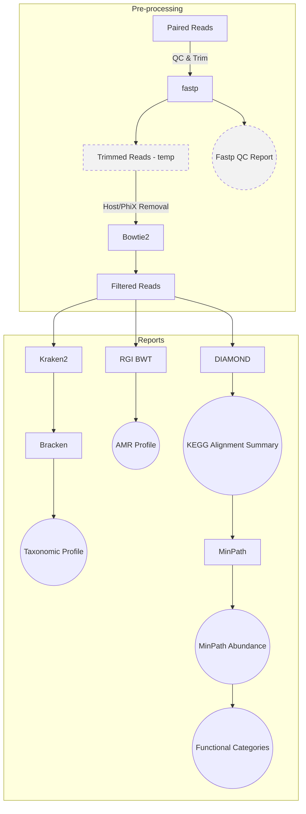

# Metagenomics Snakemake

[](README_FR.md)
[](README.md)

[](https://opensource.org/licenses/MIT)

## About

*Provide a summary, purpose, and key features of the project.*

*Example **About**:*

This repository serves as a template for creating reproducible and customizable data processing workflows. It is designed to help researchers and developers quickly set up new projects by providing modular and parameterized components that can be easily adapted to different use cases. The template may be customized, adding/removing sections as needed, while maintaining good documentation.

For more info, refer: [Template Repository User Guide](https://github.com/AAFC-Bioinfo-AAC/quick-start-guide/blob/main/docs/template-repo-user-guide.md)

---

## Table of Contents

*Example **Table of Contents** (may optionally be placed above the **About** section):*

- [Metagenomics Snakemake](#metagenomics-snakemake)
  - [About](#about)
  - [Table of Contents](#table-of-contents)
  - [Overview](#overview)
    - [Workflow diagram](#workflow-diagram)
    - [Snakemake rules](#snakemake-rules)
  - [Preprocessing Module Overview](#preprocessing-module-overview)
    - [Module `preprocessing.smk`](#module-preprocessingsmk)
    - [Module  `taxonomy.smk`](#module--taxonomysmk)
    - [Module  `amr_short_reads.smk`](#module--amr_short_readssmk)
    - [Module  `kegg.smk`](#module--keggsmk)
  - [Data](#data)
  - [Parameters](#parameters)
  - [Usage](#usage)
    - [Pre-requisites](#pre-requisites)
      - [Software](#software)
      - [Databases](#databases)
    - [Setup Instructions](#setup-instructions)
      - [1. Installation](#1-installation)
      - [2. SLURM Profile](#2-slurm-profile)
        - [2.1. SLURM Profile Directory Structure](#21-slurm-profile-directory-structure)
        - [2.2. Profile Configuration](#22-profile-configuration)
      - [3. Configuration](#3-configuration)
        - [3.1. config/config.yaml](#31-configconfigyaml)
        - [3.2. Environment file](#32-environment-file)
        - [3.3. Sample list](#33-sample-list)
      - [4. Running the pipeline](#4-running-the-pipeline)
        - [4.1. Conda environments](#41-conda-environments)
        - [4.2. SLURM launcher](#42-slurm-launcher)
    - [Notes](#notes)
      - [Warnings](#warnings)
      - [Current issues](#current-issues)
      - [Resource usage](#resource-usage)
  - [OUTPUT](#output)
  - [Credits](#credits)
  - [Contribution](#contribution)
  - [License](#license)
  - [References](#references)
    - [Publications](#publications)
    - [Resources](#resources)
    - [Tools/Software](#toolssoftware)
  - [Citation](#citation)

---

## Overview

### Workflow diagram



### Snakemake rules

## Preprocessing Module Overview

The pipeline is modularized, with each module located in the `metatranscriptomics-snakemake/workflow/rules` directory. The modules are `preprocessing.smk`, `taxonomy.smk`, `amr_short_reads.smk` and `kegg.smk`. **More modules to follow**

---

### Module `preprocessing.smk`

**`rule fastp_pe` *Quality Control & Trimming***

- **Purpose:** Performs adapter trimming, quality trimming, and filtering of paired-end reads.
- **Inputs:** `samplesheet.csv` defines sample IDs and corresponding read pairs.
- **Outputs:**

  - Trimmed paired reads: `sample_r1.fastq.gz`, `sample_r2.fastq.gz`
- **Notes:**

  - Parameters are defined in **`config/config.ymal`** for `fastp`.
  - These files are marked as temporary in the rule: `sample_u1.fastq.gz`, `sample_r2.fastq.gz`,`sample.fastp.html`, and `sample.fastp.json`. If these are required the temporary() flag on the output files in the rule can be removed.

**`rule bowtie2_align` *Alignment to Host/Phix***

- **Purpose:** Aligns trimmed reads to a user created reference (Host/PhiX) that has been indexed by Bowtie2 index.
- **Inputs:**

  - Trimmed paired reads: `*_r1.fastq.gz`, `*_r2.fastq.gz`
  - Bowtie2 index files with the suffix `.bt2`
- **Outputs:**

  - Sorted BAM file: `sample.bam`
- **Notes:**

  - Uses **default parameters** from `Bowtie2`.
  - This file is marked as temporary in the rule: `sample.bam`. If it is required the temporary() flag on the output file in the rule can be removed.

**`rule extract_unmapped_fastq` *Decontamination***

- **Purpose:** extracts the reads that did not align into paired-end FASTQ files depleted of host and PhiX reads.
- **Inputs:**
  - Sorted BAM file: `sample.bam`
- **Outputs:**
  - Clean read pairs: `sample_trimmed_clean_R1.fastq.gz`/`sample_trimmed_clean_R2.fastq.gz`

---

### Module  `taxonomy.smk`

**`rule kraken2` *Assign Taxonomy***

- **Purpose:** Assign taxonomy to the clean reads using a Kraken2-formatted GTDB.
- **Inputs:**
  - Clean read pairs: `sample_trimmed_clean_R1.fastq.gz`/`sample_trimmed_clean_R2.fastq.gz`
- **Outputs:**
  - Kraken and report for each sample: `sample.kraken` and `sample.report.txt`
- **Notes:**
  - Must use **Large compute node** with at least 600 GB. The custom database used here needed 840 GB.

**`rule bracken` *Abundance Estimation***

- **Purpose:** Refines Kraken classification to provide abundance estimates at the species, genus and phylum level for each sample.
- **Inputs:** Kraken report: `sample.report.txt`
- **Outputs:**
  - Bracken reports at:
    - Species level: `sample_bracken.species.report.txt`
    - Genus level: `sample_bracken.genus.report.txt`
    - Phylum level: `sample_bracken.phylum.report.txt`
    - Domain level: `sample_bracken.domain.report.txt`
- **Notes:**
  - Outputs are used as **intermediate files** for downstream rule: `combine_bracken_outputs`
  - Domain level file is needed for normalizing the reads at each taxon to the proportion of total prokaryotic reads (bacteria + archaea)
  - This rule is also making `sample.report_bracken_species.txt` at each level in the `kraken2` directory. At some point see if we can either place these into a directory called `reports` or have them cleaned up in the shell block.

**`rule combine_bracken_outputs` *Merging Abundance Tables***

- **Inputs:**
  - Bracken reports at:
    - Species level: `sample_bracken.species.report.txt`
    - Genus level: `sample_bracken.genus.report.txt`
    - Phylum level: `sample_bracken.phylum.report.txt`
    - Domain level: `sample_bracken.domain.report.txt`
- **Outputs:**
  - Combined abundance tables for:
    - Species level: `merged_abundance_species.txt`
    - Genus level: `merged_abundance_genus.txt`
    - Phylum level: `merged_abundance_phylum.txt`
    - Domain level: `merged_abundance_domain.txt`

**`clean_host_bracken` *Remove host taxonomy***

- **Purpose:** Remove the host taxa from Bracken output files and normalize using the total remaining read counts.
- **Inputs:**
  - Combined abundance tables for:
    - Species level: `merged_abundance_species.txt`
    - Genus level: `merged_abundance_genus.txt`
    - Phylum level: `merged_abundance_phylum.txt`
    - Domain level: `merged_abundance_domain.txt`
- **Outputs**
  - Corresponding cleaned abundance tables:
    - Species level: `merged_abundance_species_cleaned.txt`
    - Genus level: `merged_abundance_genus_cleaned.txt`
    - Phylum level: `merged_abundance_phylum_cleaned.txt`
    - Domain level: `merged_abundance_domain_cleaned.txt`
- **Notes:**
  - The script `clean_bracken_batch.py` contains the taxa filters that can be edited. Maybe these could be included in the config file so the script doesn't need to be modified.

**`bracken_recompute_fractions` *Relative abundance using only prokaryotic reads***

- **Purpose:** Recalculates the relative abundance by using the total prokaryotic reads (bacteria + archaea) from the Bracken domain table.
- **Inputs:**:
  - Corresponding cleaned abundance tables:
    - Species level: `merged_abundance_species_cleaned.txt`
    - Genus level: `merged_abundance_genus_cleaned.txt`
    - Phylum level: `merged_abundance_phylum_cleaned.txt`
    - Domain level: `merged_abundance_domain_cleaned.txt`
- **Outputs**
  - Combined Bracken tables with original and recalculated relative abundance
    - Species level: `bracken_cleaned_adjusted_species.txt`
    - Genus level: `bracken_cleaned_adjusted_genus.txt`
    - Phylum level: `bracken_cleaned_adjusted_phylum.txt`

**`rule bracken_extract` *Abundance Tables***

- **Purpose:** Generate tables for the raw counts, bracken default relative abundance and the adjusted relative abundance for each taxonomic level for all samples.
- **Inputs:**
  - Combined Bracken tables with original and recalculated relative abundance
    - Species level: `bracken_cleaned_adjusted_species.txt`
    - Genus level: `bracken_cleaned_adjusted_genus.txt`
    - Phylum level: `bracken_cleaned_adjusted_phylum.txt`
- **Outputs:**
  - Combined relative and raw abundance tables for
    - Species level: `bracken_species_raw_abundance.csv`, `bracken_species_rel_abundance_default.csv`, and `bracken_species_rel_abundance_adjusted.csv`
    - Genus level: `bracken_genus_raw_abundance.csv`, `bracken_genus_rel_abundance_default.csv`, and `bracken_genus_rel_abundance_adjusted.csv`
    - Phylum level: `bracken_phylum_raw_abundance.csv`, `bracken_phylum_rel_abundance_default.csv`, and `bracken_phylum_rel_abundance_adjusted.csv`
- **Notes:**
  - The three output files are made so that the user can decide if they would like to use the adjusted Bracken tables.

---

### Module  `amr_short_reads.smk`

**`rule rgi_reload_database` *Load CARD DB***

- **Purpose:** Checks if the CARD Database has been loaded from a common directory or user specific directory.
- **Inputs:**
  - `card_reference.fasta`
  - `card.json`
- **Outputs:**
  - Done marker `rgi_reload_db.done` to prevent the rule from re-running every time the pipeline is called.

**`symlink_rgi_card` *Symlink CARD to the working directory***

- **Purpose:** Prevent the re-loading of the CARD DB

**`rule rgi_bwt` *Antimicrobial Resistance Gene Profiling***

- **Purpose:** performs antimicrobial resistance gene profiling on the cleaned reads using *k*-mer alignment (kma).
- **Inputs:**

  - Clean read pairs: `sample_trimmed_clean_R1.fastq.gz`/`sample_trimmed_clean_R2.fastq.gz`
- **Outputs:**

  - `sample_paired.allele_mapping_data.txt`
  - `sample_paired.artifacts_mapping_stats.txt`
  - `sample_paired.gene_mapping_data.txt`
  - `sample_paired.overall_mapping_stats.txt`
  - `sample_paired.reference_mapping_stats.txt`
- **Notes:**

  - Uses default RGI BWT parameters.
  - For large sample files the large memory node may be required.
  - These files are marked as temporary in the rule: `sample_paired.allele_mapping_data.json`, `sample_paired.sorted.length_100.bam`, and `sample_paired.sorted.length_100.bam.bai`. If these are required the temporary() flag on the output files in the rule can be removed.

---

### Module  `kegg.smk`

**`merge_read_pairs` *Concatenate***

- **Purpose:** Concatenate read pairs for each sample.
- **Inputs:**
  - Clean read pairs: `sample_trimmed_clean_R1.fastq.gz`/`sample_trimmed_clean_R2.fastq.gz`
- **Outputs:**
  - Concatenated read pairs: `sample_merged.fastq.gz`

**`kegg_diamond` *DIAMOND Alignment***

- **Purpose:** Provide a tab-delimited text file that summarizes the alignment of sample reads against a DIAMOND formatted KEGG protein database.
- **Inputs:**
  - Concatenated read pairs: `sample_merged.fastq.gz`
  - DIAMOND formatted KEGG protein database: `prokaryotes.pep.dmnd`
**Outputs:**
  - DIAMOND alignment file: `sample_diamond_output.m8`

**`count_reads` *Read Count***

- **Purpose:** Total reads for each concatenated read pairs.
- **Inputs:**
  - Concatenated read pairs: `sample_merged.fastq.gz`
**Outputs:**
  - Text file with the read count: `sample_read_count.txt`

**`gene_ko_abundance` *KO-Annotated Abundance Table***

- **Purpose:** Generate a KEGG orthology table with gene counts normalized by reads per kilobase and counts per million.
- **Inputs:**
  - DIAMOND alignment file: `sample_diamond_output.m8`
  - Text file with the read count: `sample_read_count.txt`
  - KEGG Orthology assignments of genes `ko_genes.list`
- **Outputs:**
  - Abundance table: `sample_gene_ko_abundance.tsv`

**`make_ko_lists` *Generate KO list for MinPath***

- **Purpose:** Generate a KEGG orthology list from the KEGG orthology abundance table and format the list for MinPath.
- **Inputs:**
  - Abundance table: `sample__gene_ko_abundance.tsv`
- **Outputs:**
  - Raw extracted KEGG orthology ID list: `sample_ko_list_raw.txt`
  - MinPath formatted KEGG orthology ID list: `sample_ko_list_fixed.txt`

**`minpath` *Run MinPath***

- **Purpose:** Infer the minimal set of pathway presence to explain the KEGG orthology ID list by running MinPath.
- **Inputs:**
  - MinPath formatted KEGG orthology ID list: `sample_ko_list_fixed.txt`
- **Outputs:**
  - List of predicted pathways in the sample: `sample_minpath_output.txt`
- **Notes:**

  - This rule runs the script MinPath.py from MinPath version 1.6, which is available on the [MinPath github](https://github.com/mgtools/MinPath).
  - The MinPath program directory must be added into the scripts folder `workflow/scripts/MinPath`.
  - The file permission for glpsol must be changed by running

      ```bash
      chmod +x /abs/path/to/the/snakemake/workflow/scripts/MinPath/glpk-4.6/examples/glpsol
      ```


**`aggregate_minpath_pathways` *MinPath Abundance***

- **Purpose:** For only MinPath confirmed pathways produce a pathway-level abundance table.
- **Inputs:**
  - List of predicted pathways in the sample: `sample_minpath_output.txt`
  - Abundance table: `sample_gene_ko_abundance.tsv`
  - KEGG orthology assignments of pathways: `ko_pathway.list`
- **Outputs:**
  - Table of abundances pathways confirmed by MinPath: `sample_aggregated_minpath.tsv`
  
**`kegg_category_mappings` * Functional Categories***

- **Purpose:** To summarize the MinPath-confirmed pathways into higher-level categories
- **Inputs:**
  - Table of abundances pathways confirmed by MinPath: `sample_aggregated_minpath.tsv`
  - BRITE hierarchy file from the KEGG database: `ko00001.keg`
- **Outputs:**
  - Table of MinPath-confirmed pathways into higher-level categories: `sample_ko_pathway_abundance_with_category.tsv`

---

## Data

The raw input data must be in the form of paired-end FASTQ files generated from metagenomics experiments.

- Each sample should include both forward (R1) and reverse (R2) read files.
- The path to the `PROJECT_ROOT` needs to be specified in the `.evn` file
- Raw fastq file directory must be specified in the `config.yaml` file.

**Example:**

- **Dataset 1 Filename**: Sequencing reads (FASTQ) from beef cattle rumen samples are provided for three samples: `LLC42Nov10C`, `LLC42Sep06CR`, and `LLC82Sep06GR`.

---

## Parameters

The `config/config.yaml` file contains the editable pipeline parameters, thread allocation for rules with more than one core, and the relative file paths for input and output. The prefix of the absolute file path must go in `.env`. Most tools in the pipeline have default parameters. The tools with parameters different from default or that can be edited in the `config/config.ymal` file are listed below.


| Parameter                        | Value                                                                                                                                                                      |
| ---------------------------------- | ---------------------------------------------------------------------------------------------------------------------------------------------------------------------------- |
| *samplesheet.csv*                | *The samplesheet is described here: [Sample list](#33-sample-list)*                                                                                                        |
| *fastp: cut_tail*                | *If true, trim low quality bases from the 3′ end until a base meets or exceeds the cut_mean_quality threshold. If false,disabled.*                                        |
| *fastp: cut_front*               | *If true, trim low quality bases from the 5′ end until a base meets or exceeds the cut_mean_quality threshold. If false,disabled.*                                        |
| *fastp: cut_mean_quality*        | *A positive integer specifying the minimum average quality score threshold for sliding window trimming.*                                                                   |
| *fastp: cut_window_size*         | *A positive interger specifing the sliding window size in bp when using cut_mean_quality.*                                                                                 |
| *fastp: qualified_quality_phred* | *A positive interger specifing the minimum Phed score that a base needs to be considered qualified*.                                                                       |
| *fastp: detect_adapter_for_pe*   | *If true, auto adapter detection. If false,disabled.*                                                                                                                      |
| *fastp: length_required*         | *Reads shorter then this positive interger will be discarded.*                                                                                                             |
| *kraken2: conf_threshold*        | *Interval between 0 and 1. Higher values require more of a read’s k-mers to match the same taxon before it is classified, increasing precision but reducing sensitivity.* |
| *bracken: readlen*               | *The read length of your data in bp.*                                                                                                                                      |
| *kegg_diamond: sensitivity*      | *Sensitivity modes are descibed in the [DIAMOND github wiki](https://github.com/bbuchfink/diamond/wiki/3.-Command-line-options).*|
|*kegg_diamond: max_target_num*    | *--max-target-seqs/-k is the max number of target sequences per alignment to report. Set at 1 in this pipeline to only keep the best hit. Default is 25.*|
|*kegg_diamond: out_file_format*   | *--outfmt is the output file format. Set as 6 qseqid sseqid slen pident length mismatch gapopen qstart qend sstart send evalue bitscore in this pipeline. |

---

## Usage

### Pre-requisites

#### Software

- Snakemake version 9.9.0
- Snakemake-executor-plugin-slurm
- MinPath version 1.6
  - The MinPath software is avalible on the [MinPath github](https://github.com/mgtools/MinPath/blob/master/MinPath.py)
  - The repository needs to be placed in the `project-snakemake/workflow/scripts` directory
  - The file premissions for `project-snakemake/workflow/scripts/MinPath/glpk-4.6/examples/glpsol` need to be changed to executable:
  
``` bash
chmod +x absolute/path/code/metagenomics-snakemake/workflow/scripts/MinPath/glpk-4.6/examples/glpsol
```

#### Databases

- **Bowtie2** Bowtie2 uses an index of reference sequences to align reads. This index must be created before running the pipeline. The index files (with the `.bt2` extension) must be located in the directory you specify in the `config/config.yaml` file. Make sure to update the prefix of these files in the `config.yaml` file.

  - In `resources/bowtie2_index` there is a `README.md` file that details where the index was copied from.
- **Kraken2** Kraken2 requires a Kraken2-formatted GTDB database.

  - Kraken2-formatted GTDB release 226 built with the following scripts provided by Jean-Simon Brouard.
  - The Bracken database was built specifying a read length of 150 bp and a kmer length of 35 (default for Kraken2)
  - As per Gihawi et al, 2023, Kraken2 can assign host reads to bacteria in low microbial biomass samples if the host genomes are not included in the Kraken2 database. Therefore, this version of the GTDB release 226 was formatted for Kraken2 with the inclusion of four host genomes: Bos indicus (GCF_029378745.1), Bos taurus (GCF_002263795.3), Homo sapiens (GCF_000001405.40), and Sus scrofa (GCF_000003025.6).

  > **See:** Gihawi A, Ge Y, Lu J, Puiu D, Xu A, Cooper CS, Brewer DS, Pertea M, Salzberg SL. Major data analysis errors invalidate cancer microbiome findings. mBio. 2023 Oct 31;14(5):e0160723. doi: 10.1128/mbio.01607-23. Epub 2023 Oct 9.
  >
- **RGI BWT/CARD**  RGI BWT requires the CARD (Comprehensive Antibiotic Resistance Database) database. The version tested in this pipeline was 4.0.1. The database can be located on a common drive or in your working directory.
  Instructions for installing the CARD database are available on [CARD RGI github](https://github.com/arpcard/rgi/blob/master/docs/rgi_bwt.rst).
  Steps copied from the RGI documentation:

  **Download CARD data:**

  ```bash
  wget https://card.mcmaster.ca/latest/data
  tar -xvf data ./card.json

  rgi load --card_json /path/to/card.json --local

  rgi card_annotation -i /path/to/card.json > card_annotation.log 2>&1

  rgi load -i /path/to/card.json --card_annotation card_database_v3.0.1.fasta --local
  ```

  **Note:** the files after loading and annotating card must be called `card.json` and `card_reference.fasta`
- **KEGG** The functional pathway analysis requires the [KEGG database](https://www.genome.jp/kegg/). Below are the files required for the analysis:

  - DIAMOND formatted KEGG protein database: `prokaryotes.pep.dmnd`
    - Instructiond for creating the `prokaryotes.pep.dmnd` are avalible on [DIAMOND github wiki](https://github.com/bbuchfink/diamond/wiki).
    - Here the database was created with the KEGG protein sequnce database for prokaryotic orginisms.

    ```bash
    zcat "prokaryotes.pep" | diamond makedb --in - -d "prokaryotes.pep" --threads 20
    ```
  - KEGG Orthology assignments of genes `ko_genes.list`
  - KEGG Orthology assignments of pathways `ko_pathway.list`
  - KEGG BRITE hierarchy file `ko00001.keg` avalible here <https://www.kegg.jp/kegg-bin/download_htext?htext=ko00001.keg&format=htext&KEGG>.
**Note:** The KEGG BRITE file is in the snakemake folder. It would be better suited in the`data/reference/databases/KEGG` direcorty, but I was getting disk space full errors.

### Setup Instructions

#### 1. Installation

Clone the repository into the directory where you want to run the metagenomics Snakemake pipeline.
**Note:** This location must be on an HPC (High Performance Computing) cluster with access to a high-memory node (at least 600 GB RAM) and sufficient storage for all metagenomics analyses.

```bash
cd /path/to/code/directory
git clone <repository-url>
```

#### 2. SLURM Profile

##### 2.1. SLURM Profile Directory Structure

```bash
metatranscriptomics_pipeline/
├── Workflow/
│   └── Snakefile
│   └── ... 
├── profiles/
│   └── slurm/
│       └── config.yaml         ← profile config
├── config/
│   └── config.yaml             ← workflow data/sample config
|   └── samples.txt
├── run_snakemake.sh            ← your SLURM launcher
├── .env
└── ...                     
```

##### 2.2. Profile Configuration

The SLURM execution settings are configured in profiles/slurm/config.yaml. This file defines resource defaults, cluster submission commands, and job script templates for Snakemake. This file should be adjusted for each HPC configuration. Remember to adjust `rerun-triggers: [input, params, software-env]` pipeline is being modified. The pre-rule resources need to be adjusted for the size and number of input samples for each rule.

**Example for profiles/slurm/config.yaml:**

```bash
### How Snakemake assigns resources to rules

cores: 60
jobs: 10 
latency-wait: 60 
rerun-incomplete: true
retries: 2          
max-jobs-per-second: 2 
executor: slurm


### Env Vars ###
envvars:
  TMPDIR: "/gpfs/fs7/aafc/scratch/$USER/tmpdir"

default-resources:
  - slurm_account=aafc_aac
  - slurm_partition=standard
  - slurm_cluster=gpsc8
  - runtime=60       # minutes
  - slurm_qos=low    #If jobs are held in queue for long.
  - mem_mb=4000
  - cpus=1

### Env modules ###
# use-envmodules: false 

# Prevent rerunning jobs just for Snakefile edits
## flags available [input, mtime, params, software-env, code, resources, none]
rerun-triggers: [input, params, software-env]

### Conda ###
use-conda: true
conda-frontend: mamba   

### Resource scopes ###
set-resource-scopes:
  cores: local 

## Per rule resources
set-resources:
  fastp_pe:
    cpus: 2
    mem_mb: 4000
    runtime: 40
    slurm_partition: standard
    slurm_account: aafc_aac
    slurm_cluster: gpsc8

  bowtie2_align:
    cpus: 24
    mem_mb: 48000
    runtime: 30
    slurm_partition: standard
    slurm_account: aafc_aac
    slurm_cluster: gpsc8
```

#### 3. Configuration

The pipeline requires the following configuration files: `config.yaml`, `.env`, and `samples.txt`.

##### 3.1. config/config.yaml

The `config.yaml` file must be located in the `config` directory, which resides in the main Snakemake working directory. This file specifies crucial settings, including:

- Path to the `samples.txt`
- Input and output directories
- File paths to required databases
- Parameters for each rule **NEED TO UPDATE RULES**

**Note:**
You must edit `config.yaml` **before** running the pipeline to ensure all paths are correctly set.
For best practice, use database paths that are in common locations to all users on the HPC.

##### 3.2. Environment file

This file must contain paths to the **PROJECT ROOT**,  **USER SCRATCH**, and **RGI COMMON DATABASE**. Follow these instructions:

- In the main Snakemake directory (where you are running Snakemake from)

```bash
touch .env
```

- Open the .env file and add

```bash
 PROJECT_ROOT = path/to/project/root
 TMPDIR = path/to/temp/on/cluster **Issue with $USER. I had to use my actual username in the .env file**
 RGI_CARD = path/to/card.json and card_reference.fasta
```

##### 3.3. Sample list

`samplesheet.csv` Has the following column names: "sample","fastq_1","fastq_2". For the column 'sample" use the sampleID for the read pair, and for "fastq_1","fastq_2" have the names of the read1 and read2 files as they appear in the raw fastq files directory. The file location of the `samplesheet.csv` must be`config/samplesheet.csv`.

**Example `samplesheet.csv`:**
sample,fastq_1,fastq_2
test_LLC82Nov10GR,test_LLC82Nov10GR_r1.fastq.gz,test_LLC82Nov10GR_r2.fastq.gz
test_LLC82Sep06GR,test_LLC82Sep06GR_r1.fastq.gz,test_LLC82Sep06GR_r2.fastq.gz

#### 4. Running the pipeline

Complete steps **1.Installation**, **2.SLURM Profile**, and **3.Configuration** and ensure database paths have been added to the 'config/config.yaml'. Required databases are described in the [Pre-requisites](#pre-requisites).

##### 4.1. Conda environments

Snakemake can automatically create and load Conda environments for each rule in your workflow. Check to see that you have the following configuration files in the `workflow/envs` directory:

- `bedtools.yaml`
- `bowtie2.yaml`
- `diamond.yaml`
- `fastp.yaml`
- `kraken2.yaml`
- `minpath.yaml`
- `python3.yaml`
- `rgi.yaml`

Load the required conda environments for the pipeline with:

```bash
snakemake --use-conda \
  --conda-create-envs-only \
  --conda-prefix path/to/common/lab/folder/conda/metatranscriptomics-snakemake-conda
```

##### 4.2. SLURM launcher

This is the script you use to submit the Snakemake pipeline to SLURM.

- **Before submitting job to SLURM run `export SLURM_CONF="/etc/slurm-llnl/gpsc8.science.gc.ca.conf"`**
- Defines resources for the job scheduler
- Activates the Snakemake environment
- Submits and manages jobs using the Snakemake `--profile` configuration `(profiles/slurm/)`.
- Contains any additional Snakemake arguments (e.g.., `--unlock`, `--dry-run`, `--rerun-incomplete`)
- For a snakemake report with runtime and software versions use --report path/to/metatranscriptomics_report.html after the pipeline has completed

```bash
#!/bin/bash
#SBATCH --job-name=run_snakemake.sh
#SBATCH --output=run_snakemaket_%j.out 
#SBATCH --error=run_snakemake_%j.err 
#SBATCH --cluster=gpsc8 
#SBATCH --partition=standard
#SBATCH --account=aafc_aac
#SBATCH --mem=2000
#SBATCH --time=8:00:00
#SBATCH --qos=low #If jobs are stuck in queue

source /gpfs/fs7/aafc/common/miniforge/miniforge3/etc/profile.d/conda.sh

conda activate snakemake-9.6.0
export PATH="$PWD/bin:$PATH"

  snakemake \
    --profile absolute/path/to/profiles/slurm \
    --configfile absolute/path/to/config/config.yaml \
    --conda-prefix absolute/path/to/common/conda/metatranscriptomics-snakemake-conda \
    --printshellcmds \
    --keep-going 
```

### Notes

- temp folder is set to `/gpfs/fs7/aafc/scratch/$USER/tmpdir` for running on the GPSC.

#### Warnings

- The conda environments will not be created if the conda configuration is `conda config --set channel_priority strict`.
- Set conda to `conda config --set channel_priority flexible` or use libmamba.
- The `.env` file can overwrite the `config/config.yaml` file

#### Current issues

- In the .env file /gpfs/fs7/aafc/scratch/$USER/ was not solving to user so as a temporary fix I put in my user name.

#### Resource usage

- Kraken2: Large compute node with 840 GB.

## OUTPUT

*Provide format, location, and naming of result files, and a brief description.*

*Example Output:*

*Output files include:*

*- results/reports/summary.csv: Key metrics from analysis.*

*- results/logs/pipeline.log: Step-by-step log.*

*- results/plots/visualization.png: Output plot.*

---

## Credits

This repository was written by Katherine James-Gzyl and assisted by Devin Holman and Arun Kommadath.

---

## Contribution

If you would like to contribute to this project, please review the guidelines in [CONTRIBUTING.md](CONTRIBUTING.md) and ensure you adhere to our [CODE_OF_CONDUCT.md](CODE_OF_CONDUCT.md) to foster a respectful and inclusive environment.

---

## License

This project is distributed under the MIT License. For complete details and copyright information, see the [LICENSE](LICENSE) file.

---

## References

*Provide references to key publications and any useful resources for tools/software used. Formal citations of the tools used may also be provided via a CITATIONS.md file.*

*Example References:*

### Publications

The pipeline and analysis associated with it is published here:

- Your published paper title – Journal, Year.

### Resources

- Link to Snakemake Manual
- Link to Tool X Documentation

### Tools/Software

References to tools and software used here can be found in the [CITATIONS.md](CITATIONS.md) file.

## Citation

*Provide information on how to cite this repository. Use a CITATION.cff file where required. Citation tools like GitHub and Zenodo will use this file to generate standardized references.*

If you use this project in your work, please cite it using the [CITATION.cff](CITATION.cff) file.
