# Metagenomics Snakemake 

[](README_FR.md)
[](README.md)

[](https://opensource.org/licenses/MIT)

## About

*Provide a summary, purpose, and key features of the project.*

*Example **About**:*

This repository serves as a template for creating reproducible and customizable data processing workflows. It is designed to help researchers and developers quickly set up new projects by providing modular and parameterized components that can be easily adapted to different use cases. The template may be customized, adding/removing sections as needed, while maintaining good documentation.

For more info, refer: [Template Repository User Guide](https://github.com/AAFC-Bioinfo-AAC/quick-start-guide/blob/main/docs/template-repo-user-guide.md)

---

## Table of Contents

*Example **Table of Contents** (may optionally be placed above the **About** section):*

- [Metatranscriptomics Snakemake Pipeline](#metatranscriptomics-snakemake-pipeline)
  - [About](#about)
  - [Table of Contents](#table-of-contents)
  - [Overview](#overview)
    - [Workflow diagram](#workflow-diagram)
    - [Snakemake rules](#snakemake-rules)
  - [Data](#data)
  - [Parameters](#parameters)
  - [Usage](#usage)
    - [Pre-requisites](#pre-requisites)
      - [Software](#software)
      - [Databases](#databases)
    - [Setup Instructions](#setup-instructions)
      - [1. Installation](#1-installation)
      - [2. Configuration](#2-configuration)
        - [2.1. config.yaml](#21-configyaml)
        - [2.2. Environment file](#22-environment-file)
        - [2.3. Sample list](#23-sample-list)
      - [3. Running the pipeline](#3-running-the-pipeline)
        - [3.1.Conda environments](#31conda-environments)
    - [Notes](#notes)
      - [Warnings](#warnings)
      - [Current issues](#current-issues)
      - [Resource usage](#resource-usage)
  - [OUTPUT](#output)
  - [Credits](#credits)
  - [Contribution](#contribution)
  - [License](#license)
  - [References](#references)
    - [Publications](#publications)
    - [Resources](#resources)
    - [Tools/Software](#toolssoftware)
  - [Citation](#citation)
---

## Overview

### Workflow diagram

```mermaid
flowchart TD

    subgraph PREPROC [Pre-processing]
        A[Paired Reads] -->|QC & Trim| B[fastp]
        B --> C[Trimmed Reads - temp]
        B --> L((Fastp QC Report))
        C -->|Host/PhiX Removal| D[Bowtie2]
        D --> E[Filtered Reads]
    end

    subgraph QC_REPORTS [Reports]
        E --> M[Kraken2]
        M --> N[Bracken]
        N --> O((Taxonomic Profile))

        E --> W[RGI BWT]
        W --> Q((AMR Profile))
    end

    %% TEMP FILE STYLING
    style C fill:#f2f2f2,stroke-dasharray: 5 5
    style L fill:#f2f2f2,stroke-dasharray: 5 5
```



### Snakemake rules

## Preprocessing Module Overview

The pipeline is modularized, with each module located in the `metatranscriptomics-snakemake/workflow/rules` directory. The modules are `preprocessing.smk`, `taxonomy.smk` and `amr_short_reads.smk`. **More modules to follow**

---   
### Module  `preprocessing.smk` contains these rules:
🔹 **`rule fastp_pe` *Quality Control & Trimming***

- **Purpose:** Performs adapter trimming, quality trimming, and filtering of paired-end reads.
- **Inputs:** `samplesheet.csv` defines sample IDs and corresponding read pairs.
- **Outputs:**
  - Trimmed paired reads: `*_r1.fastq.gz`, `*_r2.fastq.gz`
  - Unpaired reads: `*_u1.fastq.gz`, `*_u2.fastq.gz`
  - QC reports (HTML and JSON)

- **Notes:**
  - Parameters are defined in **`config/config.ymal`** for `fastp`.
  - Outputs are marked as **temporary** and automatically cleaned up once no longer needed.


🔹 **`rule bowtie2_align` *Alignment to Host/Phix***
- **Purpose:** Aligns trimmed reads to a user created reference (Host/PhiX) that has been indexed by Bowtie2 index.
- **Inputs:** 
  - Trimmed paired reads: `*_r1.fastq.gz`, `*_r2.fastq.gz`
  - Bowtie2 index files with the suffix `.bt2`
- **Outputs:**
  - Reference-aligned `BAM` file

- **Notes:**
  - Uses **default parameters** from `Bowtie2`.
  - Outputs are marked as **temporary** and automatically cleaned up once no longer needed.
- **Performance Notes:**
  > **Wall time:**  
  > - 60 cores (bowtie2: 44, SAMtools view: 4, SAMtools sort: 12): 12m 18s  
  > - 24 cores (bowtie2: 16, SAMtools view: 4, SAMtools sort: 8): ??


🔹 **`rule extract_unmapped_fastq` *Decontamination***
- **Purpose:** extracts the reads that did not align into paired-end FASTQ files depleted of host and PhiX reads
- **Inputs:**
  - Sorted BAM file
- **Outputs:**
  - Clean read pairs: `*_trimmed_clean_R1.fastq.gz`/`*_trimmed_clean_R2.fastq.gz` 
- **Notes:**
  - Uses **default parameters** from `Bowtie2`.
  - ## *Add the parameters to the `config/config.yaml`*
- **Performance Notes:**
  >  **Wall time:**  
  > - 60 cores, no splitting: 17m 57s  
  > - Optimized run with core splitting at a 80:20 ratio between SAMtools and pigz (SAMtools: 48, pigz: 12) : time???

---  

### Module  `taxonomy.smk` contains these rules:
### ALL parameters still need to go into config/config.yaml and wall time needs to be removed

🔹 **`rule kraken2` *Assign Taxonomy***
- **Purpose:** Assign taxonomy to the clean reads using a Kraken2-formatted GTDB
- **Inputs:**
  - Clean read pairs: `*_trimmed_clean_R1.fastq.gz`/`*_trimmed_clean_R2.fastq.gz` 
- **Outputs:**
  -Kraken and report for each sample: `*.kraken`/`*.report`
- **Notes:**
  - Uses confidence threshold of 0.5 and **default parameters** from `Kraken2`
  - New Kraken2 database has not been tested yet
  - Must use **Large compute node**

- **Performance Notes:**
  >  **Wall time:**  
  > - Large compute node with 600 GB. With 16 CUPs wall time was 7m 56s
  > - Large compute node with 600 GB. With 2 CUPs wall time was 19m 13s

🔹 **`rule bracken` *Abundance Estimation***
  - **Purpose:** Refines Kraken classification to provide abundance estimates at the species, genus and phylum level for each sample.
  - **Inputs:** Report file from `kraken`
  - **Outputs:**  
  - Bracken reports at:
    - Species level
    - Genus level
    - Phylum level
 - **Notes:**
  - Outputs are used as **intermediate files** for downstream rule: `combine_bracken_outputs`
  - his rule is also making `.report_bracken_species.txt` at each level in the `06_kraken` directory. At some point see if we can either place these into a directory called `reports` or have them cleaned up in the shell block.

- **Performance Notes:**
  >  **Wall time:**  
  > - 10 threads the wall time was 9s.
  > - 2 threads ??

🔹 **`rule combine_bracken_outputs` *Merging Abundance Tables***
- **Inputs:**  
  - Bracken reports at species, genus, and phylum levels from `rule bracken`
- **Outputs:**  
  - Combined abundance tables for:
    - Species level
    - Genus level
    - Phylum level

🔹 **`rule bracken_extract` *Relative Abundance Tables***
- **Purpose:** generate tables for the raw and relative abundance for each taxonomic level for all samples
- **Inputs:**
  - Combined abundance tables for:
    - Species level
    - Genus level
    - Phylum level
- **Outputs:**
  - Combined relative and raw abundance tables for
    - Species level
    - Genus level
    - Phylum level
---
### Module  `amr_short_reads.smk` contains these rules:
### ALL parameters still need to go into config/config.yaml and wall time needs to be removed
🔹 **`rule rgi_reload_database` *Load CARD DB***
- **Purpose:** Checks if the CARD Database has been loaded from a common directory or user specific directory
- **Inputs:** 
  - `card_reference.fasta`
  - `card.json`
- **Outputs:**
  - Done marker `rgi_reload_db.done` to prevent the rule from re-running every time the pipeline is called.

🔹 **`symlink_rgi_card` *Symlink CARD to the working directory***
- **Purpose:** Prevent the re-loading of the CARD DB

🔹 **`rule rgi_bwt` *Antimicrobial Resistance Gene Profiling***
- **Purpose:** performs antimicrobial resistance gene profiling on the cleaned reads using *k*-mer alignment (kma)
- **Inputs:** 
  - Clean read pairs: `*_trimmed_clean_R1.fastq.gz`/`*_trimmed_clean_R2.fastq.gz` 
- **Outputs:**  
  - `*_paired.allele_mapping_data.json` – JSON-formatted allele mapping results  
  - `*_paired.allele_mapping_data.txt` – Text-formatted allele mapping  
  - `*_paired.artifacts_mapping_stats.txt` – Statistics on mapping artifacts  
  - `*_paired.gene_mapping_data.txt` – Per-gene alignment details  
  - `*_paired.overall_mapping_stats.txt` – Summary statistics across all mappings  
  - `*_paired.reference_mapping_stats.txt` – Reference-specific mapping stats  
  - `*_paired.sorted.length_100.bam` – Filtered and sorted BAM file with reads ≥100 bp  
  - `*_paired.sorted.length_100.bam.bai` – BAM index for downstream access

- **Notes:**
  - Uses default RGI BWT parameters.

- **Performance Notes:**
  >  **Wall time:**  
  > - 40 cores wall time: 18m 7s
  > - 20 cores wall time: ??If time does not increase much further reduce cores.

---

## Data

The raw input data must be in the form of paired-end FASTQ files generated from metagenomics experiments.

- Each sample should include both forward (R1) and reverse (R2) read files.
- The path to the `PROJECT_ROOT` needs to be specified in the `.evn` file
- Raw fastq file directory must be specified in the `config.yaml` file.

**Example:**

- **Dataset 1 Filename**: Sequencing reads (FASTQ) from beef cattle rumen samples are provided for three samples: `LLC42Nov10C`, `LLC42Sep06CR`, and `LLC82Sep06GR`.

---

## Parameters

| Parameter          | Value                                                                                               |
| -------------------- | ----------------------------------------------------------------------------------------------------- |
| *parameter_name_1* | *Description of what the parameter does and the expected value (e.g., integer, string, file path).* |
| *parameter_name_2* | *Description of what the parameter does and the expected value (e.g., boolean, list).*              |

---

## Usage

### Pre-requisites

#### Software

- Snakemake version 9.6.0
- Snakemake-executor-plugin-slurm

#### Databases

- **Bowtie2**  
  Bowtie2 uses an index of reference sequences to align reads. This index must be created before running the pipeline. The index files (with the `.bt2` extension) must be located in the directory you specify in the `config/config.yaml` file. Make sure to update the prefix of these files in the `config.yaml` file.
  - In `resources/bowtie2_index` there is a `README.md` file that details where the index was copied from.

- **Kraken2**  
  Kraken2 requires a Kraken2-formatted GTDB database.
  - Kraken2-formatted GTDB release 226 built with the following scripts provided by Jean-Simon Brouard.
  - The Bracken database was built specifying a read length of 150 bp and a kmer length of 35 (default for Kraken2) 
  - As per Gihawi et al, 2023, Kraken2 can assign host reads to bacteria in low microbial biomass samples if the host genomes are not included in the Kraken2 database. Therefore, this version of the GTDB release 226 was formatted for Kraken2 with the inclusion of four host genomes: Bos indicus (GCF_029378745.1), Bos taurus (GCF_002263795.3), Homo sapiens (GCF_000001405.40), and Sus scrofa (GCF_000003025.6).

  > **See:** Gihawi A, Ge Y, Lu J, Puiu D, Xu A, Cooper CS, Brewer DS, Pertea M, Salzberg SL. Major data analysis errors invalidate cancer microbiome findings. mBio. 2023 Oct 31;14(5):e0160723. doi: 10.1128/mbio.01607-23. Epub 2023 Oct 9. 


- **RGI BWT/CARD**  RGI BWT requires the CARD (Comprehensive Antibiotic Resistance Database) database. The version tested in this pipeline was 4.0.1. The database can be located on a common drive or in your working directory.  
  Instructions for installing the CARD database are available on [CARD RGI github](https://github.com/arpcard/rgi/blob/master/docs/rgi_bwt.rst).  
  Steps copied from the RGI documentation:

  **Download CARD data:**

  ```bash
  wget https://card.mcmaster.ca/latest/data
  tar -xvf data ./card.json

  rgi load --card_json /path/to/card.json --local

  rgi card_annotation -i /path/to/card.json > card_annotation.log 2>&1

  rgi load -i /path/to/card.json --card_annotation card_database_v3.0.1.fasta --local
  ```

  **Note:** the files after loading and annotating card must be called `card.json` and `card_reference.fasta`

### Setup Instructions

#### 1. Installation

Clone the repository into the directory where you want to run the metagenomics Snakemake pipeline.  
**Note:** This location must be on an HPC (High Performance Computing) cluster with access to a high-memory node (at least 600 GB RAM) and sufficient storage for all metagenomics analyses.

```bash
cd /path/to/code/directory
git clone <repository-url>
```
#### 2. SLURM Profile
##### 2.1. SLURM Profile Directory Structure
```
metatranscriptomics_pipeline/
├── Workflow/
│   └── Snakemake/
│   └── ... 
├── profiles/
│   └── slurm/
│       └── config.yaml         ← profile config
├── config/
│   └── config.yaml             ← workflow data/sample config
|   └── samples.txt
├── run_snakemake.sh            ← your SLURM launcher
├── .env
└── ...                         
```
##### 2.2. Profile Configuration
The SLURM execution settings are configured in profiles/slurm/config.yaml. This file defines resource defaults, cluster submission commands, and job script templates for Snakemake. The pre-rule resources need to be adjusted for the size and number of input samples for each rule.

**Example for profiles/slurm/config.yaml:**
```bash
### How Snakemake assigns resources to rules
cores: 60
jobs: 10 
latency-wait: 60 
rerun-incomplete: true
retries: 2              
max-jobs-per-second: 2 
executor: slurm


### Env Vars ###
envvars:
  TMPDIR: "/gpfs/fs7/aafc/scratch/$USER/tmpdir"

default-resources:
  - slurm_account=aafc_aac
  - slurm_partition=standard
  - slurm_cluster=gpsc8
  - runtime=60       # minutes
  - mem_mb=4000
  - cpus=1

### Env modules ###
# use-envmodules: false 

### Conda ###
use-conda: true
conda-frontend: mamba   

### Resource scopes ###
set-resource-scopes:
  cores: local 

## Per rule resources
set-resources:
  fastp_pe:
    cpus: 2
    mem_mb: 4000
    runtime: 40
    slurm_partition: standard
    slurm_account: aafc_aac

  bowtie2_align:
    cpus: 24
    mem_mb: 48000
    runtime: 30
    slurm_partition: standard
    slurm_account: aafc_aac
```

#### 3. Configuration

The pipeline requires the following configuration files: `config.yaml`, `.env`, and `samples.txt`.

##### 3.1. config/config.yaml

The `config.yaml` file must be located in the `config` directory, which resides in the main Snakemake working directory. This file specifies crucial settings, including:

- Path to the `samples.txt`  
- Input and output directories  
- File paths to required databases 
- Parameters for each rule **NEED TO UPDATE RULES** 

**Note:**  
You must edit `config.yaml` **before** running the pipeline to ensure all paths are correctly set.  
For best practice, use database paths that are in common locations to all users on the HPC.

##### 3.2. Environment file

This file must contain paths to the **PROJECT ROOT**,  **USER SCRATCH**, and **RGI COMMON DATABASE**. Follow these instructions:

- In the main Snakemake directory (where you are running Snakemake from)

```bash
touch .env
```

- Open the .env file and add

```bash
 PROJECT_ROOT = path/to/project/root
 TMPDIR = path/to/temp/on/cluster **Issue with $USER. I had to use my actual username in the .env file**
 RGI_CARD = path/to/card.json and card_reference.fasta
 ```

##### 3.3. Sample list

 `samplesheet.csv` Has the following column names: "sample","fastq_1","fastq_2". For the column 'sample" use the sampleID for the read pair, and for "fastq_1","fastq_2" have the names of the read1 and read2 files as they appear in the raw fastq files directory. The file location of the `samplesheet.csv` must be`config/samplesheet.csv`.

**Example `samplesheet.csv`:**
sample,fastq_1,fastq_2
test_LLC82Nov10GR,test_LLC82Nov10GR_r1.fastq.gz,test_LLC82Nov10GR_r2.fastq.gz
test_LLC82Sep06GR,test_LLC82Sep06GR_r1.fastq.gz,test_LLC82Sep06GR_r2.fastq.gz

#### 4. Running the pipeline

Complete steps **1.Installation**, **2.SLURM Profile**, and **3.Configuration** and ensure database paths have been added to the 'config/config.yaml'. Required databases are described in the [Pre-requisites](#pre-requisites).

##### 4.1. Conda environments

Snakemake can automatically create and load Conda environments for each rule in your workflow. Check to see that you have the following configuration files in the `workflow/envs` directory:

- `bedtools.yaml`
- `bowtie2.yaml`
- `kraken2.yaml`
- `rgi.yaml`

Load the required conda environments for the pipeline with:

```bash
snakemake --use-conda \
  --conda-create-envs-only \
  --conda-prefix path/to/common/lab/folder/conda/metatranscriptomics-snakemake-conda
```
##### 4.2. SLURM launcher
This is the script you use to submit the Snakemake pipeline to SLURM.
- Defines resources for the job scheduler
- Activates the Snakemake environment
- Submits and manages jobs using the Snakemake `--profile` configuration `(profiles/slurm/)`.
- Contains any additional Snakemake arguments (e.g.., `--unlock`, `--dry-run`, `--rerun-incomplete`)
- For a snakemake report with runtime and software versions use --report path/to/metatranscriptomics_report.html after the pipeline has completed

```bash
#!/bin/bash
#SBATCH --job-name=run_snakemake.sh
#SBATCH --output=run_snakemaket_%j.out 
#SBATCH --error=run_snakemake_%j.err 
#SBATCH --cluster=gpsc8 
#SBATCH --partition=standard
#SBATCH --account=aafc_aac
#SBATCH --mem=2000
#SBATCH --time=8:00:00

source /gpfs/fs7/aafc/common/miniforge/miniforge3/etc/profile.d/conda.sh

conda activate snakemake-9.6.0
export PATH="$PWD/bin:$PATH"

  snakemake \
    --profile absolute/path/to/profiles/slurm \
    --configfile absolute/path/to/config/config.yaml \
    --conda-prefix absolute/path/to/common/conda/metatranscriptomics-snakemake-conda \
    --printshellcmds \
    --keep-going 
  ```
### Notes
- temp folder is set to `/gpfs/fs7/aafc/scratch/$USER/tmpdir` for running on the GPSC.
#### Warnings

- The conda environments will not be created if the conda configuration is `conda config --set channel_priority strict`.
- Set conda to `conda config --set channel_priority flexible` or use libmamba.
- The `.env` file can overwrite the `config/config.yaml` file

#### Current issues

- In the .env file /gpfs/fs7/aafc/scratch/$USER/ was not solving to user so as a temporary fix I put in my user name.

#### Resource usage

- Kraken2: Large compute node with 600 GB. With 16 CUPs wall time was 7m 56s. With 2 CPUs wall time was 19m 13s.

## OUTPUT

*Provide format, location, and naming of result files, and a brief description.*

*Example Output:*

*Output files include:*

*- results/reports/summary.csv: Key metrics from analysis.*

*- results/logs/pipeline.log: Step-by-step log.*

*- results/plots/visualization.png: Output plot.*

---

## Credits

This repository was written by Katherine James-Gzyl and assisted by Devin Holman and Arun Kommadath.

---

## Contribution

If you would like to contribute to this project, please review the guidelines in [CONTRIBUTING.md](CONTRIBUTING.md) and ensure you adhere to our [CODE_OF_CONDUCT.md](CODE_OF_CONDUCT.md) to foster a respectful and inclusive environment.

---

## License

This project is distributed under the MIT License. For complete details and copyright information, see the [LICENSE](LICENSE) file.

---

## References

*Provide references to key publications and any useful resources for tools/software used. Formal citations of the tools used may also be provided via a CITATIONS.md file.*

*Example References:*

### Publications

The pipeline and analysis associated with it is published here:

- Your published paper title – Journal, Year.

### Resources

- Link to Snakemake Manual
- Link to Tool X Documentation
  
### Tools/Software

References to tools and software used here can be found in the [CITATIONS.md](CITATIONS.md) file.

## Citation

*Provide information on how to cite this repository. Use a CITATION.cff file where required. Citation tools like GitHub and Zenodo will use this file to generate standardized references.*

If you use this project in your work, please cite it using the [CITATION.cff](CITATION.cff) file.
