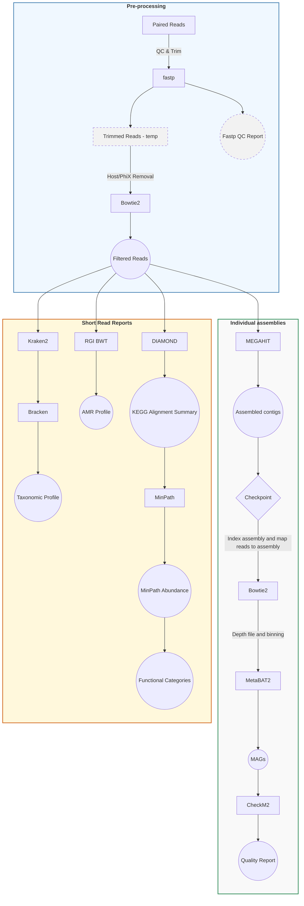

<!-- omit in toc -->

# METAGENOMICS SNAKEMAKE PIPELINE - USER GUIDE

---

<!-- omit in toc -->

## Table of Contents

- [METAGENOMICS SNAKEMAKE PIPELINE - USER GUIDE](#metagenomics-snakemake-pipeline---user-guide)
  - [Table of Contents](#table-of-contents)
  - [Overview](#overview)
    - [Workflow diagram](#workflow-diagram)
    - [Snakemake rules](#snakemake-rules)
      - [Module `preprocessing.smk`](#module-preprocessingsmk)
      - [Module `taxonomy.smk`](#module-taxonomysmk)
      - [Module `amr_short_reads.smk`](#module-amr_short_readssmk)
      - [Module `kegg.smk`](#module-keggsmk)
      - [Module `mag.smk`](#module-magsmk)
  - [Data](#data)
  - [Parameters](#parameters)
  - [Filters and exclusion lists](#filters-and-exclusion-lists)
  - [Usage](#usage)
    - [Pre-requisites](#pre-requisites)
      - [Software](#software)
      - [Databases](#databases)
    - [Setup Instructions](#setup-instructions)
      - [1. Installation](#1-installation)
      - [2. SLURM Profile](#2-slurm-profile)
        - [2.1. SLURM Profile Directory Structure](#21-slurm-profile-directory-structure)
        - [2.2. Profile Configuration](#22-profile-configuration)
      - [3. Configuration](#3-configuration)
        - [3.1. config/config.yaml](#31-configconfigyaml)
        - [3.2. Environment file](#32-environment-file)
        - [3.3. Sample list](#33-sample-list)
      - [4. Running the pipeline](#4-running-the-pipeline)
        - [4.1. Conda environments](#41-conda-environments)
        - [4.2. SLURM launcher](#42-slurm-launcher)
    - [Notes](#notes)
      - [Warnings](#warnings)
      - [Current issues](#current-issues)
      - [Resource usage](#resource-usage)
  - [Output](#output)
    - [Preprocessing Module (`preprocessing.smk`)](#preprocessing-module-preprocessingsmk)
    - [Taxonomy Module (`taxonomy.smk`)](#taxonomy-module-taxonomysmk)
    - [AMR Module (`amr_short_reads.smk`)](#amr-module-amr_short_readssmk)
    - [KEGG Module (`kegg.smk`)](#kegg-module-keggsmk)
    - [MAG Module (`mag.smk`)](#mag-module-magsmk)

---

## Overview

### Workflow diagram



### Snakemake rules

The pipeline is modularized, with each module located in the `metagenomics-snakemake/workflow/rules` directory. The modules are `preprocessing.smk`, `taxonomy.smk`, `amr_short_reads.smk`, `kegg.smk` and `mag.smk`.

#### Module `preprocessing.smk`

**Rule: `fastp_pe` *Quality Control & Trimming***

- **Purpose:** Performs adapter trimming, quality trimming, and filtering of paired-end reads.
- **Inputs:** `samplesheet.csv` defines sample IDs and corresponding read pairs.
- **Outputs:**

  - Trimmed paired reads: `sample_r1.fastq.gz`, `sample_r2.fastq.gz`
- **Notes:**

  - Parameters are defined in **`config/config.yaml`** for `fastp`.
  - These files are marked as temporary in the rule: `sample_u1.fastq.gz`, `sample_r2.fastq.gz`,`sample.fastp.html`, and `sample.fastp.json`. If these are required the temporary() flag on the output files in the rule can be removed.

**Rule: `bowtie2_align` *Alignment to Host/Phix***

- **Purpose:** Aligns trimmed reads to a user created reference (Host/PhiX) that has been indexed by Bowtie2 index.
- **Inputs:**

  - Trimmed paired reads: `*_r1.fastq.gz`, `*_r2.fastq.gz`
  - Bowtie2 index files with the suffix `.bt2`
- **Outputs:**

  - Sorted BAM file: `sample.bam`
- **Notes:**

  - Uses **default parameters** from `Bowtie2`.
  - This file is marked as temporary in the rule: `sample.bam`. If it is required the temporary() flag on the output file in the rule can be removed.

**Rule: `extract_unmapped_fastq` *Decontamination***

- **Purpose:** extracts the reads that did not align into paired-end FASTQ files depleted of host and PhiX reads.
- **Inputs:**
  - Sorted BAM file: `sample.bam`
- **Outputs:**
  - Clean read pairs: `sample_trimmed_clean_R1.fastq.gz`/`sample_trimmed_clean_R2.fastq.gz`

---

#### Module `taxonomy.smk`

**Rule: `kraken2` *Assign Taxonomy***

- **Purpose:** Assign taxonomy to the clean reads using a Kraken2-formatted GTDB.
- **Inputs:**
  - Clean read pairs: `sample_trimmed_clean_R1.fastq.gz`/`sample_trimmed_clean_R2.fastq.gz`
- **Outputs:**
  - Kraken and report for each sample: `sample.kraken` and `sample.report.txt`
- **Notes:**
  - Must use **Large compute node** with at least 600 GB. The custom database used here needed 840 GB.

**Rule: `bracken` *Abundance Estimation***

- **Purpose:** Refines Kraken classification to provide abundance estimates at the species, genus and phylum level for each sample.
- **Inputs:** Kraken report: `sample.report.txt`
- **Outputs:**
  - Bracken reports at:
    - Species level: `sample_bracken.species.report.txt`
    - Genus level: `sample_bracken.genus.report.txt`
    - Phylum level: `sample_bracken.phylum.report.txt`
    - Domain level: `sample_bracken.domain.report.txt`
- **Notes:**
  - Outputs are used as **intermediate files** for downstream rule: `combine_bracken_outputs`
  - Domain level file is needed for normalizing the reads at each taxon to the proportion of total prokaryotic reads (bacteria + archaea)
  - This rule is also making `sample.report_bracken_species.txt` at each level in the `kraken2` directory. At some point see if we can either place these into a directory called `reports` or have them cleaned up in the shell block.

**Rule: `combine_bracken_outputs` *Merging Abundance Tables***

- **Inputs:**
  - Bracken reports at:
    - Species level: `sample_bracken.species.report.txt`
    - Genus level: `sample_bracken.genus.report.txt`
    - Phylum level: `sample_bracken.phylum.report.txt`
    - Domain level: `sample_bracken.domain.report.txt`
- **Outputs:**
  - Combined abundance tables for:
    - Species level: `merged_abundance_species.txt`
    - Genus level: `merged_abundance_genus.txt`
    - Phylum level: `merged_abundance_phylum.txt`
    - Domain level: `merged_abundance_domain.txt`

**Rule: `clean_host_bracken` *Remove host taxonomy***

- **Purpose:** Remove the host taxa from Bracken output files and normalize using the total remaining read counts.
- **Inputs:**
  - Combined abundance tables for:
    - Species level: `merged_abundance_species.txt`
    - Genus level: `merged_abundance_genus.txt`
    - Phylum level: `merged_abundance_phylum.txt`
    - Domain level: `merged_abundance_domain.txt`
- **Outputs**
  - Corresponding cleaned abundance tables:
    - Species level: `merged_abundance_species_cleaned.txt`
    - Genus level: `merged_abundance_genus_cleaned.txt`
    - Phylum level: `merged_abundance_phylum_cleaned.txt`
    - Domain level: `merged_abundance_domain_cleaned.txt`
- **Notes:**
  - The script `clean_bracken_batch.py` contains the taxa filters that can be edited. Maybe these could be included in the config file so the script doesn't need to be modified.

**Rule: `bracken_recompute_fractions` *Relative abundance using only prokaryotic reads***

- **Purpose:** Recalculates the relative abundance by using the total prokaryotic reads (bacteria + archaea) from the Bracken domain table.
- **Inputs:**:
  - Corresponding cleaned abundance tables:
    - Species level: `merged_abundance_species_cleaned.txt`
    - Genus level: `merged_abundance_genus_cleaned.txt`
    - Phylum level: `merged_abundance_phylum_cleaned.txt`
    - Domain level: `merged_abundance_domain_cleaned.txt`
- **Outputs**
  - Combined Bracken tables with original and recalculated relative abundance
    - Species level: `bracken_cleaned_adjusted_species.txt`
    - Genus level: `bracken_cleaned_adjusted_genus.txt`
    - Phylum level: `bracken_cleaned_adjusted_phylum.txt`

**Rule: `bracken_extract` *Abundance Tables***

- **Purpose:** Generate tables for the raw counts, bracken default relative abundance and the adjusted relative abundance for each taxonomic level for all samples.
- **Inputs:**
  - Combined Bracken tables with original and recalculated relative abundance
    - Species level: `bracken_cleaned_adjusted_species.txt`
    - Genus level: `bracken_cleaned_adjusted_genus.txt`
    - Phylum level: `bracken_cleaned_adjusted_phylum.txt`
- **Outputs:**
  - Combined relative and raw abundance tables for
    - Species level: `bracken_species_raw_abundance.csv`, `bracken_species_rel_abundance_default.csv`, and `bracken_species_rel_abundance_adjusted.csv`
    - Genus level: `bracken_genus_raw_abundance.csv`, `bracken_genus_rel_abundance_default.csv`, and `bracken_genus_rel_abundance_adjusted.csv`
    - Phylum level: `bracken_phylum_raw_abundance.csv`, `bracken_phylum_rel_abundance_default.csv`, and `bracken_phylum_rel_abundance_adjusted.csv`
- **Notes:**
  - The three output files are made so that the user can decide if they would like to use the adjusted Bracken tables.

---

#### Module `amr_short_reads.smk`

**Rule: `rgi_reload_database` *Load CARD DB***

- **Purpose:** Checks if the CARD Database has been loaded from a common directory or user specific directory.
- **Inputs:**
  - `card_reference.fasta`
  - `card.json`
- **Outputs:**
  - Done marker `rgi_reload_db.done` to prevent the rule from re-running every time the pipeline is called.

**Rule: `symlink_rgi_card` *Symlink CARD to the working directory***

- **Purpose:** Prevent the re-loading of the CARD DB

**Rule: `rgi_bwt` *Antimicrobial Resistance Gene Profiling***

- **Purpose:** performs antimicrobial resistance gene profiling on the cleaned reads using *k*-mer alignment (kma).
- **Inputs:**

  - Clean read pairs: `sample_trimmed_clean_R1.fastq.gz`/`sample_trimmed_clean_R2.fastq.gz`
- **Outputs:**

  - `sample_paired.allele_mapping_data.txt`
  - `sample_paired.artifacts_mapping_stats.txt`
  - `sample_paired.gene_mapping_data.txt`
  - `sample_paired.overall_mapping_stats.txt`
  - `sample_paired.reference_mapping_stats.txt`
- **Notes:**

  - Uses default RGI BWT parameters.
  - For large sample files the large memory node may be required.
  - These files are marked as temporary in the rule: `sample_paired.allele_mapping_data.json`, `sample_paired.sorted.length_100.bam`, and `sample_paired.sorted.length_100.bam.bai`. If these are required the temporary() flag on the output files in the rule can be removed.

---

#### Module `kegg.smk`

**Rule: `merge_read_pairs` *Concatenate***

- **Purpose:** Concatenate read pairs for each sample.
- **Inputs:**
  - Clean read pairs: `sample_trimmed_clean_R1.fastq.gz`/`sample_trimmed_clean_R2.fastq.gz`
- **Outputs:**
  - Concatenated read pairs: `sample_merged.fastq.gz`

**Rule: `make_kegg_diamond_db` * Format database for DIAMOND***

- **Purpose:** Prepare the prokaryotic gene sequence file from the KEGG database for use with DIAMOND. If the DIAMOND-formatted database file (`prokaryotes.pep.dmnd`) already exists, the rule will skip database creation and only update or create the `prokaryotes_db_done.txt` marker file.
- **Inputs:**
  - prokaryotes fasta file from KEGG: `prokaryotes.pep.gz`
- **Outputs:**
  - DIAMOND formatted database: `prokaryotes.pep.dmnd` (If there was no DIAMOND formatted database)
  - Done marker: `prokaryotes_db_done.txt`

**Rule: `kegg_diamond` *DIAMOND Alignment***

- **Purpose:** Provide a tab-delimited text file that summarizes the alignment of sample reads against a DIAMOND formatted KEGG protein database.
- **Inputs:**
  - Concatenated read pairs: `sample_merged.fastq.gz`
  - DIAMOND formatted KEGG protein database: `prokaryotes.pep.dmnd`
    **Outputs:**
  - DIAMOND alignment file: `sample_diamond_output.m8`

**Rule: `count_reads` *Read Count***

- **Purpose:** Total reads for each concatenated read pairs.
- **Inputs:**
  - Concatenated read pairs: `sample_merged.fastq.gz`
    **Outputs:**
  - Text file with the read count: `sample_read_count.txt`

**Rule: `gene_ko_abundance` *KO-Annotated Abundance Table***

- **Purpose:** Generate a KEGG orthology table with gene counts normalized by reads per kilobase and counts per million.
- **Inputs:**
  - DIAMOND alignment file: `sample_diamond_output.m8`
  - Text file with the read count: `sample_read_count.txt`
  - KEGG Orthology assignments of genes `ko_genes.list`
- **Outputs:**
  - Abundance table: `sample_gene_ko_abundance.tsv`

**Rule: `make_ko_lists` *Generate KO list for MinPath***

- **Purpose:** Generate a KEGG orthology list from the KEGG orthology abundance table and format the list for MinPath.
- **Inputs:**
  - Abundance table: `sample_gene_ko_abundance.tsv`
- **Outputs:**
  - Raw extracted KEGG orthology ID list: `sample_ko_list_raw.txt`
  - MinPath formatted KEGG orthology ID list: `sample_ko_list_fixed.txt`

**Rule: `minpath` *Run MinPath***

- **Purpose:** Infer the minimal set of pathway presence to explain the KEGG orthology ID list by running MinPath.
- **Inputs:**

  - MinPath formatted KEGG orthology ID list: `sample_ko_list_fixed.txt`
- **Outputs:**

  - List of predicted pathways in the sample: `sample_minpath_output.txt`
- **Notes:**

  - This rule runs the script MinPath.py from MinPath version 1.6, which is available on the [MinPath github](https://github.com/mgtools/MinPath).
  - The MinPath program directory must be added into the scripts folder `workflow/scripts/MinPath`.
  - The file permission for glpsol must be changed by running

    ```bash
    chmod +x /abs/path/to/the/snakemake/workflow/scripts/MinPath/glpk-4.6/examples/glpsol
    ```

**Rule: `aggregate_minpath_pathways` *MinPath Abundance***

- **Purpose:** For only MinPath confirmed pathways produce a pathway-level abundance table.
- **Inputs:**
  - List of predicted pathways in the sample: `sample_minpath_output.txt`
  - Abundance table: `sample_gene_ko_abundance.tsv`
  - KEGG orthology assignments of pathways: `ko_pathway.list`
- **Outputs:**
  - Table of abundances pathways confirmed by MinPath: `sample_aggregated_minpath.tsv`

**Rule: `kegg_category_mappings` *Functional Categories***

- **Purpose:** To summarize the MinPath-confirmed pathways into higher-level categories
- **Inputs:**

  - Table of abundances pathways confirmed by MinPath: `sample_aggregated_minpath.tsv`
  - BRITE hierarchy file from the KEGG database: `ko00001.keg`
- **Outputs:**

  - Table of MinPath-confirmed pathways into higher-level categories: `sample_ko_pathway_abundance_with_category.tsv`
    **Rule: `kegg_category_sampleID` *Add SampleID column***
- **Purpose:** A sampleID column is added, so that tables can be combined.
- **Inputs:**

  - Table of MinPath-confirmed pathways into higher-level categories: `sample_ko_pathway_abundance_with_category.tsv`
- **Outputs:**

  - Table of MinPath-confirmed pathways into higher-level categories with SampleID: `sample_ko_pathway_abundance_with_category_sampleID.tsv"`

**Rule: `combine_kegg_category_tables` *Combine tables***

- **Purpose:** Combine all samples into one table
- **Inputs:**
  - Table of MinPath-confirmed pathways into higher-level categories with SampleID: `sample_ko_pathway_abundance_with_category_sampleID.tsv"`
- **Outputs:**
  - Combined table of all samples for higher-level categories: `combined_ko_pathway_abundance_with_category.tsv`

**Rule: `filter_combined_kegg_table` *Remove non-prokaryotic pathways***

- **Purpose:** Remove higher level pathways from the table based an exclusion list.
- **Inputs:**

  - Combined table of all samples for higher-level categories: `combined_ko_pathway_abundance_with_category.tsv`
  - List of pathways to remove: `KEGG_BRITE_pathway_exclusion_file.txt`
- **Outputs:**

  - Combined table with non-prokaryotic pathways removed: `combined_ko_pathway_abundance_with_category_filtered.tsv`
- **Notes:**

  - Exclusion list can be edited and is located in `code/metagenomics-snakemake/resources`.

#### Module `mag.smk`

**Rule: `megahit_assembly` *Assembly***

- **Purpose:** Assemble reads into contigs and retain contigs over a user set length.
- **Inputs:**
  - Clean read pairs: `sample_trimmed_clean_R1.fastq.gz`/`sample_trimmed_clean_R2.fastq.gz`
- **Outputs:**
  - Assembly for each sample: `sample_assembly.contigs.fa`

**Checkpoint: `filter_nonempty_assemblies` *Create new sample list***

- **Purpose:** Remove poor samples that do not assemble from further steps in rules that use the assembly files as input.
- **Inputs:**
  - Assembly for each sample: `sample_assembly.contigs.fa`
- **Outputs:**
  - Sample list: `samples_with_contigs.txt`

**Rule: `index_assembly` *Bowtie2 index***

- **Purpose:** Create a Bowtie2 index for each sample assembly.
- **Inputs:**
  - Assembly for each sample: `sample_assembly.contigs.fa`
- **Outputs:**
  - Bowtie2 index: `sample_assembly.1.bt2`, `sample_assembly.2.bt2`, `sample_assembly.3.bt2`, `sample_assembly.4.bt2`, `sample_assembly.rev.1.bt2`, and `sample_assembly.rev.2.bt2`

**Rule: `map_reads_to_assembly` *Map paired reads back to assembly***

- **Purpose:** Map each samples paired reads back to that sample assembly.
- **Inputs:**
  - Clean read pairs: `sample_trimmed_clean_R1.fastq.gz`/`sample_trimmed_clean_R2.fastq.gz`
  - Bowtie2 index: `sample_assembly.1.bt2`, `sample_assembly.2.bt2`, `sample_assembly.3.bt2`, `sample_assembly.4.bt2`, `sample_assembly.rev.1.bt2`, and `sample_assembly.rev.2.bt2`
- **Outputs:**
  - Alignment map: `sample.bam`

**Rule: `sample_depth_file` *Depth file for binning**

- **Purpose:** Generate a depth file that contains the contig depth and contig variance. This file is used by MetaBAT for binning.
- **Inputs:**
  - Alignment map: `sample.bam`
- **Outputs:**
  - Depth file: `sample_depth.txt`

**Rule: `metabat2_binning` *Bin contigs**

- **Purpose:** MetaBAT2 will bin contigs into potential MAGs.
- **Inputs:**

  - Assembly for each sample: `sample_assembly.contigs.fa`
  - Depth file: `sample_depth.txt`
- **Outputs:**

  - Directory for binned contigs: `SAMPLE_ASSEMBLY/metabat2/sample/bins`
  - Directory for unbinned contigs: `SAMPLE_ASSEMBLY/metabat2/sample/unbinned`
- **Notes:**

  - The `bins` directory contains: `sample.bin.BinInfo.txt` and bins with the naming convention `sample.bin[1-9].fa` where [1-9] is a integer starting from 1 to the last bin number for that sample.
  - The `unbinned` directory contains: `sample.bin.unbinned.fa`, `sample.bin.tooShort.fa`, and `sample.binlowDepth.fa`

**Rule: `checkm2_bins` *Completeness and contamination**

- **Purpose:** Check the completeness and contamination of the bins/potential MAGs.
- **Inputs:**

  - Directory for binned contigs: `SAMPLE_ASSEMBLY/metabat2/sample/bins`
  - CheckM2 database: `uniref100.KO.1.dmnd`
- **Outputs:**

  - CheckM2 directory: `SAMPLE_ASSEMBLY/metabat2/sample/checkm2`
  - Quality report: `quality_report.tsv`
- **Notes:**

  - The `checkm2` directory contains: `quality_report.tsv`.

---

## Data

The raw input data must be in the form of paired-end FASTQ files generated from metagenomics experiments.

- Each sample should include both forward (R1) and reverse (R2) read files.
- The path to the `PROJECT_ROOT` needs to be specified in the `.evn` file
- Raw fastq file directory must be specified in the `config.yaml` file.

**Example:**

- **Dataset 1 Filename**: Sequencing reads (FASTQ) from beef cattle rumen samples are provided for three samples: `LLC42Nov10C`, `LLC42Sep06CR`, and `LLC82Sep06GR`.

---

## Parameters

The `config/config.yaml` file contains the editable pipeline parameters, thread allocation for rules with more than one core, and the relative file paths for input and output. The prefix of the absolute file path must go in `.env`. Most tools in the pipeline have default parameters. The tools with parameters different from default or that can be edited in the `config/config.yaml` file are listed below.

| Parameter                                                          | Value                                                                                                                                                                                                                                                                                 |
| -------------------------------------------------------------------- | --------------------------------------------------------------------------------------------------------------------------------------------------------------------------------------------------------------------------------------------------------------------------------------- |
| *samplesheet.csv*                                                  | *The samplesheet is described here: [Sample list](#33-sample-list)*                                                                                                                                                                                                                   |
| *fastp: cut_tail*                                                  | *If true, trim low quality bases from the 3′ end until a base meets or exceeds the cut_mean_quality threshold. If false,disabled.*                                                                                                                                                   |
| *fastp: cut_front*                                                 | *If true, trim low quality bases from the 5′ end until a base meets or exceeds the cut_mean_quality threshold. If false,disabled.*                                                                                                                                                   |
| *fastp: cut_mean_quality*                                          | *A positive integer specifying the minimum average quality score threshold for sliding window trimming.*                                                                                                                                                                              |
| *fastp: cut_window_size*                                           | *A positive integer specifying the sliding window size in bp when using cut_mean_quality.*                                                                                                                                                                                            |
| *fastp: qualified_quality_phred*                                   | *A positive integer specifying the minimum Phred score that a base needs to be considered qualified*.                                                                                                                                                                                 |
| *fastp: detect_adapter_for_pe*                                     | *If true, auto adapter detection. If false,disabled.*                                                                                                                                                                                                                                 |
| *fastp: length_required*                                           | *Reads shorter then this positive integer will be discarded.*                                                                                                                                                                                                                         |
| *kraken2: conf_threshold*                                          | *Interval between 0 and 1. Higher values require more of a read’s k-mers to match the same taxon before it is classified, increasing precision but reducing sensitivity.*                                                                                                            |
| *bracken: readlen*                                                 | *Specify the read length (in base pairs) of your sequencing data.*                                                                                                                                                                                                                    |
| *bracken: threshold_species,threshold_genus, and threshold_phylum* | *specifies the minimum number of reads required for a classification at the specified rank. Any classifications with less than the specified threshold will not receive additional reads from higher taxonomy levels when distributing reads for abundance estimation. Default is 10* |
| *bracken: threshold_domain*                                        | *specifies the minimum number of reads required for a classification. Set to 0 in this workflow to capture all the reads*                                                                                                                                                             |
| *kegg_diamond: sensitivity*                                        | *Sensitivity modes are described in the [DIAMOND github wiki](https://github.com/bbuchfink/diamond/wiki/3.-Command-line-options).*                                                                                                                                                    |
| *kegg_diamond: max_target_num*                                     | *--max-target-seqs/-k is the max number of target sequences per alignment to report. Set at 1 in this pipeline to only keep the best hit. Default is 25.*                                                                                                                             |
| *kegg_diamond: out_file_format*                                    | *--outfmt is the output file format. Set as 6 qseqid sseqid slen pident length mismatch gapopen qstart qend sstart send evalue bitscore in this pipeline.*                                                                                                                            |
| *megahit_assembly: min_contig_length*                              | *--min-contig-len is the minimum length contigs must be to be outputted. Set at 1000 bp in this pipeline. Default is 200 bp.*                                                                                                                                                         |
| *megahit_assembly: out_prefix*                                     | *--out-prefix is the prefix of the outfile in the scratch directory. When it is moved from the scratch to working directory it will be renamed to `sample__assembly.contigs.fa`. In the pipeline this is set to final.*                                                               |
| *map_reads_to_assembly: max_mem_per_thread*                        | *Maximum memory per node that `Samtools` can use during sorting. In this pipeline it is set at 4G*                                                                                                                                                                                    |
| *metabat2_binning: min_contig_length*                              | *The minimum length a contig must be to be considered for binning. Set to 2000 bp in this pipeline. Default is 2500 bp.*                                                                                                                                                              |

## Filters and exclusion lists

**SEE What can be put in confug file**

|Module | Rule | File | Description|
|------|------|------|-------------|
|taxonomy.smk| clean_host_bracken | workflow/scripts/clean_bracken_batch.py| This script removes the host taxa from Bracken output files (as defined in the TAXA_FILTERS). Then the samples are re-normalized using the total remaining read counts (recomputing *_frac columns from *_num columns). It is clearly indicated in the script where to edit the filter lists.|
|kegg.smk| filter_combined_kegg_table | resources/KEGG_BRITE_pathway_exclusion_file.txt| The exclusion list removes non-prokaryotic pathways from the analysis. This tab-delimited file contains two columns: "Pathway_ID" and "Pathway_Name". The "Pathway_ID" is a four-digit string (e.g., 00073, 05418) that corresponds to the [KEGG Pathway Map](https://www.genome.jp/kegg-bin/get_htext?br08901.keg).|

---

## Usage

### Pre-requisites

#### Software

- Snakemake version 9.9.0
- Snakemake-executor-plugin-slurm
- MinPath version 1.6
  - The MinPath software is available on the [MinPath github](https://github.com/mgtools/MinPath/blob/master/MinPath.py)
  - The repository needs to be placed in the `project-snakemake/workflow/scripts` directory
  - The file permissions for `project-snakemake/workflow/scripts/MinPath/glpk-4.6/examples/glpsol` need to be changed to executable:

```bash
chmod +x absolute/path/code/metagenomics-snakemake/workflow/scripts/MinPath/glpk-4.6/examples/glpsol
```

#### Databases

- **Bowtie2** Bowtie2 uses an index of reference sequences to align reads. This index must be created before running the pipeline. The index files (with the `.bt2` extension) must be located in the directory you specify in the `config/config.yaml` file. Make sure to update the prefix of these files in the `config.yaml` file.

  - In `resources/bowtie2_index` there is a `README.md` file that details where the index was copied from.
- **Kraken2** Kraken2 requires a Kraken2-formatted GTDB database.

  - Kraken2-formatted GTDB release 226 built with the following scripts provided by Jean-Simon Brouard.
  - The Bracken database was built specifying a read length of 150 bp and a kmer length of 35 (default for Kraken2)
  - As per Gihawi et al, 2023, Kraken2 can assign host reads to bacteria in low microbial biomass samples if the host genomes are not included in the Kraken2 database. Therefore, this version of the GTDB release 226 was formatted for Kraken2 with the inclusion of four host genomes: Bos indicus (GCF_029378745.1), Bos taurus (GCF_002263795.3), Homo sapiens (GCF_000001405.40), and Sus scrofa (GCF_000003025.6).

  > **See:** Gihawi A, Ge Y, Lu J, Puiu D, Xu A, Cooper CS, Brewer DS, Pertea M, Salzberg SL. Major data analysis errors invalidate cancer microbiome findings. mBio. 2023 Oct 31;14(5):e0160723. doi: 10.1128/mbio.01607-23. Epub 2023 Oct 9.
  >
- **RGI BWT/CARD**  RGI BWT requires the CARD (Comprehensive Antibiotic Resistance Database) database. The version tested in this pipeline was 4.0.1. The database can be located on a common drive or in your working directory.
  Instructions for installing the CARD database are available on [CARD RGI github](https://github.com/arpcard/rgi/blob/master/docs/rgi_bwt.rst).
  Steps copied from the RGI documentation:

  **Download CARD data:**

  ```bash
  wget https://card.mcmaster.ca/latest/data
  tar -xvf data ./card.json

  rgi load --card_json /path/to/card.json --local

  rgi card_annotation -i /path/to/card.json > card_annotation.log 2>&1

  rgi load -i /path/to/card.json --card_annotation card_database_v3.0.1.fasta --local
  ```

  **Note:** the files after loading and annotating card must be called `card.json` and `card_reference.fasta`
- **KEGG** The functional pathway analysis requires the [KEGG database](https://www.genome.jp/kegg/). Below are the files required for the analysis:

  - KEGG protein database: `prokaryotes.pep`
  - KEGG Orthology assignments of genes `ko_genes.list`
  - KEGG Orthology assignments of pathways `ko_pathway.list`
  - KEGG BRITE hierarchy file `ko00001.keg`

### Setup Instructions

#### 1. Installation

Clone the repository into the directory where you want to run the metagenomics Snakemake pipeline.
**Note:** This location must be on an HPC (High Performance Computing) cluster with access to a high-memory node (at least 600 GB RAM) and sufficient storage for all metagenomics analyses.

```bash
cd /path/to/code/directory
git clone <repository-url>
```

#### 2. SLURM Profile

##### 2.1. SLURM Profile Directory Structure

```bash
metagenomics_pipeline/
├── Workflow/
|   └── Rules
|          └──preprocessing.smk
|          └── ...
|   └── Snakefile
│   └── env
|        └── fastp.yaml
|        └── bowtie2.yaml
|        └── ...
├── config/
│   └── config.yaml             ← workflow config
|   └── samples.txt
├── profiles/
│   └── slurm/
│       └── config.yaml         ← profile config
├── run_snakemake.sh            ← your SLURM launcher
├── .env
└── ...                 
```

##### 2.2. Profile Configuration

The SLURM execution settings must be configured in `profiles/slurm/config.yaml.` An editable example is provided in this repository at `profiles/slurm/example_config.yaml` After editing, rename this file to `config.yaml` so that Snakemake recognizes it.

- This configuration file defines resource defaults, cluster submission commands, and job script templates for Snakemake. It should be customized for each specific HPC environment.
- Remember to update the rerun-triggers: [input, params, software-env] setting whenever the pipeline is modified.
- Pre-rule resource allocations should also be adjusted according to the size and number of input samples for each rule.

**Example for profiles/slurm/config.yaml:**

```bash
### How Snakemake assigns resources to rules
cores: 60
jobs: 10 
latency-wait: 60 
rerun-incomplete: true
retries: 2            
max-jobs-per-second: 2 
executor: slurm

# Prevent rerunning jobs just for Snakefile edits
## flags available [input, mtime, params, software-env, code, resources, none]
rerun-triggers: [input, params, software-env]

### Env Vars ###
envvars:
  TMPDIR: "/path/to/scratch/${USER}/tmpdir"

default-resources:
  - slurm_account=<ACCOUNT_NAME>
  - slurm_partition=<PARTITION_NAME>
  - slurm_cluster=<CLUSTER_NAME>
  - slurm_qos=<QOS_LEVEL>      # e.g., 'low' if jobs are held in queue for long
  - runtime=<RUNTIME_MINUTES>  # e.g., 60
  - mem_mb=<MEMORY_MB>         # e.g., 4000

### Env modules ###
# use-envmodules: false 

### Conda ###
use-conda: true
conda-frontend: mamba   

### Resource scopes ###
set-resource-scopes:
  cores: local 

# Reusable Slurm Blocks (anchors)
# Standard partition/account/cluster used by most rules
_slurm_std: &slurm_std
  slurm_partition: <PARTITION_NAME>
  slurm_account: <ACCOUNT_NAME_standard> # e.g., standard, large memory 
  slurm_cluster: <CLUSTER_NAME>

# Large memory partition/account/cluster used by some rules
_slurm_large: &slurm_large
  slurm_partition: <PARTITION_NAME>
  slurm_account: <ACCOUNT_NAME_large> # e.g., standard, large memory 
  slurm_cluster: <CLUSTER_NAME>

## Per rule resources
set-resources:
  fastp_pe:
    <<: *slurm_std
    mem_mb: 4000
    runtime: 40

  kraken2:
    <<: *slurm_large
    mem_mb: 600000
    runtime: 30
```

#### 3. Configuration

The pipeline requires the following configuration files: `config.yaml`, `.env`, and `samples.txt`.

##### 3.1. config/config.yaml

The `config.yaml` file must be located in the `config` directory, which resides in the main Snakemake working directory. This file specifies crucial settings, including:

- Path to the `samples.txt`
- Input and output directories
- File paths to required databases
- Threads for each rule
- Parameters for software see the [Parameters](#parameters) section **NEED TO UPDATE RULES**

**Note:**
You must edit `config.yaml` **before** running the pipeline to ensure all paths are correctly set.
For best practice, use database paths that are in common locations to all users on the HPC.

##### 3.2. Environment file

This file must contain paths to the **PROJECT ROOT**,  **USER SCRATCH**, and **RGI COMMON DATABASE**. Follow these instructions:

- In the main Snakemake directory (where you are running Snakemake from)

```bash
touch .env
```

- Open the .env file and add

```bash
 PROJECT_ROOT = path/to/project/root
 TMPDIR = path/to/temp/on/cluster 
 RGI_CARD = path/to/card.json and card_reference.fasta
```

##### 3.3. Sample list

`samplesheet.csv` Has the following column names: "sample","fastq_1","fastq_2". For the column 'sample" use the sampleID for the read pair, and for "fastq_1","fastq_2" have the names of the read1 and read2 files as they appear in the raw fastq files directory. The file location of the `samplesheet.csv` must be`config/samplesheet.csv`.

**Example `samplesheet.csv`:**
sample,fastq_1,fastq_2
test_LLC82Nov10GR,test_LLC82Nov10GR_r1.fastq.gz,test_LLC82Nov10GR_r2.fastq.gz
test_LLC82Sep06GR,test_LLC82Sep06GR_r1.fastq.gz,test_LLC82Sep06GR_r2.fastq.gz

#### 4. Running the pipeline

Complete steps **1.Installation**, **2.SLURM Profile**, and **3.Configuration** and ensure database paths have been added to the 'config/config.yaml'. Required databases are described in the [Pre-requisites](#pre-requisites).

##### 4.1. Conda environments

Snakemake can automatically create and load Conda environments for each rule in your workflow. Check to see that you have the following configuration files in the `workflow/envs` directory:

- `bedtools.yaml`
- `bowtie2.yaml`
- `checkm2.yaml`
- `diamond.yaml`
- `fastp.yaml`
- `kraken2.yaml`
- `megahit.yaml`
- `metabat2.yaml`
- `minpath.yaml`
- `python3.yaml`
- `rgi.yaml`

Load the required conda environments for the pipeline with:

```bash
snakemake --use-conda \
  --conda-create-envs-only \
  --conda-prefix path/to/common/lab/folder/conda/metatranscriptomics-snakemake-conda
```

##### 4.2. SLURM launcher

This is the script you use to submit the Snakemake pipeline to SLURM.

- Defines resources for the job scheduler
- Activates the Snakemake environment
- Submits and manages jobs using the Snakemake `--profile` configuration `(profiles/slurm/)`.
- Contains any additional Snakemake arguments (e.g.., `--unlock`, `--dry-run`, `--rerun-incomplete`)
- For a snakemake report with runtime and software versions use --report path/to/metatranscriptomics_report.html after the pipeline has completed

```bash
#!/bin/bash
#SBATCH --job-name=run_snakemake.sh
#SBATCH --output=run_snakemake_%j.out 
#SBATCH --error=run_snakemake_%j.err 
#SBATCH --cluster=<CLUSTER_NAME>
#SBATCH --partition=<PARTITION_NAME>
#SBATCH --account=<ACCOUNT_NAME>
#SBATCH --mem=<MEMORY_MB>         # e.g., 2000
#SBATCH --time=<HH:MM:SS>         # Must be long enough for completion of workflow 

source path/to/source/conda/common/miniforge/miniforge3/etc/profile.d/conda.sh

conda activate snakemake_env
export PATH="$PWD/bin:$PATH"

  snakemake \
    --profile absolute/path/to/profiles/slurm \
    --configfile absolute/path/to/config/config.yaml \
    --conda-prefix absolute/path/to/common/conda/metatranscriptomics-snakemake-conda \
    --printshellcmds \
    --keep-going 
```

### Notes

- The `profile/slurm/config.yaml` has been configured for our SLURM cluster. This will need to be configured for the cluster you are using.
- temp folder is set to `path/to/scratch/${USER}/tmpdir`
- A Snakemake report can be generated from the head node with `snakemake --report path/to/report/report_name.html`

#### Warnings

- The conda environments will not be created if the conda configuration is `conda config --set channel_priority strict`.
- Set conda to `conda config --set channel_priority flexible` or use libmamba.
- The `.env` file can overwrite the `config/config.yaml` file

#### Current issues

None.

#### Resource usage

- Kraken2: Large compute node with 840 GB.
- Generate Snakemake report to track walltime

## Output

### Preprocessing Module (`preprocessing.smk`)


| **Output Type**      | **Filename**                                                                                 | **Description**                                                                                                                                                                                                                                                     |
| ---------------------- | ---------------------------------------------------------------------------------------------- | --------------------------------------------------------------------------------------------------------------------------------------------------------------------------------------------------------------------------------------------------------------------- |
| Trimmed paired reads | temp(`sample_r1.fastq.gz`), temp(`sample_r2.fastq.gz`)                                       | Adapter and quality trimmed paired-end reads from`fastp_pe` rule. These are marked temporary in the rule and will be removed once they are not needed by the pipeline. Can easily be changed by opening `workflow/rules/preprocessing.smk` and removing the temp(). |
| Fastp Report         | temp(`sample.fastp.html`), temp(`sample.fastp.json`)                                         | Quality score statistics before and after processing.These are marked temporary in the rule and will be removed once they are not needed by the pipeline. Can easily be changed by opening`workflow/rules/preprocessing.smk` and removing the temp().               |
| Sorted BAM file      | `sample.bam`                                                                                 | Aligned reads to Host/PhiX reference using Bowtie2 (`bowtie2_align` rule).                                                                                                                                                                                          |
| Clean read pairs     | protected(`sample_trimmed_clean_R1.fastq.gz`), protected(`sample_trimmed_clean_R2.fastq.gz`) | Host- and PhiX-depleted reads from`extract_unmapped_fastq`. These file are marked protected.                                                                                                                                                                        |

---

### Taxonomy Module (`taxonomy.smk`)


| **Output Type**                             | **Filename**                                                                                                                                               | **Description**                                             |
| --------------------------------------------- | ------------------------------------------------------------------------------------------------------------------------------------------------------------ | ------------------------------------------------------------- |
| Kraken output                               | `sample.kraken`, `sample.report.txt`                                                                                                                       | Kraken2 taxonomy assignment results.                        |
| Bracken species/genus/phylum/domain reports | `sample_bracken.species.report.txt`, `sample_bracken.genus.report.txt`, `sample_bracken.phylum.report.txt`, `sample_bracken.domain.report.txt`             | Refined abundance estimates at multiple taxonomic levels.   |
| Combined abundance tables                   | `merged_abundance_species.txt`, `merged_abundance_genus.txt`, `merged_abundance_phylum.txt`, `merged_abundance_domain.txt`                                 | Merged Bracken abundance tables across samples.             |
| Cleaned abundance tables                    | `merged_abundance_species_cleaned.txt`, `merged_abundance_genus_cleaned.txt`, `merged_abundance_phylum_cleaned.txt`, `merged_abundance_domain_cleaned.txt` | Host taxa removed and normalized Bracken outputs.           |
| Adjusted Bracken tables                     | `bracken_cleaned_adjusted_species.txt`, `bracken_cleaned_adjusted_genus.txt`, `bracken_cleaned_adjusted_phylum.txt`                                        | Relative abundance recalculated for prokaryotic reads only. |
| Combined relative and raw abundance tables  | `bracken_*_raw_abundance.csv`, `bracken_*_rel_abundance_default.csv`, `bracken_*_rel_abundance_adjusted.csv`                                               | Consolidated Bracken outputs (raw, default, adjusted).      |

---

### AMR Module (`amr_short_reads.smk`)


| **Output Type** | **Filename**                                                                         | **Description**                                                |
| ----------------- | -------------------------------------------------------------------------------------- | ---------------------------------------------------------------- |
| CARD DB marker  | `rgi_reload_db.done`                                                                 | Confirms CARD database has been loaded (prevents reloading).   |
| RGI BWT outputs | `sample_paired.*.txt` (e.g., `allele_mapping_data.txt`, `overall_mapping_stats.txt`) | Antimicrobial resistance gene profiling outputs using RGI BWT. |

---

### KEGG Module (`kegg.smk`)


| **Output Type**              | **Filename**                                         | **Description**                                                                                                                          |
| ------------------------------ | ------------------------------------------------------ | ------------------------------------------------------------------------------------------------------------------------------------------ |
| Concatenated read pairs      | `sample_merged.fastq.gz`                             | Merged clean reads for KEGG processing.                                                                                                  |
| DIAMOND formatted database   | `prokaryotes.pep.dmnd`                               | The KEGG database file`prokaryotes.pep.gz` is used to create the DIAMOND formatted database only if the database does not already exists |
| DIAMOND database done marker | `prokaryotes_db_done.txt`                            | Confirms that`prokaryotes.pep.dmnd` exists                                                                                               |
| DIAMOND alignment output     | `sample_diamond_output.m8`                           | Alignment summary of reads vs KEGG protein database.                                                                                     |
| Read count                   | `sample_read_count.txt`                              | Total read count for concatenated read pairs.                                                                                            |
| KEGG gene abundance table    | `sample_gene_ko_abundance.tsv`                       | KEGG orthology gene abundance normalized by RPKM and CPM.                                                                                |
| KEGG KO lists                | `sample_ko_list_raw.txt`, `sample_ko_list_fixed.txt` | KEGG orthology ID lists for MinPath input.                                                                                               |
| MinPath output               | `sample_minpath_output.txt`                          | Predicted minimal set of KEGG pathways (MinPath).                                                                                        |
| MinPath pathway abundance    | `sample_aggregated_minpath.tsv`                      | Abundance table for MinPath-confirmed pathways.                                                                                          |
| KEGG category table          | `sample_ko_pathway_abundance_with_category.tsv`,`sample_ko_pathway_abundance_with_category_sampleID.tsv`, `combined_ko_pathway_abundance_with_category.tsv`, and  `combined_ko_pathway_abundance_with_category_filtered.tsv`     | Pathways summarized into higher-level KEGG BRITE categories for each sample and a combined table of all the pathways with and without an exclusion pathway filter.                                                                             |

---

### MAG Module (`mag.smk`)


| **Output Type**        | **Filename**                                                 | **Description**                                         |
| ------------------------ | -------------------------------------------------------------- | --------------------------------------------------------- |
| Assembly               | `sample_assembly.contigs.fa`                                 | Assembled contigs for each sample (`megahit_assembly`). |
| Filtered sample list   | `samples_with_contigs.txt`                                   | List of samples with successful assemblies.             |
| Bowtie2 index          | `sample_assembly.[1-4].bt2`, `sample_assembly.rev.[1-2].bt2` | Bowtie2 index files for each assembly.                  |
| Assembly alignment map | `sample.bam`                                                 | Reads mapped back to assembly.                          |
| Depth file             | `sample_depth.txt`                                           | Contig depth and variance for binning with MetaBAT2.    |
| Binning outputs        | `SAMPLE_ASSEMBLY/metabat2/sample/bins`, `.../unbinned`       | Binned and unbinned contigs from MetaBAT2.              |
| CheckM2 quality report | `quality_report.tsv`                                         | Completeness and contamination metrics for bins/MAGs.   |

---
