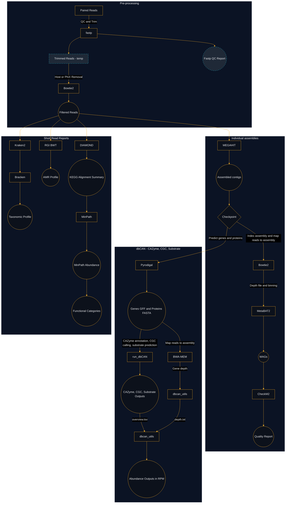

<!-- omit in toc -->

# METAGENOMICS SNAKEMAKE PIPELINE - USER GUIDE

---

<!-- omit in toc -->

## Table of Contents

- [METAGENOMICS SNAKEMAKE PIPELINE - USER GUIDE](#metagenomics-snakemake-pipeline---user-guide)
  - [Table of Contents](#table-of-contents)
  - [Overview](#overview)
    - [Workflow diagram](#workflow-diagram)
    - [Snakemake rules](#snakemake-rules)
      - [Module `preprocessing.smk`](#module-preprocessingsmk)
      - [Module `taxonomy.smk`](#module-taxonomysmk)
      - [Module `amr_short_reads.smk`](#module-amr_short_readssmk)
      - [Module `kegg.smk`](#module-keggsmk)
      - [Module `mag.smk`](#module-magsmk)
      - [Module `db_can.smk`](#module-db_cansmk)
  - [Data](#data)
  - [Parameters](#parameters)
  - [Filters and exclusion lists](#filters-and-exclusion-lists)
  - [Usage](#usage)
    - [Pre-requisites](#pre-requisites)
      - [Software](#software)
      - [Databases](#databases)
    - [Setup Instructions](#setup-instructions)
      - [1. Installation](#1-installation)
      - [2. SLURM Profile](#2-slurm-profile)
        - [2.1. SLURM Profile Directory Structure](#21-slurm-profile-directory-structure)
        - [2.2. Profile Configuration](#22-profile-configuration)
      - [3. Configuration](#3-configuration)
        - [3.1. config/config.yaml](#31-configconfigyaml)
        - [3.2. Environment file](#32-environment-file)
        - [3.3. Sample list](#33-sample-list)
      - [4. Running the pipeline](#4-running-the-pipeline)
        - [4.1. Conda environments](#41-conda-environments)
        - [4.2. SLURM launcher](#42-slurm-launcher)
    - [Notes](#notes)
      - [Warnings](#warnings)
      - [Current issues](#current-issues)
      - [Resource usage](#resource-usage)
  - [Output](#output)
    - [Preprocessing Module (`preprocessing.smk`)](#preprocessing-module-preprocessingsmk)
    - [Taxonomy Module (`taxonomy.smk`)](#taxonomy-module-taxonomysmk)
    - [AMR Module (`amr_short_reads.smk`)](#amr-module-amr_short_readssmk)
    - [KEGG Module (`kegg.smk`)](#kegg-module-keggsmk)
    - [MAG Module (`mag.smk`)](#mag-module-magsmk)
    - [dbCAN Module (`db_can.smk`)](#dbcan-module-db_cansmk)

---

## Overview

The **Metagenomics Snakemake pipeline** is a reproducible workflow for paired-end Illumina shotgun metagenomic reads from high-biomass, host-associated samples. It performs read-quality control, trimming, filtering and removal of host and PhiX sequences before conducting selected downstream analyses.

The workflow rules are organized into modules. Users can run the complete workflow or selected analysis targets when the required upstream files and reference databases are available. Most downstream modules require host-depleted paired reads. The CAZyme module also requires the corresponding per-sample assemblies.

Depending on the modules selected, the pipeline produces taxonomic abundance tables, antimicrobial resistance gene profiles, KEGG functional pathway profiles, metagenome-assembled genomes (MAGs) and carbohydrate-active enzyme (CAZyme) annotations and abundance tables.

Reference databases are supplied separately and are not distributed with the pipeline. 

### Workflow diagram


```mermaid
---
config:
  theme: base
  themeVariables:
    darkMode: true
    background: '#0c111b'
    mainBkg: '#0c111b'
    textColor: '#e5e7eb'
    titleColor: '#f3f4f6'

    primaryColor: '#1f2937'
    primaryTextColor: '#e5e7eb'
    primaryBorderColor: '#F8B229'

    secondaryColor: '#111827'
    secondaryBorderColor: '#2d3748'

    tertiaryColor: '#0b1324'
    tertiaryBorderColor: '#374151'

    lineColor: '#F8B229'
---
flowchart TD

    subgraph PREPROC ["Pre-processing"]
        direction TB
        A[Paired Reads] -->|QC and Trim| B[fastp]
        B --> C[Trimmed Reads - temp]
        B --> L1((Fastp QC Report))
        C -->|Host or PhiX Removal| D[Bowtie2]
        D --> E((Filtered Reads))
    end

    subgraph MAGS ["Individual assemblies"]
        direction TB
        E --> F[MEGAHIT]
        F --> G((Assembled contigs))
        G --> I{Checkpoint}
        I -->|Index assembly and map reads to assembly | J[Bowtie2]
        J -->|Depth file and binning| K[MetaBAT2]
        K --> L2((MAGs))
        L2 --> M[CheckM2]
        M --> N((Quality Report))
    end

    subgraph DBCAN ["dbCAN - CAZyme, CGC, Substrate"]
      direction TB
      I -->|Predict genes and proteins| D1[Pyrodigal]
      D1 --> D2((Genes GFF and Proteins FASTA))

      D2 -->|CAZyme annotation, CGC calling, substrate prediction| D3[run_dbCAN]
      D3 --> D4((CAZyme, CGC, Substrate Outputs))

      D2 -->|Map reads to assembly| D5[BWA-MEM]
      D5 -->|Gene depth| D6[dbcan_utils]
      D4 -->|overview.tsv| D7[dbcan_utils]
      D6 -->|depth.txt| D7
      D7 --> D8((Abundance Outputs in RPM))
  end

    subgraph QC_REPORTS ["Short Read Reports"]
        direction TB
        E --> P[Kraken2]
        P --> Q[Bracken]
        Q --> S((Taxonomic Profile))

        E --> W1[RGI BWT]
        W1 --> Q2((AMR Profile))

        E --> T[DIAMOND]
        T --> U((KEGG Alignment Summary))
        U --> V[MinPath]
        V --> W2((MinPath Abundance))
        W2 --> X((Functional Categories))
    end

    %% TEMP FILE STYLING
    style C fill:#1f2937,stroke:#22d3ee,stroke-dasharray: 5 5,color:#e5e7eb
    style L1 fill:#1f2937,stroke:#22d3ee,stroke-dasharray: 5 5,color:#e5e7eb

```

### Snakemake rules

Workflow rules are located in the `workflow/rules` directory. The principal modules are `preprocessing.smk`, `taxonomy.smk`, `amr_short_reads.smk`, `kegg.smk`, `mag.smk`, `db_can.smk` and `env_versions.smk`.

#### Module `preprocessing.smk`

This module performs read-quality control, trimming and removal of reads originating from the host or PhiX control.

**Default configuration settings**

The following values are supplied in `config/config.yaml`. These workflow settings may differ from the default settings used by the individual software packages.

| Configuration setting | Default | Description |
|---|---:|---|
| `fastp: threads` | `4` | Number of threads used by *fastp*. |
| `fastp: cut_tail` | `true` | Enables sliding-window quality trimming from the 3′ end. |
| `fastp: cut_front` | `true` | Enables sliding-window quality trimming from the 5′ end. |
| `fastp: cut_mean_quality` | `20` | Minimum mean Phred quality required within the trimming window. |
| `fastp: cut_window_size` | `4` | Number of bases included in the sliding quality window. |
| `fastp: qualified_quality_phred` | `15` | Minimum Phred score used to define a qualified base. |
| `fastp: detect_adapter_for_pe` | `true` | Enables automatic adapter detection for paired-end reads. |
| `fastp: length_required` | `100` | Minimum read length retained after trimming. |
| `bowtie2_align: threads` | `16` | Total number of threads allocated among *Bowtie2* and *SAMtools*. |
| `extract_unmapped_fastq: threads` | `8` | Total number of threads allocated among *SAMtools* and *pigz*. |

Quality-filtering parameters should be selected according to the sequencing platform, read length and study objectives.

**Rule: `fastp_pe` — Quality control and trimming**

- **Purpose:** Uses *fastp* to perform adapter detection, adapter trimming, quality trimming and length filtering of paired-end reads.
- **Inputs:**
  - Paired-end fastq files specified for each sample in the sample sheet
- **Outputs:**
  - Trimmed R1 reads: `sample_r1.fastq.gz`
  - Trimmed R2 reads: `sample_r2.fastq.gz`
  - Unpaired R1 reads: `sample_u1.fastq.gz`
  - Unpaired R2 reads: `sample_u2.fastq.gz`
  - HTML quality-control report: `sample.fastp.html`
  - JSON quality-control report: `sample.fastp.json`
- **Notes:**
  - Only the paired trimmed reads are used by subsequent preprocessing rules.
  - All outputs from this rule are marked with the Snakemake `temp()` function and are removed automatically when they are no longer required.
  - To retain the HTML and JSON quality-control reports, remove `temp()` from those outputs in `workflow/rules/preprocessing.smk`.
  - The processing log is written to `fastp/sample.fastp.log` beneath the configured log directory.

**Rule: `bowtie2_align` — Host and PhiX alignment**

- **Purpose:** Aligns the trimmed paired reads against a user-supplied Bowtie2 index containing the relevant host genome sequence and PhiX reference sequence. The alignments are converted into a coordinate-sorted BAM file using *SAMtools*.
- **Inputs:**
  - Trimmed R1 reads: `sample_r1.fastq.gz`
  - Trimmed R2 reads: `sample_r2.fastq.gz`
  - Complete Bowtie2 index specified by `bowtie2_index` in `config/config.yaml`
- **Outputs:**
  - Coordinate-sorted alignment file: `bam/sample.bam`
- **Notes:**
  - The Bowtie2 index may use either the `.bt2` or `.bt2l` format.
  - Bowtie2 default alignment settings are used apart from the configured number of threads and the addition of a read-group identifier.
  - Available threads are divided among *Bowtie2* and *SAMtools*.
  - The BAM file is marked with `temp()` because it is an intermediate file used to recover host-depleted paired reads.
  - The alignment log is written to `bowtie2/sample.log` beneath the configured log directory.

**Rule: `extract_unmapped_fastq` — Host and PhiX read removal**

- **Purpose:** Extracts paired reads for which neither mate aligned to the combined host and PhiX reference.
- **Inputs:**
  - Coordinate-sorted alignment file: `bam/sample.bam`
- **Outputs:**
  - Host-depleted R1 reads: `sample_trimmed_clean_R1.fastq.gz`
  - Host-depleted R2 reads: `sample_trimmed_clean_R2.fastq.gz`
- **Notes:**
  - *SAMtools* retains read pairs for which both mates are unmapped and excludes secondary alignments.
  - The retained alignments are sorted by read name before *BEDTools* converts them back into paired fastq files.
  - The fastq files are compressed using *pigz*.
  - Available threads are divided between *SAMtools* and *pigz*.
  - Temporary sorting files are written beneath `TMPDIR` and removed when the rule finishes.
  - The host-depleted fastq files are marked with `protected()` to reduce the risk of accidental overwriting.
  - These host-depleted paired reads are the principal inputs for the downstream analysis modules.
  - The extraction log is written to `bedtools/sample.log` beneath the configured log directory.
  - 
---

#### Module `taxonomy.smk`

This module uses *Kraken2* and *Bracken* to classify host-depleted reads and generate taxonomic abundance tables. Results are produced at the domain, phylum, genus and species levels.

**Default analysis settings**

The following settings are supplied in `config/config.yaml` or used as rule-level defaults.

| Configuration setting | Default | Description |
|---|---:|---|
| `kraken2: conf_threshold` | `0.5` | Minimum Kraken2 confidence score required to assign a read to a taxon. |
| `bracken: readlen` | `150` | Read length used for Bracken abundance estimation. |
| `bracken: threshold_species` | `10` | Minimum read threshold used for species-level abundance estimation. |
| `bracken: threshold_genus` | `10` | Minimum read threshold used for genus-level abundance estimation. |
| `bracken: threshold_phylum` | `10` | Minimum read threshold used for phylum-level abundance estimation. |
| `bracken: threshold_domain` | `0` | Minimum read threshold used for domain-level abundance estimation. |

The selected Kraken2 database must contain a Bracken k-mer distribution compatible with the value specified by `bracken: readlen`.

**Default taxon-exclusion settings**

The following taxa are removed from the combined Bracken tables by default:

| Taxonomic level | Taxa removed |
|---|---|
| Domain | Eukaryota |
| Phylum | Chordata |
| Genus | *Bos*, *Sus* and *Homo* |
| Species | *Bos taurus*, *Bos indicus*, *Sus scrofa* and *Homo sapiens* |

The default exclusion lists are defined under `taxa_filters` in `config/config.yaml`:

```yaml
taxa_filters:
  domain:
    - "Eukaryota"
  phylum:
    - "Chordata"
  genus:
    - "Bos"
    - "Sus"
    - "Homo"
  species:
    - "Bos taurus"
    - "Bos indicus"
    - "Sus scrofa"
    - "Homo sapiens"
```

The script `workflow/scripts/clean_bracken_batch.py` removes taxa by exact name matching at each taxonomic level. Removing a taxon at one level does not automatically remove its descendants from the other tables. Users must therefore review and modify every level of the exclusion list to match the host organisms and taxonomic names present in their selected Kraken2 database.

After the configured taxa are removed, `clean_bracken_batch.py` recalculates the fraction columns using the total estimated counts remaining at each taxonomic level. The script `workflow/scripts/recompute_bracken_fractions.py` subsequently calculates an additional relative abundance using the total number of reads assigned to Bacteria and Archaea as the denominator. Finally, `workflow/scripts/extract_bracken_columns.py` creates the simplified count and relative-abundance tables.

**Rule: `kraken2` — Taxonomic classification**

- **Purpose:** Classifies host-depleted paired reads against a user-specified Kraken2-formatted reference database.
- **Inputs:**
  - Host-depleted R1 reads: `sample_trimmed_clean_R1.fastq.gz`
  - Host-depleted R2 reads: `sample_trimmed_clean_R2.fastq.gz`
  - Kraken2-formatted reference database specified by `gtbd_DB` in `config/config.yaml`
- **Outputs:**
  - Per-read classifications: `sample.kraken`
  - Kraken2 classification report: `sample.report.txt`
- **Notes:**
  - *Kraken2* processes the input files as paired-end reads.
  - Taxon names are included in the per-read classifications.
  - Taxa with zero assigned reads are retained in the Kraken2 report.
  - Memory requirements depend primarily on the size of the selected database. The assigned compute node must have enough memory to load the complete database.
  - The classification log is written to `kraken2/sample.log` beneath the configured log directory.

**Rule: `bracken` — Taxonomic abundance estimation**

- **Purpose:** Uses each Kraken2 report to estimate taxonomic abundances at the domain, phylum, genus and species levels.
- **Inputs:**
  - Kraken2 classification report: `sample.report.txt`
  - The same Kraken2-formatted reference database used for classification
- **Outputs:**
  - Species-level report: `species/sample_bracken.species.report.txt`
  - Genus-level report: `genus/sample_bracken.genus.report.txt`
  - Phylum-level report: `phylum/sample_bracken.phylum.report.txt`
  - Domain-level report: `domain/sample_bracken.domain.report.txt`
- **Notes:**
  - The selected database must contain the Bracken k-mer distribution corresponding to the configured read length.
  - Minimum read thresholds can be configured independently for the domain, phylum, genus and species levels.
  - The domain-level report is used to determine the total number of reads assigned to Bacteria and Archaea.
  - The processing log is written to `bracken/sample.log` beneath the configured log directory.

**Rule: `combine_bracken_outputs` — Combine per-sample reports**

- **Purpose:** Combines the per-sample Bracken reports into separate multi-sample tables for each taxonomic level.
- **Inputs:**
  - Per-sample species-level Bracken reports
  - Per-sample genus-level Bracken reports
  - Per-sample phylum-level Bracken reports
  - Per-sample domain-level Bracken reports
- **Outputs:**
  - Species-level table: `merged_abundance_species.txt`
  - Genus-level table: `merged_abundance_genus.txt`
  - Phylum-level table: `merged_abundance_phylum.txt`
  - Domain-level table: `merged_abundance_domain.txt`
- **Notes:**
  - These combined tables contain estimated read counts and Bracken fractions for all samples.
  - The processing log is written to `bracken/combine_bracken_outputs.log` beneath the configured log directory.

**Rule: `clean_host_bracken` — Remove configured host and unwanted taxa**

- **Purpose:** Removes host or other unwanted taxa from the combined Bracken tables using the exclusion lists defined in `config/config.yaml`.
- **Inputs:**
  - `merged_abundance_species.txt`
  - `merged_abundance_genus.txt`
  - `merged_abundance_phylum.txt`
  - `merged_abundance_domain.txt`
- **Outputs:**
  - `merged_abundance_species_cleaned.txt`
  - `merged_abundance_genus_cleaned.txt`
  - `merged_abundance_phylum_cleaned.txt`
  - `merged_abundance_domain_cleaned.txt`
- **Notes:**
  - Taxa are removed by exact name matching using the level-specific lists under `taxa_filters` in `config/config.yaml`.
  - The fraction columns are recalculated after the configured taxa are removed.
  - At each taxonomic level, the recalculated fractions use the total estimated counts remaining in that table as the denominator.
  - Users must modify the exclusion lists to match the host organisms and database taxonomy relevant to their study.
  - The processing log is written to `bracken/clean_host_bracken.log` beneath the configured log directory.

**Rule: `bracken_recompute_fractions` — Calculate prokaryote-normalized relative abundances**

- **Purpose:** Calculates an additional relative-abundance value for each species, genus and phylum by dividing its estimated read count by the total number of reads assigned to Bacteria and Archaea in that sample.
- **Inputs:**
  - `merged_abundance_species_cleaned.txt`
  - `merged_abundance_genus_cleaned.txt`
  - `merged_abundance_phylum_cleaned.txt`
  - `merged_abundance_domain_cleaned.txt`
- **Outputs:**
  - Species-level table: `bracken_cleaned_adjusted_species.txt`
  - Genus-level table: `bracken_cleaned_adjusted_genus.txt`
  - Phylum-level table: `bracken_cleaned_adjusted_phylum.txt`
- **Notes:**
  - The filtered Bracken fractions are retained in the output tables.
  - Additional columns containing the prokaryote-normalized relative abundances are appended.
  - The processing log is written to `bracken/recompute_fractions.log` beneath the configured log directory.

**Rule: `bracken_extract` — Create final abundance tables**

- **Purpose:** Creates simplified multi-sample tables containing estimated read counts, rank-normalized relative abundances and prokaryote-normalized relative abundances.
- **Inputs:**
  - `bracken_cleaned_adjusted_species.txt`
  - `bracken_cleaned_adjusted_genus.txt`
  - `bracken_cleaned_adjusted_phylum.txt`
- **Outputs:**
  - Species estimated counts: `bracken_species_raw_abundance.csv`
  - Species rank-normalized relative abundance: `bracken_species_rel_abundance_default.csv`
  - Species prokaryote-normalized relative abundance: `bracken_species_rel_abundance_adjusted.csv`
  - Genus estimated counts: `bracken_genus_raw_abundance.csv`
  - Genus rank-normalized relative abundance: `bracken_genus_rel_abundance_default.csv`
  - Genus prokaryote-normalized relative abundance: `bracken_genus_rel_abundance_adjusted.csv`
  - Phylum estimated counts: `bracken_phylum_raw_abundance.csv`
  - Phylum rank-normalized relative abundance: `bracken_phylum_rel_abundance_default.csv`
  - Phylum prokaryote-normalized relative abundance: `bracken_phylum_rel_abundance_adjusted.csv`
- **Notes:**
  - Files containing `default` in their names are normalized over the estimated counts remaining at the corresponding taxonomic level after the configured taxa are removed.
  - Files containing `adjusted` in their names use the total number of reads assigned to Bacteria and Archaea as the denominator.
  - The domain-level table is used for normalization but is not exported as a final simplified CSV file.

---
#### Module `amr_short_reads.smk`

This module uses the *Resistance Gene Identifier* (RGI) and the *Comprehensive Antibiotic Resistance Database* (CARD) to identify putative antimicrobial resistance genes in host-depleted paired reads.

CARD is not distributed with the pipeline. Users must provide a prepared RGI-compatible CARD database and record the CARD and RGI versions used for the analysis.

**Default analysis settings**

| Setting | Default | Description |
|---|---|---|
| Alignment algorithm | KMA | RGI BWT maps the paired reads to CARD reference sequences using *KMA*. |
| Database mode | Local | RGI uses a locally prepared CARD database through the `--local` option. |
| Intermediate cleanup | Enabled | RGI is run with `--clean` to remove temporary files that it no longer requires. |
| Other RGI BWT settings | RGI defaults | No additional analytical thresholds are configured by the workflow. |

**CARD database requirements**

The path to the prepared CARD database is supplied through `RGI_CARD` in the `.env` file. If `RGI_CARD` is not defined, the workflow uses `card_latest` from `config/config.yaml` as a fallback.

`RGI_CARD` must point to a directory rather than an individual file. The prepared directory should contain the files required by RGI BWT, including:

- `card.json`
- `card_reference.fasta`
- `loaded_databases.json`
- `bwt/`

For example:

```dotenv
RGI_CARD=/absolute/path/to/CARD/localDB
```
**Rule: `rgi_reload_database` — Confirm CARD database files**

- **Purpose:** Confirms that the CARD source files required by the workflow are present before the AMR analysis begins.
- **Inputs:**
  - CARD ontology and reference data: `card.json`
  - CARD reference sequences: `card_reference.fasta`
- **Outputs:**
  - Database marker: `rgi_reload_db.done`
- **Notes:**
  - Despite the rule name, the current workflow does not download CARD.
  - When `card.json` and `card_reference.fasta` are already present, the rule records their availability and creates the marker file.
  - The database must be prepared before the workflow is started.
  - The processing log is written to `rgi/rgi_reload_db.log` beneath the configured log directory.

**Rule: `symlink_rgi_card` — Make the CARD database available to RGI**

- **Purpose:** Creates links from the workflow’s `localDB` directory to the prepared CARD database.
- **Inputs:**
  - Database marker: `rgi_reload_db.done`
  - Prepared CARD database directory
- **Outputs:**
  - Database-link marker: `rgi_symlink.done`
- **Notes:**
  - The rule links `card.json`, `card_reference.fasta`, `loaded_databases.json` and the `bwt` directory into `localDB`.
  - RGI uses this directory through the `RGI_DATA_PATH` environment variable.
  - The processing log is written to `rgi/symlink_rgi_card.log` beneath the configured log directory.

**Rule: `rgi_bwt` — Antimicrobial resistance gene profiling**

- **Purpose:** Maps host-depleted paired reads against CARD reference sequences using the RGI BWT workflow with *KMA*.
- **Inputs:**
  - Host-depleted R1 reads: `sample_trimmed_clean_R1.fastq.gz`
  - Host-depleted R2 reads: `sample_trimmed_clean_R2.fastq.gz`
  - Database-link marker: `rgi_symlink.done`
- **Outputs:**
  - Allele-level mapping report: `sample_paired.allele_mapping_data.txt`
  - Allele-level mapping data: `sample_paired.allele_mapping_data.json`
  - Sorted alignment file: `sample_paired.sorted.length_100.bam`
  - BAM index: `sample_paired.sorted.length_100.bam.bai`
- **Notes:**
  - The JSON, BAM and BAM-index files are marked with `temp()` and are removed when they are no longer required.
  - The allele-level text report is retained as the principal output.
  - To retain the temporary files, remove `temp()` from the corresponding outputs in `workflow/rules/amr_short_reads.smk`.
  - Additional files generated internally by RGI are not guaranteed workflow outputs unless they are declared in the Snakemake rule.
  - Detected genes represent sequence-based evidence of putative antimicrobial resistance determinants and do not by themselves demonstrate a resistant phenotype.
  - The processing log is written to `rgi/bwt_sample.log` beneath the configured log directory.

---
#### Module `kegg.smk`

This module uses translated sequence alignment to identify KEGG genes and KEGG Orthology (KO) identifiers in host-depleted reads. *MinPath* infers a parsimonious set of pathways consistent with the detected KOs. The inferred pathways are then annotated with pathway names and categories from the KEGG BRITE hierarchy.

KEGG data are not distributed with the pipeline. Users must obtain authorized access to the required KEGG files.

**Default analysis settings**

| Configuration setting | Default | Description |
|---|---|---|
| `kegg_diamond: sensitivity` | `""` | Uses the standard DIAMOND sensitivity mode without specifying an additional sensitivity option. |
| `kegg_diamond: max-target-seqs` | `1` | Reports a maximum of one target sequence for each query read. |
| `kegg_diamond: outfmt` | `6 qseqid sseqid slen pident length mismatch gapopen qstart qend sstart send evalue bitscore` | Specifies the fields included in the tabular DIAMOND output. |
| MinPath version | `1.6` | Version of *MinPath* expected by the workflow. |

The value assigned to `max-target-seqs` affects which DIAMOND alignments are retained and can therefore affect downstream KO and pathway abundance estimates.

**Required KEGG files**

The workflow requires the following files:

- Prokaryotic protein sequences: `prokaryotes.pep.gz`
- Gene-to-KO mapping: `ko_genes.list`
- KO-to-pathway mapping: `ko_pathway.list`
- KEGG BRITE hierarchy: `ko00001.keg`

The workflow also requires `MinPath.py` at:

```text
workflow/scripts/MinPath/MinPath.py
```
*MinPath* is not distributed with the pipeline and must be installed separately at this location.

**Default pathway-exclusion settings**

The file `resources/KEGG_BRITE_pathway_exclusion_file.txt` contains the default list of pathways excluded from the combined pathway table. The list includes selected plant, animal, disease, immune, endocrine and signalling pathways.

Pathways are removed by matching their five-digit KEGG pathway identifiers. Users should inspect and modify this list according to the biological objectives of their study. The complete version-controlled exclusion file, rather than a summary in this guide, defines the pathways removed by default.

**Rule: `merge_read_pairs` — Concatenate R1 and R2 reads**

- **Purpose:** Concatenates the host-depleted R1 and R2 reads from each sample into one compressed fastq file for translated alignment.
- **Inputs:**
  - Host-depleted R1 reads: `sample_trimmed_clean_R1.fastq.gz`
  - Host-depleted R2 reads: `sample_trimmed_clean_R2.fastq.gz`
- **Outputs:**
  - Concatenated reads: `sample_merged.fastq.gz`
- **Notes:**
  - This rule concatenates the two files. It does not merge overlapping read pairs or reconstruct longer sequences.
  - R1 and R2 are treated as individual reads in the subsequent DIAMOND analysis.

**Rule: `make_kegg_diamond_db` — Create the DIAMOND database**

- **Purpose:** Creates a DIAMOND-formatted protein database from the KEGG prokaryotic protein sequences.
- **Inputs:**
  - Compressed KEGG protein sequences: `prokaryotes.pep.gz`
- **Outputs:**
  - DIAMOND database: `prokaryotes.pep.dmnd`
  - Completion marker: `prokaryotes_db_done.txt`
- **Notes:**
  - If `prokaryotes.pep.dmnd` already exists, database construction is skipped.
  - The compressed protein file is decompressed with *pigz* and streamed to `diamond makedb`.
  - The database-construction log is written to `kegg/make_kegg_diamond_db.log` beneath the configured log directory.

**Rule: `kegg_diamond` — Search reads against KEGG proteins**

- **Purpose:** Uses `diamond blastx` to compare translated host-depleted reads against the KEGG prokaryotic protein database.
- **Inputs:**
  - Concatenated reads: `sample_merged.fastq.gz`
  - DIAMOND-formatted KEGG database: `prokaryotes.pep.dmnd`
- **Outputs:**
  - Tabular DIAMOND alignments: `sample_diamond_output.m8`
  - Temporary decompressed reads: `sample_tmp.fastq`
- **Notes:**
  - The compressed fastq file is decompressed before the DIAMOND search.
  - The temporary decompressed fastq file is marked with `temp()` and is removed when it is no longer required.
  - DIAMOND temporary files are written beneath `TMPDIR` and removed when the rule finishes.
  - The processing log is written to `kegg/sample_kegg_diamond.log` beneath the configured log directory.

**Rule: `count_reads` — Count input reads**

- **Purpose:** Counts the total number of individual reads in the concatenated R1 and R2 fastq file.
- **Inputs:**
  - Concatenated reads: `sample_merged.fastq.gz`
- **Outputs:**
  - Read count: `sample_read_count.txt`
- **Notes:**
  - Each R1 or R2 sequence is counted as one read.
  - The result is a read count rather than a count of read pairs.
  - This value is used as the denominator when calculating counts per million reads.

**Rule: `gene_ko_abundance` — Calculate gene and KO abundances**

- **Purpose:** Maps KEGG gene identifiers from the DIAMOND results to KO identifiers and calculates gene-level abundance measurements.
- **Inputs:**
  - DIAMOND alignments: `sample_diamond_output.m8`
  - Total read count: `sample_read_count.txt`
  - Gene-to-KO mapping: `ko_genes.list`
- **Outputs:**
  - Gene and KO abundance table: `sample_gene_ko_abundance.tsv`
- **Notes:**
  - `Abundance` is the number of retained DIAMOND hits assigned to each KEGG gene.
  - `RPK` is the number of read hits per kilobase of the target coding sequence.
  - `Copies_Per_Million_Reads` is calculated by dividing the number of hits by the total number of individual reads and multiplying by one million.
  - Genes without an assigned KO are labelled `No_KO`.
  - The output contains the columns `Gene`, `KO`, `Abundance`, `RPK`, `Copies_Per_Million_Reads` and `Read_Count`.
  - The processing log is written to `kegg/sample_gene_ko_abundance.log` beneath the configured log directory.

**Rule: `make_ko_lists` — Prepare KO input for MinPath**

- **Purpose:** Extracts unique KO identifiers from the gene and KO abundance table and formats them for analysis with *MinPath*.
- **Inputs:**
  - Gene and KO abundance table: `sample_gene_ko_abundance.tsv`
- **Outputs:**
  - Unique KO identifiers: `sample_ko_list_raw.txt`
  - MinPath-formatted KO list: `sample_ko_list_fixed.txt`
- **Notes:**
  - Entries labelled `No_KO` are excluded.
  - The `ko:` prefix is removed from KO identifiers.
  - The formatted file contains an artificial feature identifier and one KO identifier per line.
  - The processing log is written to `kegg/sample_make_ko_lists.log` beneath the configured log directory.

**Rule: `minpath` — Infer KEGG pathways**

- **Purpose:** Uses *MinPath* to infer a parsimonious set of KEGG pathways consistent with the detected KO identifiers.
- **Inputs:**
  - MinPath-formatted KO list: `sample_ko_list_fixed.txt`
- **Outputs:**
  - MinPath report: `sample_minpath_output.txt`
- **Notes:**
  - An inferred pathway represents a parsimonious explanation of the detected KOs and should not be interpreted as confirmation that the complete pathway is biologically active.
  - If no KOs are available for a sample, the rule creates an empty MinPath output file and skips the analysis.
  - The processing log is written to `kegg/sample_minpath.log` beneath the configured log directory.

**Rule: `aggregate_minpath_pathways` — Calculate pathway abundances**

- **Purpose:** Maps detected KOs to pathways, retains pathways inferred by *MinPath* and calculates pathway-level abundance measurements.
- **Inputs:**
  - MinPath report: `sample_minpath_output.txt`
  - Gene and KO abundance table: `sample_gene_ko_abundance.tsv`
  - KO-to-pathway mapping: `ko_pathway.list`
- **Outputs:**
  - Pathway abundance table: `sample_aggregated_minpath.tsv`
- **Notes:**
  - Gene-level counts, RPK values and CPM values are summed for each retained pathway.
  - The output contains the columns `Pathway`, `total_abundance`, `total_rpk` and `total_cpm`.
  - The processing log is written to `kegg/sample_aggregate_minpath.log` beneath the configured log directory.

**Rule: `kegg_category_mapping` — Add KEGG Orthology BRITE annotations**

- **Purpose:** Uses the KEGG Orthology BRITE hierarchy to add pathway names, top-level categories and subcategories to the pathways inferred by *MinPath*..
- **Inputs:**
  - Pathway abundance table: `sample_aggregated_minpath.tsv`
  -  KEGG Orthology BRITE hierarchy: `ko00001.keg`
- **Outputs:**
  - BRITE-annotated pathway table: `sample_ko_pathway_abundance_with_category.tsv`
- **Notes:**
  - KEGG pathway identifiers are stored as five-digit values.
  - The rule adds `Pathway_Name`, `Top_Category` and `Sub_Category` columns.
  - Pathway abundances are not aggregated by BRITE category.
  - Pathways not found in the supplied BRITE hierarchy are labelled `Unknown`.
  - The processing log is written to `kegg/sample_kegg_category_mapping.log` beneath the configured log directory.

**Rule: `kegg_category_sampleID` — Add the sample identifier**

- **Purpose:** Adds a `sampleID` column to each BRITE-annotated pathway table so that results can be combined across samples.
- **Inputs:**
  - `sample_ko_pathway_abundance_with_category.tsv`
- **Outputs:**
  - `sample_ko_pathway_abundance_with_category_sampleID.tsv`

**Rule: `combine_kegg_category_tables` — Combine annotated pathway tables**

- **Purpose:** Combines the BRITE-annotated pathway tables from all samples into one long-format table.
- **Inputs:**
  - Per-sample `sample_ko_pathway_abundance_with_category_sampleID.tsv` files
- **Outputs:**
  - Combined pathway table: `combined_ko_pathway_abundance_with_category.tsv`

**Rule: `filter_combined_kegg_table` — Remove configured pathways**

- **Purpose:** Removes pathways listed in the configured pathway-exclusion file.
- **Inputs:**
  - Combined pathway table: `combined_ko_pathway_abundance_with_category.tsv`
  - Pathway-exclusion list: `KEGG_BRITE_pathway_exclusion_file.txt`
- **Outputs:**
  - Filtered combined pathway table: `combined_ko_pathway_abundance_with_category_filtered.tsv`
- **Notes:**
  - Pathways are removed by matching the `Pathway` column to the `Pathway_ID` column in the exclusion file.
  - The exclusion list is located in the directory specified by `kegg_custom_list` in `config/config.yaml`.
  - Users should review the exclusion list before analysis because pathway relevance depends on the biological context.

**Rule: `merge_kegg_results` — Create final multi-sample tables**

- **Purpose:** Combines per-sample gene, KO and pathway results into wide-format tables for downstream analysis.
- **Inputs:**
  - BRITE-annotated pathway tables: `sample_ko_pathway_abundance_with_category.tsv`
  - Pathway abundance tables: `sample_aggregated_minpath.tsv`
  - Gene and KO abundance tables: `sample_gene_ko_abundance.tsv`
- **Outputs:**
  - BRITE-annotated pathway CPM matrix: `pathways_categorized_cpm.tsv`
  - Pathway CPM matrix without BRITE annotations: `pathways_no_categorization_cpm.tsv`
  - Gene and KO CPM matrix: `kegg_gene_hits_raw.tsv`
  - KO CPM matrix: `ko_cpm.tsv`
  - Per-sample read counts: `read_counts_per_sample.tsv`
- **Notes:**
  - `pathways_categorized_cpm.tsv` contains the columns `Pathway`, `Pathway_Name`, `Top_Category` and `Sub_Category`, followed by one CPM column for each sample.
  - `pathways_no_categorization_cpm.tsv` contains one row for each pathway and one CPM column for each sample.
  - `kegg_gene_hits_raw.tsv` contains one row for each gene–KO combination and one CPM column for each sample. Despite the filename, this table contains CPM values rather than raw counts.
  - `ko_cpm.tsv` contains one row for each KO identifier and one CPM column for each sample. Values from genes assigned to the same KO are summed within each sample.
  - Missing feature–sample combinations are reported as zero.
  - `read_counts_per_sample.tsv` contains the columns `Sample` and `Read_Count`.
  - The two pathway CPM matrices are currently generated from unfiltered per-sample tables. Therefore, pathways listed in `KEGG_BRITE_pathway_exclusion_file.txt` are not removed from these matrices.
  - The processing log is written to `kegg/merge_kegg_results.log` beneath the configured log directory.
---

#### Module `mag.smk`

This module assembles each sample independently, maps the corresponding host-depleted reads back to the assembly, calculates contig coverage, groups contigs into putative genome bins and evaluates the resulting bins with *CheckM2*. Samples are not co-assembled.

Only assemblies that pass the configurable assembly-quality checkpoint proceed to read mapping, binning and MAG-quality assessment.

**Default analysis settings**

| Configuration setting | Default | Description |
|---|---:|---|
| `megahit_assembly: min_contig_length` | `1000` | Minimum contig length retained in the final MEGAHIT assembly. |
| `megahit_assembly: out_prefix` | `final` | Prefix assigned to the MEGAHIT output within the temporary run directory. |
| `assembly_filter: min_len_for_stats` | `2000` | Minimum contig length included when calculating the checkpoint assembly statistics. |
| `assembly_filter: min_total_bp` | `50000` | Minimum combined length of contigs meeting `min_len_for_stats`. |
| `assembly_filter: min_contigs` | `100` | Minimum number of contigs meeting `min_len_for_stats`. |
| `assembly_filter: min_fasta_bytes` | `1` | Minimum assembly file size in bytes. This excludes empty assembly files. |
| `metabat2_binning: min_contig_length` | `2500` | Minimum contig length considered by *MetaBAT2* during binning. |
| `checkm2: memory_usage` | `--lowmem` | Runs the DIAMOND annotation stage of *CheckM2* in reduced-memory mode. |

The assembly checkpoint thresholds determine whether a sample proceeds to genome binning. They are workflow inclusion criteria rather than formal MAG-quality criteria.

**Rule: `megahit_assembly` — Assemble individual samples**

- **Purpose:** Uses *MEGAHIT* to assemble the host-depleted paired reads from each sample independently.
- **Inputs:**
  - Host-depleted R1 reads: `sample_trimmed_clean_R1.fastq.gz`
  - Host-depleted R2 reads: `sample_trimmed_clean_R2.fastq.gz`
- **Outputs:**
  - Per-sample assembly: `sample_assembly.contigs.fa`
- **Notes:**
  - Each sample is assembled separately rather than as part of a co-assembly.
  - MEGAHIT run and temporary directories are created beneath `TMPDIR`.
  - The completed assembly is copied from the temporary run directory to the configured MAG output directory.
  - If *MEGAHIT* does not produce contigs, the rule creates an empty assembly file and an associated `.EMPTY` marker.
  - Temporary MEGAHIT files are removed when the rule finishes.
  - MEGAHIT settings not specified by the workflow retain their software defaults.
  - The assembly log is written to `individual_assemblies/sample_megahit.log` beneath the configured log directory.

**Checkpoint: `filter_assemblies` — Select assemblies for binning**

- **Purpose:** Evaluates each per-sample assembly and creates a list of samples that satisfy the configured assembly thresholds.
- **Inputs:**
  - Per-sample assemblies: `sample_assembly.contigs.fa`
- **Outputs:**
  - Samples passing the checkpoint: `passed_checkpoint_assemblies.txt`
  - Assembly statistics: `samples_with_contigs.metrics.tsv`
- **Notes:**
  - Only contigs at least as long as `assembly_filter: min_len_for_stats` are included in the total assembled length and qualifying-contig count.
  - An assembly must satisfy `min_total_bp`, `min_contigs` and `min_fasta_bytes` to pass.
  - The metrics table records the assembly file size, qualifying assembled length, number of qualifying contigs, total number of contigs, pass or fail status and reason for failure.
  - Only samples listed in `passed_checkpoint_assemblies.txt` proceed to assembly indexing, read mapping, binning and *CheckM2* analysis.
  - This checkpoint is distinct from the `nonempty_assemblies` checkpoint used by the CAZyme module. The CAZyme checkpoint requires only a non-empty assembly.

**Rule: `index_assembly` — Index each assembly**

- **Purpose:** Creates a Bowtie2 index for each assembly that passes the assembly-quality checkpoint.
- **Inputs:**
  - Per-sample assembly: `sample_assembly.contigs.fa`
- **Outputs:**
  - Bowtie2 assembly-index files
- **Notes:**
  - The index prefix is `sample_assembly`.
  - The index files are marked with `temp()` and are removed after read mapping is complete.
  - The indexing log is written to `individual_assemblies/sample_bowtie2_index.log` beneath the configured log directory.

**Rule: `map_reads_to_assembly` — Map reads back to the assembly**

- **Purpose:** Maps the host-depleted paired reads from each sample back to the assembly generated from the same sample.
- **Inputs:**
  - Bowtie2 index for `sample_assembly.contigs.fa`
  - Host-depleted R1 reads: `sample_trimmed_clean_R1.fastq.gz`
  - Host-depleted R2 reads: `sample_trimmed_clean_R2.fastq.gz`
- **Outputs:**
  - Coordinate-sorted alignment file: `sample.bam`
- **Notes:**
  - *Bowtie2* performs the alignment and *SAMtools* sorts the resulting alignments.
  - The BAM file is used to estimate contig depth for genome binning.
  - Bowtie2 settings not specified by the workflow retain their software defaults.
  - The mapping log is written to `individual_assemblies/sample_bowtie2_mapping.log` beneath the configured log directory.

**Rule: `sample_depth_file` — Calculate contig depth**

- **Purpose:** Calculates the coverage depth of each assembled contig using the reads mapped back to the assembly.
- **Inputs:**
  - Coordinate-sorted alignment file: `sample.bam`
- **Outputs:**
  - Contig-depth table: `metabat2/sample/sample_depth.txt`
- **Notes:**
  - The depth table is generated using `jgi_summarize_bam_contig_depths`.
  - The depth values are used by *MetaBAT2* when grouping contigs into genome bins.
  - The processing log is written to `individual_assemblies/sample_depth.log` beneath the configured log directory.

**Rule: `metabat2_binning` — Bin assembled contigs**

- **Purpose:** Uses sequence composition and contig-depth information to group assembled contigs into putative genome bins.
- **Inputs:**
  - Per-sample assembly: `sample_assembly.contigs.fa`
  - Contig-depth table: `metabat2/sample/sample_depth.txt`
- **Outputs:**
  - Genome-bin directory: `metabat2/sample/bins/`
  - Unbinned-sequence directory: `metabat2/sample/unbinned/`
- **Notes:**
  - Contigs shorter than `metabat2_binning: min_contig_length` are not considered for binning.
  - Numbered bin files and the MetaBAT2 bin-information file are placed in `bins/`.
  - Contigs classified by *MetaBAT2* as too short, low depth or unbinned are placed in `unbinned/`.
  - *MetaBAT2* runs in a temporary directory beneath `TMPDIR`.
  - Temporary MetaBAT2 files are removed after the outputs are copied to the configured MAG output directory.
  - The binning log is written to `individual_assemblies/sample_metabat2.log` beneath the configured log directory.

**Rule: `checkm2_bins` — Estimate bin completeness and contamination**

- **Purpose:** Uses *CheckM2* to estimate the completeness and contamination of the genome bins produced by *MetaBAT2*.
- **Inputs:**
  - Genome-bin directory: `metabat2/sample/bins/`
  - CheckM2 database specified by `checkm2_DB` in `config/config.yaml`
- **Outputs:**
  - CheckM2 output directory: `metabat2/sample/checkm2/`
  - Bin-quality report: `metabat2/sample/checkm2/quality_report.tsv`
- **Notes:**
  - The CheckM2 database is not distributed with the pipeline and must be installed separately.
  - The workflow evaluates `.fa` files in the genome-bin directory.
  - The default configuration uses the `--lowmem` option.
  - The workflow reports completeness and contamination estimates but does not automatically filter bins according to formal MAG-quality thresholds.
  - Users should apply study-appropriate completeness, contamination and quality criteria before treating bins as MAGs.
  - The processing log is written to `individual_assemblies/sample_checkm2.log` beneath the configured log directory.

---
#### Module `db_can.smk`

This module uses [run_dbCAN](https://run-dbcan.readthedocs.io/en/latest/) to annotate carbohydrate-active enzymes (CAZymes), identify CAZyme gene clusters (CGCs), predict CGC substrates and calculate per-sample abundances. The module operates on assemblies generated separately for each sample by `mag.smk`.

A checkpoint restricts the analysis to samples with a non-empty assembly. The dbCAN reference database is not distributed with the pipeline. Its absolute path must be provided using `dbcan_DB_path` in `config/config.yaml`. 

**Selecting dbCAN analyses**

The three run_dbCAN rules perform overlapping analyses:

- `cazyme_annotation` performs CAZyme annotation.
- `cgc_calling` performs CAZyme annotation and CGC identification.
- `substrate_prediction` performs CAZyme annotation, CGC identification and substrate prediction.

The default `rule all` requests outputs from all three rules, causing the overlapping analyses to be run separately. To omit unnecessary analyses, remove their output targets from `rule all` in `workflow/Snakefile`. The rule definitions normally do not need to be removed from `workflow/rules/db_can.smk`.

The most comprehensive output required should generally be selected:

- For CAZyme annotation only, request `sample/sample_cazyme/overview.tsv`.
- For CAZyme annotation and CGC identification, request `sample/sample_pul/cgc.gff`.
- For CAZyme annotation, CGC identification and substrate prediction, request `sample/sample_dbcan/substrate_prediction.tsv`.
- For the complete analysis including RPM abundance calculations, request `sample/sample_abund/fam_abund.out`. Its dependencies automatically trigger substrate prediction, read mapping, gene-depth calculation and the other abundance outputs.

**Default analysis settings**

| Configuration setting | Default | Description |
|---|---:|---|
| `dbcan_depth: overlap_base_ratio` | `0.2` | Minimum required overlap proportion between an aligned read and a predicted gene. |
| `dbcan_depth: mapping_quality` | `30` | Minimum mapping-quality score used for coverage calculation. |
| `dbcan_depth: identity` | `0.98` | Minimum alignment identity used for coverage calculation. |

*Pyrodigal* is run in metagenomic mode using `-p meta`. The run_dbCAN analyses use protein-input mode and abundance results are normalized as reads per million (RPM). Other settings not specified by the workflow retain their software defaults.

**Checkpoint: `nonempty_assemblies` — Select assemblies for dbCAN analysis**

- **Purpose:** Creates a list of samples with non-empty assemblies for downstream dbCAN analysis.
- **Inputs:**
  - Per-sample assemblies: `sample_assembly.contigs.fa`
- **Outputs:**
  - List of samples with non-empty assemblies: `nonempty_assemblies.txt`
- **Notes:**
  - An assembly is retained when the file exists and has a size greater than zero bytes.
  - This checkpoint does not apply the `assembly_filter` thresholds used to select assemblies for MAG binning.
  - Only samples listed in `nonempty_assemblies.txt` are included in the dbCAN targets generated by `rule all`.

**Rule: `pyrodigal` — Predict protein-coding genes**

- **Purpose:** Uses *Pyrodigal* in metagenomic mode to predict protein-coding genes from each non-empty assembly. The predicted genes and proteins are used by the downstream CAZyme, CGC and substrate analyses.
- **Inputs:**
  - Per-sample assembly: `sample_assembly.contigs.fa`
- **Outputs:**
  - Gene annotations in GFF format: `sample_genes.gff`
  - Protein translations in FASTA format: `sample_proteins.faa`
  - Coding sequences in FASTA format: `sample.cds`
- **Notes:**
  - Gene prediction is performed using the metagenomic mode specified by `-p meta`.
  - The processing log is written to `dbcan/prodigal/sample.log` beneath the configured log directory.

**Rule: `cazyme_annotation` — Identify and classify CAZymes**

- **Purpose:** Runs `run_dbcan CAZyme_annotation` on the predicted protein sequences to identify and classify CAZymes.
- **Inputs:**
  - Protein translations: `sample_proteins.faa`
  - dbCAN database specified by `dbcan_DB_path`
- **Outputs:**
  - CAZyme annotation directory: `sample/sample_cazyme/`
  - Integrated annotation summary: `sample/sample_cazyme/overview.tsv`
- **Notes:**
  - The output directory contains the principal run_dbCAN CAZyme annotation files, including:
    - Standardized protein input: `uniInput.faa`
    - dbCAN-family HMM results: `dbCAN_hmm_results.tsv`
    - Raw dbCAN-subfamily HMM results: `dbCANsub_hmm_raw.tsv`
    - Filtered dbCAN-subfamily HMM results: `dbCANsub_hmm_results.tsv`
    - DIAMOND results against the CAZy protein database: `diamond.out`
    - Integrated annotation summary: `overview.tsv`
  - This analysis is also performed as part of `cgc_calling` and `substrate_prediction`.
  - The processing log is written to `dbcan/cazyme_annotation/sample.log` beneath the configured log directory.

**Rule: `cgc_calling` — Identify CAZyme gene clusters**

- **Purpose:** Runs `run_dbcan easy_CGC` to perform CAZyme annotation, process the gene annotations and identify putative CGCs.
- **Inputs:**
  - Gene annotations: `sample_genes.gff`
  - Protein translations: `sample_proteins.faa`
  - dbCAN database specified by `dbcan_DB_path`
- **Outputs:**
  - CGC-analysis directory: `sample/sample_pul/`
  - CGC annotations in GFF format: `sample/sample_pul/cgc.gff`
- **Notes:**
  - The output directory contains CAZyme annotation files such as `uniInput.faa`, `dbCAN_hmm_results.tsv`, `dbCANsub_hmm_raw.tsv`, `dbCANsub_hmm_results.tsv`, `diamond.out` and `overview.tsv`.
  - Principal CGC outputs include `cgc.gff`, `cgc_standard_out.tsv`, `cgc_standard_out_summary.tsv` and `total_cgc_info.tsv`.
  - Additional files annotate non-CAZyme genes that may contribute to CGC definition, including `diamond.out.peptidase`, `diamond.out.sulfatase`, `diamond.out.tc`, `diamond.out.tf` and `STP_hmm_results.tsv`.
  - The directory suffix `_pul` is potentially misleading because this rule identifies CGCs rather than experimentally characterized polysaccharide utilization loci. Renaming it to `_cgc` would require coordinated changes to the rule outputs, parameters and targets in `workflow/Snakefile`.
  - This analysis does not perform CGC substrate prediction.
  - The processing log is written to `dbcan/cgc_calling/sample.log` beneath the configured log directory.

**Rule: `substrate_prediction` — Identify CGCs and predict substrates**

- **Purpose:** Runs `run_dbcan easy_substrate` to perform CAZyme annotation, identify CGCs and predict their likely carbohydrate substrates.
- **Inputs:**
  - Gene annotations: `sample_genes.gff`
  - Protein translations: `sample_proteins.faa`
  - dbCAN database specified by `dbcan_DB_path`
- **Outputs:**
  - Complete dbCAN-analysis directory: `sample/sample_dbcan/`
  - Integrated CAZyme annotation summary: `sample/sample_dbcan/overview.tsv`
  - CGC substrate predictions: `sample/sample_dbcan/substrate_prediction.tsv`
- **Notes:**
  - The directory contains the CAZyme annotation and CGC-identification outputs described for the preceding rules.
  - Principal CGC files include `cgc.gff`, `CGC.faa`, `cgc_standard_out.tsv`, `cgc_standard_out_summary.tsv` and `total_cgc_info.tsv`.
  - `substrate_prediction.tsv` contains the combined substrate predictions for the identified CGCs.
  - `PUL_blast.out` contains DIAMOND results comparing CGCs with experimentally characterized PULs in the dbCAN-PUL database.
  - The `synteny_pdf/` directory contains synteny plots for CGC–PUL matches when suitable matches are identified.
  - This rule is the upstream annotation rule required by `get_abundances_rpm` as currently written.
  - The processing log is written to `dbcan/substrate_prediction/sample.log` beneath the configured log directory.

**Rule: `bwa_mem_mapping` — Map reads to the assembly**

- **Purpose:** Maps the host-depleted paired reads from each sample back to the corresponding assembly using *BWA-MEM*. *SAMtools* then creates a coordinate-sorted BAM file and its index.
- **Inputs:**
  - Per-sample assembly: `sample_assembly.contigs.fa`
  - Host-depleted R1 reads: `sample_trimmed_clean_R1.fastq.gz`
  - Host-depleted R2 reads: `sample_trimmed_clean_R2.fastq.gz`
- **Outputs:**
  - Coordinate-sorted alignment file: `mapping/sample.bam`
  - Temporary BAM index: `mapping/sample.bam.bai`
  - Temporary BWA assembly-index files: `.amb`, `.ann`, `.bwt`, `.pac` and `.sa`
- **Notes:**
  - The BAM file is retained for coverage calculation.
  - The BAM index and BWA index files are marked with `temp()` and may be removed by Snakemake after their downstream dependencies have completed.
  - The processing log is written to `dbcan/bwa_mem_mapping/sample.log` beneath the configured log directory.

**Rule: `dbcan_depth` — Calculate gene-level sequencing depth**

- **Purpose:** Uses `dbcan_utils cal_coverage` to calculate sequencing depth for the genes predicted by *Pyrodigal*. These depth values are used to estimate CAZyme and CGC abundances.
- **Inputs:**
  - Gene annotations: `sample_genes.gff`
  - Coordinate-sorted alignment file: `mapping/sample.bam`
  - BAM index: `mapping/sample.bam.bai`
- **Outputs:**
  - Gene-depth table: `sample/sample_abund/sample.depth.txt`
- **Notes:**
  - Alignments are filtered using the configured overlap, mapping-quality and identity thresholds.
  - The default values are `0.2`, `30` and `0.98`, respectively.
  - The processing log is written to `dbcan/dbcan_depth/sample.log` beneath the configured log directory.

**Rule: `get_abundances_rpm` — Calculate normalized CAZyme and CGC abundances**

- **Purpose:** Uses the annotation results and gene-depth table to calculate CAZyme, CGC and substrate abundances as reads per million.
- **Inputs:**
  - Integrated annotation summary from `substrate_prediction`: `sample/sample_dbcan/overview.tsv`
  - Gene-depth table: `sample/sample_abund/sample.depth.txt`
- **Outputs:**
  - CAZyme-family abundances: `fam_abund.out`
  - CAZyme-subfamily abundances: `subfam_abund.out`
  - Enzyme Commission number abundances: `EC_abund.out`
  - CAZyme-associated substrate abundances: `fam_substrate_abund.out`
  - CGC abundances: `CGC_abund.out`
  - CGC substrate abundances inferred by PUL homology: `CGC_substrate_PUL_homology.out`
  - CGC substrate abundances inferred using majority voting: `CGC_substrate_majority_voting.out`
- **Notes:**
  - All abundance files are written beneath `sample/sample_abund/`.
  - If `overview.tsv` is empty or contains only its header, the rule creates empty abundance files so the workflow can continue. It also creates `did_not_run_get_abundances_rpm.txt` to document why abundance calculations were skipped.
  - As written, this rule requires the complete output directory produced by `substrate_prediction`.
  - Changing only the `overview` input to the output of `cazyme_annotation` or `cgc_calling` is insufficient. The `dbcan_dir` parameter, commands and declared outputs would also need to be changed because CAZyme-only and CGC-only analyses do not produce all inputs required for substrate-level abundance calculations.
  - The processing log is written to `dbcan/get_abundances_rpm/sample.log` beneath the configured log directory.

---
## Data

The workflow requires paired-end metagenomic sequencing reads in FASTQ format.

- Each sample must have one forward-read file (R1) and one reverse-read file (R2).
- `PROJECT_ROOT` must be defined in the `.env` file.
- The raw-read directory must be specified using `reads_dir` in `config/config.yaml`.
- Each sample and its corresponding FASTQ files must be listed in the sample sheet.
- FASTQ paths in the sample sheet may be absolute or relative to `reads_dir`.
- Sample names must be unique and cannot contain `/` or `\`.

The sample-sheet location is specified using the `samplesheet` setting in `config/config.yaml`. If this setting contains a relative path, it is resolved relative to the `config` directory.

**Example `samplesheet.csv`:**

```csv
sample,fastq_1,fastq_2
LLC42Nov10C,LLC42Nov10C_R1.fastq.gz,LLC42Nov10C_R2.fastq.gz
LLC42Sep06CR,LLC42Sep06CR_R1.fastq.gz,LLC42Sep06CR_R2.fastq.gz
LLC82Sep06GR,LLC82Sep06GR_R1.fastq.gz,LLC82Sep06GR_R2.fastq.gz
```

See [Sample list](#33-sample-list) for complete sample-sheet instructions.

---

## Parameters

The `config/config.yaml` file defines the input and output paths, database locations, thread allocations, filtering criteria, and tool-specific parameters used by the workflow.

Project-relative paths are resolved against `PROJECT_ROOT`, which is defined in the `.env` file. Absolute paths can also be used. Shared database paths should normally be absolute so they are accessible from all compute nodes.

Memory, runtime, partition, account, and other SLURM resource settings are configured separately in `profiles/slurm/config.yaml`. Thread counts are specified within the corresponding rule blocks in `config/config.yaml` and are not repeated in the table below.

| Parameter | Description |
| --- | --- |
| `samplesheet` | Path to the sample sheet. A relative path is resolved against the `config` directory. |
| `fastp: cut_tail` | Enables sliding-window quality trimming from the 3′ end when set to `true`. |
| `fastp: cut_front` | Enables sliding-window quality trimming from the 5′ end when set to `true`. |
| `fastp: cut_mean_quality` | Minimum mean Phred quality required within a trimming window. The configured value is `20`. |
| `fastp: cut_window_size` | Sliding-window size in base pairs. The configured value is `4`. |
| `fastp: qualified_quality_phred` | Minimum Phred score for a base to be considered qualified. The configured value is `15`. |
| `fastp: detect_adapter_for_pe` | Enables automatic paired-end adapter detection when set to `true`. |
| `fastp: length_required` | Discards reads shorter than this length after trimming. The configured value is `100` bp. |
| `kraken2: conf_threshold` | Kraken2 confidence threshold between `0` and `1`. Higher values generally increase classification precision but reduce sensitivity. The configured value is `0.5`. |
| `bracken: readlen` | Read length used when selecting the Bracken k-mer distribution file. It must match a distribution file available in the Kraken2/Bracken database. |
| `bracken: threshold_species` | Minimum read-count threshold used for Bracken abundance estimation at the species level. The configured value is `10`. |
| `bracken: threshold_genus` | Minimum read-count threshold used for Bracken abundance estimation at the genus level. The configured value is `10`. |
| `bracken: threshold_phylum` | Minimum read-count threshold used for Bracken abundance estimation at the phylum level. The configured value is `10`. |
| `bracken: threshold_domain` | Minimum read-count threshold used at the domain level. The configured value is `0`, allowing all domain-level classifications to be reported. |
| `kegg_diamond: sensitivity` | DIAMOND sensitivity mode. Supported options include `--faster`, `--fast`, `--mid-sensitive`, `--sensitive`, `--more-sensitive`, `--very-sensitive`, and `--ultra-sensitive`. An empty value uses DIAMOND’s default mode. See the [DIAMOND command-line documentation](https://github.com/bbuchfink/diamond/wiki/3.-Command-line-options). |
| `kegg_diamond: max-target-seqs` | Maximum number of target sequences reported per query. The configured value is `1`, retaining only the best reported target. |
| `kegg_diamond: outfmt` | DIAMOND output format and fields. The configured value is `6 qseqid sseqid slen pident length mismatch gapopen qstart qend sstart send evalue bitscore`. |
| `megahit: min_contig_length` | Minimum contig length reported by MEGAHIT. The configured value is `1000` bp. |
| `megahit: out_prefix` | Prefix used for MEGAHIT output inside its temporary run directory. The configured value is `final`. The retained assembly is renamed to `sample_assembly.contigs.fa`. |
| `assembly_filter: min_len_for_stats` | Minimum contig length included when calculating checkpoint assembly statistics. The configured value is `2000` bp. |
| `assembly_filter: min_total_bp` | Minimum combined length of qualifying contigs required for an assembly to proceed beyond the checkpoint. The configured value is `50000` bp. |
| `assembly_filter: min_contigs` | Minimum number of qualifying contigs required for an assembly to proceed beyond the checkpoint. The configured value is `100`. |
| `assembly_filter: min_fasta_bytes` | Minimum assembly FASTA file size required for an assembly to proceed beyond the checkpoint. The configured value is `1` byte. |
| `map_reads: max_mem_per_thread` | Maximum memory available to each SAMtools sorting thread. The configured value is `4G`. Total sorting memory can be several times this value when multiple sorting threads are used. |
| `metabat2: min_contig_length` | Minimum contig length considered by MetaBAT2 during binning. The configured value is `2500` bp. |
| `checkm2: memory_usage` | Optional CheckM2 memory-control argument. The configured value is `--lowmem`, which reduces memory use during the DIAMOND annotation step. Use an empty string to run without this option. |
| `dbcan_depth: overlap_base_ratio` | Minimum overlap ratio used when calculating dbCAN gene coverage. The configured value is `0.2`. |
| `dbcan_depth: mapping_quality` | Minimum mapping-quality threshold used during dbCAN coverage calculations. The configured value is `30`. |
| `dbcan_depth: identity` | Minimum alignment-identity threshold used during dbCAN coverage calculations. The configured value is `0.98`. |

### Filters and exclusion lists

The workflow uses configurable filters to remove specified taxa from Bracken results and selected pathways from the combined KEGG pathway table.

| Module | Rule | Configuration or exclusion file | Description |
| --- | --- | --- | --- |
| `taxonomy.smk` | `clean_host_bracken` | `config/config.yaml` (`taxa_filters`) | Removes taxa whose names exactly match entries in the configured `domain`, `phylum`, `genus`, or `species` lists. Matching is case-sensitive. After filtering, the relative-abundance columns are recalculated from the remaining read counts for each sample. Taxa should be added to or removed from `taxa_filters` in `config/config.yaml`; the Python script does not need to be edited. The filtering is implemented by `workflow/scripts/clean_bracken_batch.py`. |
| `kegg.smk` | `filter_combined_kegg_table` | `resources/KEGG_BRITE_pathway_exclusion_file.txt` | Removes pathways listed in the exclusion file from the combined KEGG pathway-abundance table. The exclusion file is tab-delimited and contains the columns `Pathway_ID` and `Pathway_Name`. `Pathway_ID` contains the five-digit KEGG pathway identifier, such as `00073` or `05418`, and is used for filtering. `Pathway_Name` provides a readable description of the excluded pathway. The exclusion list can be edited to suit the analysis. See the [KEGG pathway map hierarchy](https://www.genome.jp/kegg-bin/get_htext?br08901.keg) for pathway identifiers. |

---

## Usage

### Prerequisites

#### Software

The workflow was developed and tested using the following primary workflow software:

- Snakemake version 9.20.0
- `snakemake-executor-plugin-slurm`
- Conda or Mamba for creating and activating rule-specific environments
- `python-dotenv` in the environment used to run Snakemake
- Git

Software used by individual rules is defined in the YAML files under `workflow/envs/`. When Snakemake is run with `--use-conda`, these rule-specific environments can be created automatically.

##### MinPath

The KEGG module requires MinPath version 1.6. MinPath is not distributed with this repository and must be installed separately.

Clone the complete [MinPath repository](https://github.com/mgtools/MinPath) into `workflow/scripts/MinPath`:

```bash
git clone https://github.com/mgtools/MinPath.git workflow/scripts/MinPath
```

The following file must then exist:

```text
workflow/scripts/MinPath/MinPath.py
```

MinPath uses the bundled `glpsol` executable. Ensure that it is executable:

```bash
chmod +x workflow/scripts/MinPath/glpk-4.6/examples/glpsol
```

The complete MinPath directory is required because `MinPath.py` also uses files under its `data` directory.

---

#### Databases

The workflow requires several prebuilt or downloaded databases. Database paths are specified in `config/config.yaml`, except for the CARD/RGI database, which may alternatively be specified using `RGI_CARD` in `.env`.

Database locations should be accessible from every compute node used by the workflow.

##### Bowtie2 host-removal index

Bowtie2 uses an index of one or more host reference genomes to identify host-associated reads.

Set `bowtie2_index` in `config/config.yaml` to the index prefix without a numbered suffix. For example:

```yaml
bowtie2_index: "/absolute/path/to/host_index/Cow_phiX"
```

The workflow supports standard Bowtie2 indexes:

```text
Cow_phiX.1.bt2
Cow_phiX.2.bt2
Cow_phiX.3.bt2
Cow_phiX.4.bt2
Cow_phiX.rev.1.bt2
Cow_phiX.rev.2.bt2
```

It also supports large Bowtie2 indexes using the corresponding `.bt2l` extension.

All six files belonging to the selected index must be present. Additional information about the example host index used during workflow development is provided in `resources/bowtie2_index/README.md`.

##### Kraken2 and Bracken database

Set `gtbd_DB` in `config/config.yaml` to the absolute path of a Kraken2-formatted database that also contains a Bracken distribution file for the configured read length.

The directory must contain at least:

```text
hash.k2d
opts.k2d
taxo.k2d
database150mers.kmer_distrib
```

The name of the Bracken distribution file depends on `bracken: readlen`. For example, a read length of `150` requires `database150mers.kmer_distrib`.

The workflow was tested using a Kraken2-formatted GTDB release 226 database with a Bracken distribution generated for 150-bp reads and the default Kraken2 k-mer length of 35.

Host genomes were included in the database used during workflow development:

- *Bos indicus*: `GCF_029378745.1`
- *Bos taurus*: `GCF_002263795.3`
- *Homo sapiens*: `GCF_000001405.40`
- *Sus scrofa*: `GCF_000003025.6`

Including relevant host genomes can reduce erroneous microbial classifications caused by host sequences remaining after host-read removal.

> **Reference:** Gihawi A, Ge Y, Lu J, Puiu D, Xu A, Cooper CS, Brewer DS, Pertea M, Salzberg SL. Major data analysis errors invalidate cancer microbiome findings. *mBio*. 2023;14(5):e0160723. [https://doi.org/10.1128/mbio.01607-23](https://doi.org/10.1128/mbio.01607-23)

##### CARD database for RGI BWT

The AMR module requires a locally loaded and indexed [CARD](https://card.mcmaster.ca/) database compatible with RGI BWT. The workflow was tested using CARD version 4.0.1.

Specify the CARD database directory using either:

```text
RGI_CARD=/absolute/path/to/localDB
```

in `.env`, or:

```yaml
card_latest: "/absolute/path/to/localDB"
```

in `config/config.yaml`.

If both settings are present, `RGI_CARD` takes precedence.

The configured directory must contain:

```text
card.json
card_reference.fasta
loaded_databases.json
bwt/card_reference/kma.comp.b
bwt/card_reference/kma.length.b
bwt/card_reference/kma.name
bwt/card_reference/kma.seq.b
```

Follow the official [RGI load instructions](https://github.com/arpcard/rgi/blob/master/docs/rgi_load.rst) and [RGI BWT instructions](https://github.com/arpcard/rgi/blob/master/docs/rgi_bwt.rst) to download CARD, generate the CARD reference FASTA, load the local database, and prepare the KMA index.

The filename produced by `rgi card_annotation` contains the CARD version number. Use the filename generated by the installed CARD release rather than hard-coding an older filename such as `card_database_v3.0.1.fasta`.

##### KEGG database

The functional-pathway module requires data obtained from the [KEGG database](https://www.genome.jp/kegg/). KEGG data are not distributed with this workflow. Users are responsible for obtaining authorized access and complying with the applicable KEGG licensing conditions.

The workflow requires:

```text
prokaryotes.pep.gz
ko_genes.list
ko_pathway.list
ko00001.keg
```

Configure their locations in `config/config.yaml`:

```yaml
kegg_fasta: "/absolute/path/to/kegg/genes/fasta"
ko_lists: "/absolute/path/to/kegg/genes/ko"
kegg_brite_hierarchy: "/absolute/path/to/kegg/brite/ko"
kegg_diamond_DB: "/absolute/path/to/kegg/diamond"
```

The expected organization is:

```text
kegg_fasta/
└── prokaryotes.pep.gz

ko_lists/
├── ko_genes.list
└── ko_pathway.list

kegg_brite_hierarchy/
└── ko00001.keg
```

The workflow creates the DIAMOND-formatted database `prokaryotes.pep.dmnd` under `kegg_diamond_DB` if it does not already exist.

##### CheckM2 database

The MAG module requires the CheckM2 DIAMOND database.

Set `checkm2_DB` in `config/config.yaml` to the absolute path of the database file itself:

```yaml
checkm2_DB: "/absolute/path/to/CheckM2_database/uniref100.KO.1.dmnd"
```

This setting must point to `uniref100.KO.1.dmnd`, not only to the directory containing it. See the [CheckM2 repository](https://github.com/chklovski/CheckM2) for database download and installation instructions.

##### dbCAN database

The carbohydrate-active enzyme module requires a run_dbCAN database. Set `dbcan_DB_path` in `config/config.yaml` to the absolute path of the database directory:

```yaml
dbcan_DB_path: "/absolute/path/to/dbCAN"
```

Database preparation instructions are available in the [run_dbCAN documentation](https://run-dbcan.readthedocs.io/en/latest/user_guide/prepare_the_database.html).

With a compatible run_dbCAN installation, the database can be downloaded automatically:

```bash
run_dbcan database --db_dir /absolute/path/to/dbCAN --aws_s3
```

The full workflow requires the CAZyme and CGC-related database files, including:

```text
CAZy.dmnd
dbCAN.hmm
dbCAN-sub.hmm
fam-substrate-mapping.tsv
TCDB.dmnd
TF.hmm
TF.dmnd
STP.hmm
sulfatlas_db.dmnd
peptidase_db.dmnd
PUL.dmnd
dbCAN-PUL.xlsx
dbCAN-PUL/
```

The `dbCAN-PUL/` directory is created by extracting the database archive downloaded during database preparation. Do not rename it to `dbCAN-PLU`.
### Setup Instructions

#### 1. Installation

Clone the repository into a directory on a shared filesystem that is accessible from both the login node and the SLURM compute nodes:

```bash
cd /path/to/code/directory

git clone https://github.com/AAFC-Bioinfo-AAC/metagenomics-snakemake.git

cd metagenomics-snakemake
```

The cluster must provide:

- Sufficient storage for the raw reads, intermediate files, final results, temporary files, databases, and Conda environments.
- Access to nodes with enough memory to load the selected Kraken2 database.
- A writable temporary directory accessible to the compute nodes.
- SLURM partitions and accounts suitable for the requested resources.

There is no universal minimum memory requirement because Kraken2 database sizes vary. The memory assigned to the `kraken2` rule must be large enough for the selected database and must comply with the cluster’s per-node, per-CPU, partition, and account limits.

---

#### 2. SLURM Profile

##### 2.1. Repository and profile structure

After cloning and configuring the workflow, the relevant directory structure is:

```text
metagenomics-snakemake/
├── workflow/
│   ├── Snakefile
│   ├── rules/
│   │   ├── preprocessing.smk
│   │   ├── taxonomy.smk
│   │   ├── amr_short_reads.smk
│   │   ├── kegg.smk
│   │   ├── mag.smk
│   │   ├── db_can.smk
│   │   └── env_versions.smk
│   ├── envs/
│   │   ├── fastp.yaml
│   │   ├── bowtie2.yaml
│   │   └── ...
│   └── scripts/
├── config/
│   ├── config.yaml
│   └── test_samplesheet.csv
├── profiles/
│   └── slurm/
│       ├── config_example.yaml
│       ├── config.yaml
│       └── README.md
├── resources/
├── example_snakemake_slurm_launcher.sh
└── .env
```

`profiles/slurm/config.yaml` and `.env` are user-configured files and may not exist immediately after cloning.

##### 2.2. Profile configuration

Create the active SLURM profile by copying the provided example:

```bash
cp profiles/slurm/config_example.yaml profiles/slurm/config.yaml
```

Edit:

```text
profiles/slurm/config.yaml
```

Replace all placeholder values enclosed in angle brackets, including:

```text
<ACCOUNT_NAME>
<ACCOUNT_NAME_STANDARD>
<ACCOUNT_NAME_LARGE>
<PARTITION_NAME>
<LARGE_MEMORY_PARTITION_NAME>
<CLUSTER_NAME>
<RUNTIME_MINUTES>
<MEMORY_MB>
```

Remove optional settings, such as `slurm_cluster` or `slurm_qos`, if they are not required by the local cluster.

The profile controls:

- Use of the SLURM executor
- Maximum workflow concurrency
- Default memory and runtime requests
- SLURM accounts and partitions
- Per-rule resource allocations
- Job retry behaviour
- Filesystem latency handling
- Conda environment use
- The location of temporary shadow directories
- Environment variables propagated to jobs

The profile contains separate reusable settings for standard and large-memory partitions. Rules such as `kraken2` can therefore be assigned to a large-memory partition while other rules use standard compute nodes.

Review every entry under `default-resources` and `set-resources` before running the workflow. In particular:

- `mem_mb` is specified in MiB.
- `runtime` is specified in minutes.
- Per-rule memory and runtime requirements depend on the input size and selected databases.
- Kraken2 memory should be based on the size of the database plus operating overhead.
- Requested memory and threads must comply with the cluster’s maximum memory per node, maximum memory per CPU, and maximum CPU count per node.
- The `jobs` setting controls the maximum number of jobs that Snakemake may submit or execute concurrently.
- Thread allocations are configured separately in `config/config.yaml`.

The example profile uses the following rerun triggers:

```yaml
rerun-triggers:
  - input
  - params
  - software-env
```

This prevents jobs from being rerun solely because workflow source code or resource settings changed. Modify this list only if different rerun behaviour is desired.

---

#### 3. Workflow Configuration

The workflow uses the following configuration files:

- `config/config.yaml`
- `.env`
- A CSV sample sheet specified by `samplesheet` in `config/config.yaml`
- `profiles/slurm/config.yaml` when running with the SLURM profile

##### 3.1. `config/config.yaml`

The main workflow configuration file must be located at:

```text
config/config.yaml
```

It defines:

- The sample-sheet location
- Raw-read and output directories
- The Conda environment prefix
- Host-removal index location
- Kraken2, CARD, KEGG, CheckM2, and dbCAN database locations
- Taxa removed from Bracken output at the domain, phylum, genus, and species levels
- Thread allocations for individual rules
- Assembly checkpoint criteria
- Tool-specific analysis parameters

See the [Parameters](#parameters) section for descriptions of the editable analysis settings.

Paths may be absolute or relative, depending on the configuration setting. Project-relative paths are resolved against `PROJECT_ROOT`, which is defined in `.env`. The sample-sheet path is resolved relative to the `config` directory unless an absolute path is supplied.

Shared database paths should normally be absolute and must be accessible from every compute node used by the workflow.

Edit `config/config.yaml` before running Snakemake. Preserve the existing YAML indentation and data types when changing values.
##### 3.2. Environment file

Create a file named `.env` in the repository root, alongside the `config`, `profiles`, and `workflow` directories:

```bash
touch .env
```

The workflow requires the following environment variables:

- `PROJECT_ROOT`: Base directory used to resolve project-relative paths in `config/config.yaml`.
- `TMPDIR`: Shared, writable temporary directory used by workflow jobs.
- `RGI_CARD`: Directory containing the prepared local CARD/RGI database.

Add the variables using standard `KEY=value` syntax without spaces around the equals sign:

```dotenv
PROJECT_ROOT=/absolute/path/to/project
TMPDIR=/absolute/path/to/shared/scratch/username/metagenomics_tmp
RGI_CARD=/absolute/path/to/CARD/localDB
```

Create the temporary directory before running the workflow:

```bash
mkdir -p /absolute/path/to/shared/scratch/username/metagenomics_tmp
```

`TMPDIR` must be accessible from every compute node because intermediate files produced by one job may be required by a subsequent job running on a different node. Do not use node-local storage unless all dependent jobs are guaranteed to run on the same node.

`RGI_CARD` must point to the prepared CARD database directory, not to `card.json` or `card_reference.fasta` individually. The directory requirements are described in the [CARD database for RGI BWT](#card-database-for-rgi-bwt) section.

If `RGI_CARD` is not used, the CARD database can instead be specified with `card_latest` in `config/config.yaml`. In that case, remove `RGI_CARD` from the `envvars` list in `profiles/slurm/config.yaml`.

The workflow loads `.env` with environment-variable overriding enabled. Therefore, values in `.env` take precedence over environment variables with the same names that were already exported in the Snakemake controller process. The `.env` file does not modify or overwrite `config/config.yaml`.

The repository’s `.gitignore` excludes `.env`, preventing local path settings from being committed accidentally.

##### 3.3. Sample list

The sample sheet is a comma-separated CSV file with the following required columns:

```text
sample,fastq_1,fastq_2
```

- `sample` contains the unique sample identifier.
- `fastq_1` contains the forward-read filename or path.
- `fastq_2` contains the reverse-read filename or path.
- Sample identifiers cannot contain `/` or `\`.
- Empty sample identifiers, duplicate sample identifiers, and missing FASTQ entries cause the workflow to stop with an error.

The sample-sheet location is specified in `config/config.yaml`:

```yaml
samplesheet: "samplesheet.csv"
```

A relative sample-sheet path is resolved against the `config` directory. Therefore, the example above refers to:

```text
config/samplesheet.csv
```

An absolute sample-sheet path can also be used.

FASTQ entries may be absolute paths or filenames relative to the directory specified by `reads_dir`:

```yaml
reads_dir: "data/raw/fastq"
```

**Example `config/samplesheet.csv`:**

```csv
sample,fastq_1,fastq_2
test_LLC82Nov10GR,test_LLC82Nov10GR_r1.fastq.gz,test_LLC82Nov10GR_r2.fastq.gz
test_LLC82Sep06GR,test_LLC82Sep06GR_r1.fastq.gz,test_LLC82Sep06GR_r2.fastq.gz
```

Every listed FASTQ file must exist and be accessible from the compute nodes before the workflow is started.

---

#### 4. Running the Pipeline

Before running the workflow, complete the following:

1. Clone the repository.
2. Install MinPath.
3. Prepare the required databases.
4. Configure `profiles/slurm/config.yaml`.
5. Configure `config/config.yaml`.
6. Create `.env`.
7. Create and validate the sample sheet.

Required software and databases are described in the [Prerequisites](#prerequisites) section.

##### 4.1. Conda environments

The repository includes rule-specific Conda environment definitions under:

```text
workflow/envs/
```

Snakemake creates and activates these environments automatically when Conda deployment is enabled. The provided SLURM profile enables it with:

```yaml
use-conda: true
conda-frontend: mamba
```

Use a shared Conda prefix that is writable during environment creation and readable from every compute node.

If compute nodes cannot access the internet, create all required environments from an internet-connected login or data-transfer node before submitting the workflow.

From the repository root, activate the environment containing Snakemake and export the variables from `.env`:

```bash
set -a
source .env
set +a
```

Create the workflow environments without running the analysis:

```bash
snakemake \
  --snakefile workflow/Snakefile \
  --configfile config/config.yaml \
  --use-conda \
  --conda-prefix /absolute/path/to/shared/conda/metagenomics-snakemake \
  --conda-create-envs-only \
  --cores 1
```

The MAG and dbCAN modules contain prewarming rules that expose environments associated with checkpoint-dependent jobs. Separate manual executions of `prewarm_mag_gate` and `prewarm_dbcan_gate` are not normally required.

MinPath is an exception: its source code and bundled `glpsol` executable must be installed separately as described in the [MinPath](#minpath) section.

##### 4.2. SLURM launcher

The SLURM launcher starts a controller job. The controller runs Snakemake and submits individual rule jobs using `profiles/slurm/config.yaml`.

Copy the example launcher:

```bash
cp example_snakemake_slurm_launcher.sh snakemake_slurm_launcher.sh
```

Edit `snakemake_slurm_launcher.sh` for the local cluster. A corrected template is shown below:

```bash
#!/usr/bin/env bash
#SBATCH --job-name=metagenomics_snakemake
#SBATCH --output=snakemake_controller_%j.out
#SBATCH --error=snakemake_controller_%j.err
#SBATCH --clusters=<CLUSTER_NAME>
#SBATCH --partition=<CONTROLLER_PARTITION>
#SBATCH --account=<CONTROLLER_ACCOUNT>
#SBATCH --ntasks=1
#SBATCH --cpus-per-task=1
#SBATCH --mem=4000
#SBATCH --time=<CONTROLLER_TIME>

set -euo pipefail

# Remove this SBATCH directive if the local SLURM installation does not use
# multiple clusters:
#     #SBATCH --clusters=<CLUSTER_NAME>

# Make Conda available and activate the environment containing Snakemake.
source /absolute/path/to/miniforge3/etc/profile.d/conda.sh
conda activate /absolute/path/to/snakemake_environment

# Run from the repository directory containing this launcher.
REPOSITORY_DIR="$(cd "$(dirname "${BASH_SOURCE[0]}")" && pwd)"
cd "$REPOSITORY_DIR"

# Export variables from .env so they can be propagated to rule jobs.
set -a
source .env
set +a

mkdir -p "$TMPDIR"

snakemake \
  --snakefile workflow/Snakefile \
  --profile profiles/slurm \
  --configfile config/config.yaml \
  --conda-prefix /absolute/path/to/shared/conda/metagenomics-snakemake \
  --printshellcmds \
  --keep-going
```

Replace every placeholder enclosed in angle brackets. If the cluster does not use multiple SLURM clusters, remove the `#SBATCH --clusters` line entirely.

The controller job usually requires relatively little memory and only one CPU because computationally intensive rules are submitted as separate SLURM jobs. However, its time limit must be long enough for it to manage the complete workflow.

Submit the controller:

```bash
sbatch snakemake_slurm_launcher.sh
```

Monitor the controller and rule jobs using the commands appropriate for the local SLURM installation, such as:

```bash
squeue --me
```

##### 4.3. Dry run

A dry run validates the configuration and constructs the planned job graph without executing rules:

```bash
set -a
source .env
set +a

snakemake \
  --snakefile workflow/Snakefile \
  --profile profiles/slurm \
  --configfile config/config.yaml \
  --conda-prefix /absolute/path/to/shared/conda/metagenomics-snakemake \
  --dry-run \
  --printshellcmds
```

##### 4.4. Unlocking the working directory

If a previous Snakemake controller terminated unexpectedly, the working directory may remain locked.

First confirm that no controller or workflow jobs are still running. Then unlock the working directory:

```bash
set -a
source .env
set +a

snakemake \
  --snakefile workflow/Snakefile \
  --configfile config/config.yaml \
  --unlock \
  --cores 1
```

Never run `--unlock` while another Snakemake process is actively using the same working directory.

##### 4.5. Snakemake report

After the workflow has finished successfully, generate a self-contained HTML report from the repository root:

```bash
set -a
source .env
set +a

snakemake \
  --snakefile workflow/Snakefile \
  --configfile config/config.yaml \
  --report metagenomics_report.html \
  --cores 1
```

The report includes workflow provenance, topology, and runtime information stored in the `.snakemake` metadata directory.

### Notes

- `profiles/slurm/config.yaml` must be customized for the local cluster.
- The launcher’s SLURM resources apply only to the Snakemake controller. Resources for individual rules are defined in the profile.
- All input, output, database, Conda, and shared temporary paths must be accessible from the compute nodes.
- The Conda prefix should not be deleted while jobs are using its environments.
- Strict Conda channel priority is not inherently incompatible with this workflow. Do not change a user-wide channel-priority setting unless an actual dependency-resolution problem requires it.
- Values loaded from `.env` can override existing process environment variables but do not alter `config/config.yaml`.
- When both are configured, `RGI_CARD` in `.env` takes precedence over `card_latest` in `config/config.yaml`.

## Outputs

Output locations are controlled by the directory settings in `config/config.yaml`:

| Module | Configuration setting |
| --- | --- |
| Preprocessing logs | `log_files` |
| Host-depleted reads | `reads_host_dep` |
| Kraken2 | `kraken_short_reads_dir` |
| Bracken | `bracken_short_reads_dir` |
| AMR screening | `amr_screening_dir` |
| KEGG | `kegg_output_dir` |
| Assemblies and MAGs | `mag_output_dir` |
| dbCAN | `dbcan_output_dir` |
| Software versions | `software_versions` |

In the tables below, `{sample}` represents the sample identifier from the sample sheet.

Files declared with Snakemake’s `temp()` function may be removed automatically after all downstream rules that require them have completed. Files declared with `protected()` are retained and made write-protected after successful completion.

### Preprocessing Module (`preprocessing.smk`)

| Output type | Filename | Retention | Description |
| --- | --- | --- | --- |
| Trimmed paired reads | `{sample}_r1.fastq.gz`, `{sample}_r2.fastq.gz` | Temporary | Adapter- and quality-trimmed paired reads generated by `fastp_pe`. |
| Trimmed unpaired reads | `{sample}_u1.fastq.gz`, `{sample}_u2.fastq.gz` | Temporary | Reads retained by fastp when their mate does not pass filtering. |
| fastp reports | `{sample}.fastp.html`, `{sample}.fastp.json` | Temporary | HTML and JSON summaries of read quality before and after trimming. |
| Host-alignment BAM | `bam/{sample}.bam` | Temporary | Coordinate-sorted BAM containing reads aligned against the configured host and PhiX Bowtie2 index. |
| Host-depleted read pairs | `{sample}_trimmed_clean_R1.fastq.gz`, `{sample}_trimmed_clean_R2.fastq.gz` | Protected | Paired reads for which both mates were unmapped against the host and PhiX index. These reads are used by downstream modules. |

The trimmed reads and fastp reports are written below `$TMPDIR` using the directory specified by `reads_trimmed`. To retain these files permanently, remove the corresponding `temp()` declarations from `workflow/rules/preprocessing.smk` and direct them to persistent storage.

---

### Taxonomy Module (`taxonomy.smk`)

| Output type | Filename | Description |
| --- | --- | --- |
| Kraken2 classifications | `{sample}.kraken` | Per-read Kraken2 taxonomic classifications. |
| Kraken2 report | `{sample}.report.txt` | Hierarchical Kraken2 classification summary. |
| Bracken rank reports | `{sample}_bracken.species.report.txt`, `{sample}_bracken.genus.report.txt`, `{sample}_bracken.phylum.report.txt`, `{sample}_bracken.domain.report.txt` | Bracken abundance estimates at species, genus, phylum, and domain levels. |
| Combined Bracken tables | `merged_abundance_species.txt`, `merged_abundance_genus.txt`, `merged_abundance_phylum.txt`, `merged_abundance_domain.txt` | Rank-specific Bracken tables combined across all samples. |
| Cleaned Bracken tables | `merged_abundance_species_cleaned.txt`, `merged_abundance_genus_cleaned.txt`, `merged_abundance_phylum_cleaned.txt`, `merged_abundance_domain_cleaned.txt` | Combined tables after removing taxa specified by `taxa_filters` in `config/config.yaml`. Fractional abundances are recalculated after filtering. |
| Prokaryote-adjusted tables | `bracken_cleaned_adjusted_species.txt`, `bracken_cleaned_adjusted_genus.txt`, `bracken_cleaned_adjusted_phylum.txt` | Species-, genus-, and phylum-level tables containing additional fractions calculated using the total number of reads assigned to Bacteria and Archaea. |
| Analysis-ready CSV tables | `bracken_species_raw_abundance.csv`, `bracken_species_rel_abundance_default.csv`, `bracken_species_rel_abundance_adjusted.csv`, with corresponding genus and phylum files | Simplified raw-count and relative-abundance matrices suitable for downstream statistical analysis. |

---

### AMR Module (`amr_short_reads.smk`)

| Output type | Filename | Retention | Description |
| --- | --- | --- | --- |
| CARD validation marker | `rgi_card_db.validated` | Retained | Confirms that the configured CARD/RGI database and KMA index passed the workflow’s validation checks. This file is written below `log_files`. |
| Allele-level results | `{sample}_paired.allele_mapping_data.txt` | Retained | RGI BWT read-mapping results summarized by CARD reference allele. |
| Gene-level results | `{sample}_paired.gene_mapping_data.txt` | Retained | RGI BWT results summarized at the AMR gene level. |
| Mapping-artifact statistics | `{sample}_paired.artifacts_mapping_stats.txt` | Retained | Statistics describing potential read-mapping artifacts. |
| Overall mapping statistics | `{sample}_paired.overall_mapping_stats.txt` | Retained | Overall RGI BWT mapping summary. |
| Reference statistics | `{sample}_paired.reference_mapping_stats.txt` | Retained | Mapping statistics for CARD reference sequences. |
| Allele-mapping JSON | `{sample}_paired.allele_mapping_data.json` | Temporary | Intermediate structured RGI output. |
| Sorted BAM and index | `{sample}_paired.sorted.length_100.bam`, `{sample}_paired.sorted.length_100.bam.bai` | Temporary | Intermediate RGI/KMA alignment files. |

Each sample’s RGI outputs are written in a separate `{sample}/` directory below `amr_screening_dir`.

---

### KEGG Module (`kegg.smk`)

| Output type | Filename | Description |
| --- | --- | --- |
| Concatenated reads | `{sample}_merged.fastq.gz` | Host-depleted R1 and R2 FASTQ records concatenated into one compressed file for translated alignment. The reads are concatenated, not merged by sequence overlap. |
| DIAMOND database | `prokaryotes.pep.dmnd` | DIAMOND-formatted database created from `prokaryotes.pep.gz` if a completed database does not already exist. |
| DIAMOND database marker | `prokaryotes_db_done.txt` | Records successful availability or construction of `prokaryotes.pep.dmnd`. This file is written below `log_files`. |
| DIAMOND alignment output | `{sample}_diamond_output.m8` | Tabular translated alignments of metagenomic reads against the KEGG protein database. |
| Temporary uncompressed reads | `{sample}_tmp.fastq` | Temporary FASTQ used as DIAMOND input and removed after the alignment completes. |
| Read count | `{sample}_read_count.txt` | Number of FASTQ records in the concatenated R1 and R2 input. |
| Gene and KO abundance | `{sample}_gene_ko_abundance.tsv` | Per-gene KEGG Orthology assignments with raw hit abundance, reads per kilobase (RPK), and copies per million reads. |
| MinPath input | `{sample}_ko_list_raw.txt`, `{sample}_ko_list_fixed.txt` | Unique KO identifiers, including the two-column format required by MinPath. |
| MinPath report | `{sample}_minpath_output.txt` | Parsimonious set of pathways inferred from the detected KO identifiers. |
| Pathway abundance | `{sample}_aggregated_minpath.tsv` | Raw abundance, RPK, and copies-per-million values aggregated for pathways retained by MinPath. |
| BRITE-annotated pathway table | `{sample}_ko_pathway_abundance_with_category.tsv` | Per-sample pathway table containing pathway names, top-level categories, and subcategories from the KEGG BRITE hierarchy. |
| Sample-labelled pathway table | `{sample}_ko_pathway_abundance_with_category_sampleID.tsv` | BRITE-annotated pathway table with the sample identifier added as the first column. |
| Combined pathway table | `combined_ko_pathway_abundance_with_category.tsv` | BRITE-annotated pathway results combined across samples. |
| Filtered combined pathway table | `combined_ko_pathway_abundance_with_category_filtered.tsv` | Combined pathway table after removing pathways listed in `KEGG_BRITE_pathway_exclusion_file.txt`. |
| Categorized pathway CPM matrix | `pathways_categorized_cpm.tsv` | Wide pathway CPM matrix containing pathway names and BRITE categories. |
| Uncategorized pathway CPM matrix | `pathways_no_categorization_cpm.tsv` | Wide pathway CPM matrix without BRITE annotation columns. |
| Gene–KO CPM matrix | `kegg_gene_hits_raw.tsv` | Wide sample-by-gene/KO matrix containing copies-per-million values. |
| KO CPM matrix | `ko_cpm.tsv` | Wide sample-by-KO matrix in which values are summed across genes assigned to each KO. |
| Sample read counts | `read_counts_per_sample.tsv` | Concatenated FASTQ read count reported for each sample. |

---

### MAG Module (`mag.smk`)

The assembly checkpoint evaluates each sample before downstream binning. Only assemblies satisfying all configured `assembly_filter` criteria proceed through the MAG workflow.

| Output type | Filename or directory | Retention | Description |
| --- | --- | --- | --- |
| Sample assembly | `{sample}_assembly.contigs.fa` | Retained | MEGAHIT assembly generated independently for each sample. An empty file is created when MEGAHIT produces no contigs. |
| Assembly checkpoint list | `passed_checkpoint_assemblies.txt` | Retained | Sample identifiers for assemblies that passed all configured checkpoint thresholds. |
| Assembly metrics | `samples_with_contigs.metrics.tsv` | Retained | File size, total qualifying base pairs, qualifying contig count, total contig count, pass/fail status, and failure reason for every assembly. |
| Bowtie2 assembly index | `{sample}_assembly.1.bt2l`, `{sample}_assembly.2.bt2l`, `{sample}_assembly.3.bt2l`, `{sample}_assembly.4.bt2l`, `{sample}_assembly.rev.1.bt2l`, `{sample}_assembly.rev.2.bt2l` | Temporary | Large Bowtie2 index generated for each assembly that passes the checkpoint. |
| Assembly-alignment BAM | `{sample}.bam` | Retained | Cleaned reads mapped back to the corresponding sample assembly and coordinate-sorted. |
| Contig-depth table | `metabat2/{sample}/{sample}_depth.txt` | Retained | Per-contig depth and variance generated for MetaBAT2. |
| Genome bins | `metabat2/{sample}/bins/` | Retained | Numbered genome-bin FASTA files produced by MetaBAT2. The directory may also contain `BinInfo.txt`. |
| Unbinned and excluded contigs | `metabat2/{sample}/unbinned/` | Retained | MetaBAT2 outputs for unbinned, low-depth, or short contigs when produced. |
| CheckM2 quality report | `metabat2/{sample}/checkm2/quality_report.tsv` | Retained | CheckM2 completeness, contamination, and quality estimates for recovered bins. |
| CheckM2 status | `metabat2/{sample}/checkm2/status.tsv` | Retained | Indicates whether CheckM2 completed or was skipped because MetaBAT2 produced no bins. |

---

### dbCAN Module (`db_can.smk`)

The dbCAN checkpoint includes samples with a non-empty assembly. This checkpoint is separate from the more restrictive MAG assembly-quality checkpoint.

| Output type | Filename or directory | Retention | Description |
| --- | --- | --- | --- |
| dbCAN checkpoint list | `nonempty_assemblies.txt` | Retained | Sample identifiers with non-empty assemblies selected for dbCAN analysis. This file is written below `mag_output_dir`. |
| Gene annotations | `{sample}_genes.gff` | Retained | Protein-coding genes predicted by Pyrodigal in metagenomic mode. |
| Protein sequences | `{sample}_proteins.faa` | Retained | Predicted proteins used as input for run_dbCAN. |
| Coding sequences | `{sample}.cds` | Retained | Predicted nucleotide coding sequences. |
| Standalone CAZyme annotation | `{sample}_cazyme/` | Retained when requested | Results from the optional `cazyme_annotation` rule, including `overview.tsv`. |
| Standalone CGC analysis | `{sample}_pul/` | Retained when requested | Results from the optional `cgc_calling` rule, including `overview.tsv`, `cgc.gff`, and `cgc_standard_out.tsv`. The `_pul` directory name is retained for workflow compatibility. |
| Comprehensive dbCAN analysis | `{sample}_dbcan/` | Retained | Results from `substrate_prediction`, including CAZyme annotations, CGCs, `cgc_standard_out.tsv`, `substrate_prediction.tsv`, PUL-homology results, and synteny plots when produced. |
| Read-alignment BAM | `mapping/{sample}.bam` | Retained | Cleaned reads mapped to the corresponding sample assembly with BWA-MEM and coordinate-sorted with SAMtools. |
| BAM index | `mapping/{sample}.bam.bai` | Temporary | BAM index required for gene-level coverage calculation. |
| BWA assembly index | `{sample}_assembly.contigs.fa.amb`, `.ann`, `.bwt`, `.pac`, `.sa` | Temporary | BWA index files generated from the sample assembly. |
| Gene-depth table | `{sample}_abund/{sample}.depth.txt` | Retained | Sequencing depth of predicted genes after applying the configured overlap, mapping-quality, and identity thresholds. |
| CAZyme-family abundance | `{sample}_abund/fam_abund.out` | Retained | CAZyme-family abundance normalized as reads per million (RPM). |
| CAZyme-subfamily abundance | `{sample}_abund/subfam_abund.out` | Retained | CAZyme-subfamily abundance normalized as RPM. |
| EC abundance | `{sample}_abund/EC_abund.out` | Retained | Abundance of Enzyme Commission numbers associated with CAZymes, normalized as RPM. |
| Family-based substrate abundance | `{sample}_abund/fam_substrate_abund.out` | Retained | Substrate abundance inferred from CAZyme families and normalized as RPM. |
| CGC abundance | `{sample}_abund/CGC_abund.out` | Retained | CAZyme gene cluster abundance normalized as RPM. |
| PUL-homology substrate abundance | `{sample}_abund/CGC_substrate_PUL_homology.out` | Retained | CGC substrate abundance inferred by homology to characterized PULs. |
| Majority-voting substrate abundance | `{sample}_abund/CGC_substrate_majority_voting.out` | Retained | CGC substrate abundance inferred using majority voting. |
| Synteny plots | `{sample}_dbcan/synteny_pdf/` | Retained when produced | Visual comparisons between predicted CGCs and characterized PULs. |
| Abundance-skip marker | `{sample}_abund/did_not_run_get_abundances_rpm.txt` | Conditional | Explains which abundance calculations were skipped when annotation, CGC, or substrate tables contained no data rows. |

The default `rule all` requests the comprehensive `substrate_prediction` analysis and the outputs of `get_abundances_rpm`. The standalone `cazyme_annotation` and `cgc_calling` rules are available as alternative explicit targets but are not required by the default complete workflow.

Changing only the `overview.tsv` input of `get_abundances_rpm` is not sufficient to replace the comprehensive analysis with a CAZyme-only or CGC-only analysis. The rule also requires `cgc_standard_out.tsv`, `substrate_prediction.tsv`, the complete dbCAN output directory, and the associated declared abundance outputs.

Predicted CGCs are compared with experimentally characterized PULs to infer likely substrates. The workflow does not independently designate every predicted CGC as a PUL.

---

### Software-Version Outputs (`env_versions.smk`)

| Output type | Filename | Description |
| --- | --- | --- |
| Complete environment summary | `software_versions_summary.txt` | Package listings collected from environments found under the configured Conda prefix. |
| Key software summary | `key_bioinformatics_software.txt` | Text summary containing versions of principal bioinformatics programs. |
| Key software HTML report | `key_bioinformatics_software.html` | HTML version of the key-software summary included in the Snakemake report. |

---

### MAG Module (`mag.smk`)

The assembly checkpoint evaluates each sample before downstream binning. Only assemblies satisfying all criteria under `assembly_filter` in `config/config.yaml` proceed through the MAG workflow.

| Output type | Filename or directory | Retention | Description |
| --- | --- | --- | --- |
| Sample assembly | `{sample}_assembly.contigs.fa` | Retained | MEGAHIT assembly generated independently for each sample. An empty file is created if MEGAHIT produces no contigs. |
| Assembly checkpoint list | `passed_checkpoint_assemblies.txt` | Retained | Sample identifiers for assemblies that passed all configured checkpoint criteria. |
| Assembly metrics | `samples_with_contigs.metrics.tsv` | Retained | File size, qualifying base pairs, qualifying contig count, total contig count, pass/fail status, and failure reason for each assembly. |
| Bowtie2 assembly index | `{sample}_assembly.1.bt2l`, `{sample}_assembly.2.bt2l`, `{sample}_assembly.3.bt2l`, `{sample}_assembly.4.bt2l`, `{sample}_assembly.rev.1.bt2l`, `{sample}_assembly.rev.2.bt2l` | Temporary | Large Bowtie2 index generated for each assembly that passes the checkpoint. |
| Assembly-alignment BAM | `{sample}.bam` | Retained | Cleaned paired-end reads mapped back to the corresponding sample assembly and coordinate-sorted. |
| Contig-depth table | `metabat2/{sample}/{sample}_depth.txt` | Retained | Per-contig depth and variance generated for MetaBAT2. |
| Genome bins | `metabat2/{sample}/bins/` | Retained | Numbered genome-bin FASTA files produced by MetaBAT2. The directory may also contain `BinInfo.txt`. |
| Unbinned and excluded contigs | `metabat2/{sample}/unbinned/` | Retained | MetaBAT2 outputs containing unbinned, low-depth, or short contigs when produced. |
| CheckM2 quality report | `metabat2/{sample}/checkm2/quality_report.tsv` | Retained | CheckM2 completeness, contamination, and quality estimates for recovered bins. |
| CheckM2 status | `metabat2/{sample}/checkm2/status.tsv` | Retained | Indicates whether CheckM2 completed or was skipped because MetaBAT2 produced no bins. |

The Bowtie2 assembly indexes are declared with `temp()` and may be removed after all downstream rules requiring them have completed. To retain them, remove the corresponding `temp()` declaration from `index_assembly` in `workflow/rules/mag.smk`.

---

### dbCAN Module (`db_can.smk`)

The dbCAN checkpoint selects samples with non-empty assemblies. This is separate from the more restrictive MAG assembly-quality checkpoint; consequently, an assembly may proceed through dbCAN even if it does not meet all MAG binning thresholds.

| Output type | Filename or directory | Retention | Description |
| --- | --- | --- | --- |
| dbCAN checkpoint list | `nonempty_assemblies.txt` | Retained | Sample identifiers with non-empty assemblies selected for dbCAN analysis. This file is written below `mag_output_dir`. |
| Gene annotations | `{sample}/{sample}_genes.gff` | Retained | Protein-coding genes predicted by Pyrodigal in metagenomic mode. |
| Protein sequences | `{sample}/{sample}_proteins.faa` | Retained | Predicted proteins used as input for run_dbCAN. |
| Coding sequences | `{sample}/{sample}.cds` | Retained | Predicted nucleotide coding sequences. |
| Standalone CAZyme annotation | `{sample}/{sample}_cazyme/` | Retained when requested | Results from the optional `cazyme_annotation` rule, including `overview.tsv`. |
| Standalone CGC analysis | `{sample}/{sample}_pul/` | Retained when requested | Results from the optional `cgc_calling` rule, including `overview.tsv`, `cgc.gff`, and `cgc_standard_out.tsv`. The `_pul` directory name is retained for workflow compatibility. |
| Comprehensive dbCAN analysis | `{sample}/{sample}_dbcan/` | Retained | Results from `substrate_prediction`, including CAZyme annotations, CGCs, `cgc_standard_out.tsv`, `substrate_prediction.tsv`, PUL-homology results, and synteny plots when produced. |
| Read-alignment BAM | `{sample}/mapping/{sample}.bam` | Retained | Cleaned reads mapped to the corresponding sample assembly with BWA-MEM and coordinate-sorted with SAMtools. |
| BAM index | `{sample}/mapping/{sample}.bam.bai` | Temporary | BAM index required for gene-level coverage calculation. |
| BWA assembly index | `{sample}_assembly.contigs.fa.amb`, `.ann`, `.bwt`, `.pac`, `.sa` | Temporary | BWA index files generated from the corresponding sample assembly. |
| Gene-depth table | `{sample}/{sample}_abund/{sample}.depth.txt` | Retained | Sequencing depth of predicted genes after applying the configured overlap, mapping-quality, and identity thresholds. |
| CAZyme-family abundance | `{sample}/{sample}_abund/fam_abund.out` | Retained | CAZyme-family abundance normalized as reads per million (RPM). |
| CAZyme-subfamily abundance | `{sample}/{sample}_abund/subfam_abund.out` | Retained | CAZyme-subfamily abundance normalized as RPM. |
| EC abundance | `{sample}/{sample}_abund/EC_abund.out` | Retained | Abundance of Enzyme Commission numbers associated with CAZymes, normalized as RPM. |
| Family-based substrate abundance | `{sample}/{sample}_abund/fam_substrate_abund.out` | Retained | Substrate abundance inferred from CAZyme families and normalized as RPM. |
| CGC abundance | `{sample}/{sample}_abund/CGC_abund.out` | Retained | CAZyme gene cluster abundance normalized as RPM. |
| PUL-homology substrate abundance | `{sample}/{sample}_abund/CGC_substrate_PUL_homology.out` | Retained | CGC substrate abundance inferred by homology to experimentally characterized PULs. |
| Majority-voting substrate abundance | `{sample}/{sample}_abund/CGC_substrate_majority_voting.out` | Retained | CGC substrate abundance inferred using majority voting. |
| Synteny plots | `{sample}/{sample}_dbcan/synteny_pdf/` | Retained when produced | Visual comparisons between predicted CGCs and experimentally characterized PULs. |
| Abundance-skip marker | `{sample}/{sample}_abund/did_not_run_get_abundances_rpm.txt` | Conditional | Explains which abundance calculations were skipped when annotation, CGC, or substrate tables contained no data rows. |

The default `rule all` requests the comprehensive `substrate_prediction` analysis and the outputs from `get_abundances_rpm`. The standalone `cazyme_annotation` and `cgc_calling` rules are alternative explicit targets and are not required by the default complete workflow.

CAZyme gene clusters are identified before substrate prediction. Predicted CGCs are compared with experimentally characterized PULs to infer likely substrates; the workflow does not independently designate every predicted CGC as a PUL.

Changing only the `overview.tsv` input of `get_abundances_rpm` is not sufficient to replace the comprehensive analysis with CAZyme-only or CGC-only analysis. The rule also requires `cgc_standard_out.tsv`, `substrate_prediction.tsv`, the complete comprehensive dbCAN output directory, and the associated declared abundance outputs.

---
