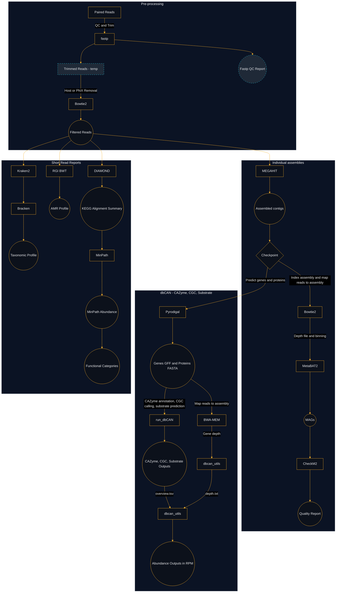

<!-- omit in toc -->

# METAGENOMICS SNAKEMAKE PIPELINE - USER GUIDE

---

<!-- omit in toc -->

## Table of Contents

- [METAGENOMICS SNAKEMAKE PIPELINE - USER GUIDE](#metagenomics-snakemake-pipeline---user-guide)
  - [Table of Contents](#table-of-contents)
  - [Overview](#overview)
    - [Workflow diagram](#workflow-diagram)
    - [Snakemake rules](#snakemake-rules)
      - [Module `preprocessing.smk`](#module-preprocessingsmk)
      - [Module `taxonomy.smk`](#module-taxonomysmk)
      - [Module `amr_short_reads.smk`](#module-amr_short_readssmk)
      - [Module `kegg.smk`](#module-keggsmk)
      - [Module `mag.smk`](#module-magsmk)
      - [Module `db_can.smk`](#module-db_cansmk)
  - [Data](#data)
  - [Parameters](#parameters)
  - [Filters and exclusion lists](#filters-and-exclusion-lists)
  - [Usage](#usage)
    - [Pre-requisites](#pre-requisites)
      - [Software](#software)
      - [Databases](#databases)
    - [Setup Instructions](#setup-instructions)
      - [1. Installation](#1-installation)
      - [2. SLURM Profile](#2-slurm-profile)
        - [2.1. SLURM Profile Directory Structure](#21-slurm-profile-directory-structure)
        - [2.2. Profile Configuration](#22-profile-configuration)
      - [3. Configuration](#3-configuration)
        - [3.1. config/config.yaml](#31-configconfigyaml)
        - [3.2. Environment file](#32-environment-file)
        - [3.3. Sample list](#33-sample-list)
      - [4. Running the pipeline](#4-running-the-pipeline)
        - [4.1. Conda environments](#41-conda-environments)
        - [4.2. SLURM launcher](#42-slurm-launcher)
    - [Notes](#notes)
      - [Warnings](#warnings)
      - [Current issues](#current-issues)
      - [Resource usage](#resource-usage)
  - [Output](#output)
    - [Preprocessing Module (`preprocessing.smk`)](#preprocessing-module-preprocessingsmk)
    - [Taxonomy Module (`taxonomy.smk`)](#taxonomy-module-taxonomysmk)
    - [AMR Module (`amr_short_reads.smk`)](#amr-module-amr_short_readssmk)
    - [KEGG Module (`kegg.smk`)](#kegg-module-keggsmk)
    - [MAG Module (`mag.smk`)](#mag-module-magsmk)
    - [dbCAN Module (`db_can.smk`)](#dbcan-module-db_cansmk)

---

## Overview

The **Metagenomics Snakemake pipeline** is a reproducible workflow for paired-end Illumina shotgun metagenomic reads from high-biomass, host-associated samples. It performs read-quality control, trimming, filtering and removal of host and PhiX sequences before conducting selected downstream analyses.

The workflow rules are organized into modules. Users can run the complete workflow or selected analysis targets when the required upstream files and reference databases are available. Most downstream modules require host-depleted paired reads. The CAZyme module also requires the corresponding per-sample assemblies.

Depending on the modules selected, the pipeline produces taxonomic abundance tables, antimicrobial resistance gene profiles, KEGG functional pathway profiles, metagenome-assembled genomes (MAGs) and carbohydrate-active enzyme (CAZyme) annotations and abundance tables.

Reference databases are supplied separately and are not distributed with the pipeline. 

### Workflow diagram


```mermaid
---
config:
  theme: base
  themeVariables:
    darkMode: true
    background: '#0c111b'
    mainBkg: '#0c111b'
    textColor: '#e5e7eb'
    titleColor: '#f3f4f6'

    primaryColor: '#1f2937'
    primaryTextColor: '#e5e7eb'
    primaryBorderColor: '#F8B229'

    secondaryColor: '#111827'
    secondaryBorderColor: '#2d3748'

    tertiaryColor: '#0b1324'
    tertiaryBorderColor: '#374151'

    lineColor: '#F8B229'
---
flowchart TD

    subgraph PREPROC ["Pre-processing"]
        direction TB
        A[Paired Reads] -->|QC and Trim| B[fastp]
        B --> C[Trimmed Reads - temp]
        B --> L1((Fastp QC Report))
        C -->|Host or PhiX Removal| D[Bowtie2]
        D --> E((Filtered Reads))
    end

    subgraph MAGS ["Individual assemblies"]
        direction TB
        E --> F[MEGAHIT]
        F --> G((Assembled contigs))
        G --> I{Checkpoint}
        I -->|Index assembly and map reads to assembly | J[Bowtie2]
        J -->|Depth file and binning| K[MetaBAT2]
        K --> L2((MAGs))
        L2 --> M[CheckM2]
        M --> N((Quality Report))
    end

    subgraph DBCAN ["dbCAN - CAZyme, CGC, Substrate"]
      direction TB
      I -->|Predict genes and proteins| D1[Pyrodigal]
      D1 --> D2((Genes GFF and Proteins FASTA))

      D2 -->|CAZyme annotation, CGC calling, substrate prediction| D3[run_dbCAN]
      D3 --> D4((CAZyme, CGC, Substrate Outputs))

      D2 -->|Map reads to assembly| D5[BWA-MEM]
      D5 -->|Gene depth| D6[dbcan_utils]
      D4 -->|overview.tsv| D7[dbcan_utils]
      D6 -->|depth.txt| D7
      D7 --> D8((Abundance Outputs in RPM))
  end

    subgraph QC_REPORTS ["Short Read Reports"]
        direction TB
        E --> P[Kraken2]
        P --> Q[Bracken]
        Q --> S((Taxonomic Profile))

        E --> W1[RGI BWT]
        W1 --> Q2((AMR Profile))

        E --> T[DIAMOND]
        T --> U((KEGG Alignment Summary))
        U --> V[MinPath]
        V --> W2((MinPath Abundance))
        W2 --> X((Functional Categories))
    end

    %% TEMP FILE STYLING
    style C fill:#1f2937,stroke:#22d3ee,stroke-dasharray: 5 5,color:#e5e7eb
    style L1 fill:#1f2937,stroke:#22d3ee,stroke-dasharray: 5 5,color:#e5e7eb

```

### Snakemake rules

Workflow rules are located in the `workflow/rules` directory. The principal modules are `preprocessing.smk`, `taxonomy.smk`, `amr_short_reads.smk`, `kegg.smk`, `mag.smk`, `db_can.smk` and `env_versions.smk`.

#### Module `preprocessing.smk`

This module performs read-quality control, trimming and removal of reads originating from the host or PhiX control.

**Default configuration settings**

The following values are supplied in `config/config.yaml`. These workflow settings may differ from the default settings used by the individual software packages.

| Configuration setting | Default | Description |
|---|---:|---|
| `fastp: threads` | `4` | Number of threads used by *fastp*. |
| `fastp: cut_tail` | `true` | Enables sliding-window quality trimming from the 3′ end. |
| `fastp: cut_front` | `true` | Enables sliding-window quality trimming from the 5′ end. |
| `fastp: cut_mean_quality` | `20` | Minimum mean Phred quality required within the trimming window. |
| `fastp: cut_window_size` | `4` | Number of bases included in the sliding quality window. |
| `fastp: qualified_quality_phred` | `15` | Minimum Phred score used to define a qualified base. |
| `fastp: detect_adapter_for_pe` | `true` | Enables automatic adapter detection for paired-end reads. |
| `fastp: length_required` | `100` | Minimum read length retained after trimming. |
| `bowtie2_align: threads` | `16` | Total number of threads allocated among *Bowtie2* and *SAMtools*. |
| `extract_unmapped_fastq: threads` | `8` | Total number of threads allocated among *SAMtools* and *pigz*. |

Quality-filtering parameters should be selected according to the sequencing platform, read length and study objectives.

**Rule: `fastp_pe` — Quality control and trimming**

- **Purpose:** Uses *fastp* to perform adapter detection, adapter trimming, quality trimming and length filtering of paired-end reads.
- **Inputs:**
  - Paired-end fastq files specified for each sample in the sample sheet
- **Outputs:**
  - Trimmed R1 reads: `sample_r1.fastq.gz`
  - Trimmed R2 reads: `sample_r2.fastq.gz`
  - Unpaired R1 reads: `sample_u1.fastq.gz`
  - Unpaired R2 reads: `sample_u2.fastq.gz`
  - HTML quality-control report: `sample.fastp.html`
  - JSON quality-control report: `sample.fastp.json`
- **Notes:**
  - Only the paired trimmed reads are used by subsequent preprocessing rules.
  - All outputs from this rule are marked with the Snakemake `temp()` function and are removed automatically when they are no longer required.
  - To retain the HTML and JSON quality-control reports, remove `temp()` from those outputs in `workflow/rules/preprocessing.smk`.
  - The processing log is written to `fastp/sample.fastp.log` beneath the configured log directory.

**Rule: `bowtie2_align` — Host and PhiX alignment**

- **Purpose:** Aligns the trimmed paired reads against a user-supplied Bowtie2 index containing the relevant host genome sequence and PhiX reference sequence. The alignments are converted into a coordinate-sorted BAM file using *SAMtools*.
- **Inputs:**
  - Trimmed R1 reads: `sample_r1.fastq.gz`
  - Trimmed R2 reads: `sample_r2.fastq.gz`
  - Complete Bowtie2 index specified by `bowtie2_index` in `config/config.yaml`
- **Outputs:**
  - Coordinate-sorted alignment file: `bam/sample.bam`
- **Notes:**
  - The Bowtie2 index may use either the `.bt2` or `.bt2l` format.
  - Bowtie2 default alignment settings are used apart from the configured number of threads and the addition of a read-group identifier.
  - Available threads are divided among *Bowtie2* and *SAMtools*.
  - The BAM file is marked with `temp()` because it is an intermediate file used to recover host-depleted paired reads.
  - The alignment log is written to `bowtie2/sample.log` beneath the configured log directory.

**Rule: `extract_unmapped_fastq` — Host and PhiX read removal**

- **Purpose:** Extracts paired reads for which neither mate aligned to the combined host and PhiX reference.
- **Inputs:**
  - Coordinate-sorted alignment file: `bam/sample.bam`
- **Outputs:**
  - Host-depleted R1 reads: `sample_trimmed_clean_R1.fastq.gz`
  - Host-depleted R2 reads: `sample_trimmed_clean_R2.fastq.gz`
- **Notes:**
  - *SAMtools* retains read pairs for which both mates are unmapped and excludes secondary alignments.
  - The retained alignments are sorted by read name before *BEDTools* converts them back into paired fastq files.
  - The fastq files are compressed using *pigz*.
  - Available threads are divided between *SAMtools* and *pigz*.
  - Temporary sorting files are written beneath `TMPDIR` and removed when the rule finishes.
  - The host-depleted fastq files are marked with `protected()` to reduce the risk of accidental overwriting.
  - These host-depleted paired reads are the principal inputs for the downstream analysis modules.
  - The extraction log is written to `bedtools/sample.log` beneath the configured log directory.
  - 
---

#### Module `taxonomy.smk`

This module uses *Kraken2* and *Bracken* to classify host-depleted reads and generate taxonomic abundance tables. Results are produced at the domain, phylum, genus and species levels.

**Default analysis settings**

The following settings are supplied in `config/config.yaml` or used as rule-level defaults.

| Configuration setting | Default | Description |
|---|---:|---|
| `kraken2: conf_threshold` | `0.5` | Minimum Kraken2 confidence score required to assign a read to a taxon. |
| `bracken: readlen` | `150` | Read length used for Bracken abundance estimation. |
| `bracken: threshold_species` | `10` | Minimum read threshold used for species-level abundance estimation. |
| `bracken: threshold_genus` | `10` | Minimum read threshold used for genus-level abundance estimation. |
| `bracken: threshold_phylum` | `10` | Minimum read threshold used for phylum-level abundance estimation. |
| `bracken: threshold_domain` | `0` | Minimum read threshold used for domain-level abundance estimation. |

The selected Kraken2 database must contain a Bracken k-mer distribution compatible with the value specified by `bracken: readlen`.

**Default taxon-exclusion settings**

The following taxa are removed from the combined Bracken tables by default:

| Taxonomic level | Taxa removed |
|---|---|
| Domain | Eukaryota |
| Phylum | Chordata |
| Genus | *Bos*, *Sus* and *Homo* |
| Species | *Bos taurus*, *Bos indicus*, *Sus scrofa* and *Homo sapiens* |

The default exclusion lists are defined under `taxa_filters` in `config/config.yaml`:

```yaml
taxa_filters:
  domain:
    - "Eukaryota"
  phylum:
    - "Chordata"
  genus:
    - "Bos"
    - "Sus"
    - "Homo"
  species:
    - "Bos taurus"
    - "Bos indicus"
    - "Sus scrofa"
    - "Homo sapiens"
```

The script `workflow/scripts/clean_bracken_batch.py` removes taxa by exact name matching at each taxonomic level. Removing a taxon at one level does not automatically remove its descendants from the other tables. Users must therefore review and modify every level of the exclusion list to match the host organisms and taxonomic names present in their selected Kraken2 database.

After the configured taxa are removed, `clean_bracken_batch.py` recalculates the fraction columns using the total estimated counts remaining at each taxonomic level. The script `workflow/scripts/recompute_bracken_fractions.py` subsequently calculates an additional relative abundance using the total number of reads assigned to Bacteria and Archaea as the denominator. Finally, `workflow/scripts/extract_bracken_columns.py` creates the simplified count and relative-abundance tables.

**Rule: `kraken2` — Taxonomic classification**

- **Purpose:** Classifies host-depleted paired reads against a user-specified Kraken2-formatted reference database.
- **Inputs:**
  - Host-depleted R1 reads: `sample_trimmed_clean_R1.fastq.gz`
  - Host-depleted R2 reads: `sample_trimmed_clean_R2.fastq.gz`
  - Kraken2-formatted reference database specified by `gtbd_DB` in `config/config.yaml`
- **Outputs:**
  - Per-read classifications: `sample.kraken`
  - Kraken2 classification report: `sample.report.txt`
- **Notes:**
  - *Kraken2* processes the input files as paired-end reads.
  - Taxon names are included in the per-read classifications.
  - Taxa with zero assigned reads are retained in the Kraken2 report.
  - Memory requirements depend primarily on the size of the selected database. The assigned compute node must have enough memory to load the complete database.
  - The classification log is written to `kraken2/sample.log` beneath the configured log directory.

**Rule: `bracken` — Taxonomic abundance estimation**

- **Purpose:** Uses each Kraken2 report to estimate taxonomic abundances at the domain, phylum, genus and species levels.
- **Inputs:**
  - Kraken2 classification report: `sample.report.txt`
  - The same Kraken2-formatted reference database used for classification
- **Outputs:**
  - Species-level report: `species/sample_bracken.species.report.txt`
  - Genus-level report: `genus/sample_bracken.genus.report.txt`
  - Phylum-level report: `phylum/sample_bracken.phylum.report.txt`
  - Domain-level report: `domain/sample_bracken.domain.report.txt`
- **Notes:**
  - The selected database must contain the Bracken k-mer distribution corresponding to the configured read length.
  - Minimum read thresholds can be configured independently for the domain, phylum, genus and species levels.
  - The domain-level report is used to determine the total number of reads assigned to Bacteria and Archaea.
  - The processing log is written to `bracken/sample.log` beneath the configured log directory.

**Rule: `combine_bracken_outputs` — Combine per-sample reports**

- **Purpose:** Combines the per-sample Bracken reports into separate multi-sample tables for each taxonomic level.
- **Inputs:**
  - Per-sample species-level Bracken reports
  - Per-sample genus-level Bracken reports
  - Per-sample phylum-level Bracken reports
  - Per-sample domain-level Bracken reports
- **Outputs:**
  - Species-level table: `merged_abundance_species.txt`
  - Genus-level table: `merged_abundance_genus.txt`
  - Phylum-level table: `merged_abundance_phylum.txt`
  - Domain-level table: `merged_abundance_domain.txt`
- **Notes:**
  - These combined tables contain estimated read counts and Bracken fractions for all samples.
  - The processing log is written to `bracken/combine_bracken_outputs.log` beneath the configured log directory.

**Rule: `clean_host_bracken` — Remove configured host and unwanted taxa**

- **Purpose:** Removes host or other unwanted taxa from the combined Bracken tables using the exclusion lists defined in `config/config.yaml`.
- **Inputs:**
  - `merged_abundance_species.txt`
  - `merged_abundance_genus.txt`
  - `merged_abundance_phylum.txt`
  - `merged_abundance_domain.txt`
- **Outputs:**
  - `merged_abundance_species_cleaned.txt`
  - `merged_abundance_genus_cleaned.txt`
  - `merged_abundance_phylum_cleaned.txt`
  - `merged_abundance_domain_cleaned.txt`
- **Notes:**
  - Taxa are removed by exact name matching using the level-specific lists under `taxa_filters` in `config/config.yaml`.
  - The fraction columns are recalculated after the configured taxa are removed.
  - At each taxonomic level, the recalculated fractions use the total estimated counts remaining in that table as the denominator.
  - Users must modify the exclusion lists to match the host organisms and database taxonomy relevant to their study.
  - The processing log is written to `bracken/clean_host_bracken.log` beneath the configured log directory.

**Rule: `bracken_recompute_fractions` — Calculate prokaryote-normalized relative abundances**

- **Purpose:** Calculates an additional relative-abundance value for each species, genus and phylum by dividing its estimated read count by the total number of reads assigned to Bacteria and Archaea in that sample.
- **Inputs:**
  - `merged_abundance_species_cleaned.txt`
  - `merged_abundance_genus_cleaned.txt`
  - `merged_abundance_phylum_cleaned.txt`
  - `merged_abundance_domain_cleaned.txt`
- **Outputs:**
  - Species-level table: `bracken_cleaned_adjusted_species.txt`
  - Genus-level table: `bracken_cleaned_adjusted_genus.txt`
  - Phylum-level table: `bracken_cleaned_adjusted_phylum.txt`
- **Notes:**
  - The filtered Bracken fractions are retained in the output tables.
  - Additional columns containing the prokaryote-normalized relative abundances are appended.
  - The processing log is written to `bracken/recompute_fractions.log` beneath the configured log directory.

**Rule: `bracken_extract` — Create final abundance tables**

- **Purpose:** Creates simplified multi-sample tables containing estimated read counts, rank-normalized relative abundances and prokaryote-normalized relative abundances.
- **Inputs:**
  - `bracken_cleaned_adjusted_species.txt`
  - `bracken_cleaned_adjusted_genus.txt`
  - `bracken_cleaned_adjusted_phylum.txt`
- **Outputs:**
  - Species estimated counts: `bracken_species_raw_abundance.csv`
  - Species rank-normalized relative abundance: `bracken_species_rel_abundance_default.csv`
  - Species prokaryote-normalized relative abundance: `bracken_species_rel_abundance_adjusted.csv`
  - Genus estimated counts: `bracken_genus_raw_abundance.csv`
  - Genus rank-normalized relative abundance: `bracken_genus_rel_abundance_default.csv`
  - Genus prokaryote-normalized relative abundance: `bracken_genus_rel_abundance_adjusted.csv`
  - Phylum estimated counts: `bracken_phylum_raw_abundance.csv`
  - Phylum rank-normalized relative abundance: `bracken_phylum_rel_abundance_default.csv`
  - Phylum prokaryote-normalized relative abundance: `bracken_phylum_rel_abundance_adjusted.csv`
- **Notes:**
  - Files containing `default` in their names are normalized over the estimated counts remaining at the corresponding taxonomic level after the configured taxa are removed.
  - Files containing `adjusted` in their names use the total number of reads assigned to Bacteria and Archaea as the denominator.
  - The domain-level table is used for normalization but is not exported as a final simplified CSV file.

---
#### Module `amr_short_reads.smk`

This module uses the *Resistance Gene Identifier* (RGI) and the *Comprehensive Antibiotic Resistance Database* (CARD) to identify putative antimicrobial resistance genes in host-depleted paired reads.

CARD is not distributed with the pipeline. Users must provide a prepared RGI-compatible CARD database and record the CARD and RGI versions used for the analysis.

**Default analysis settings**

| Setting | Default | Description |
|---|---|---|
| Alignment algorithm | KMA | RGI BWT maps the paired reads to CARD reference sequences using *KMA*. |
| Database mode | Local | RGI uses a locally prepared CARD database through the `--local` option. |
| Intermediate cleanup | Enabled | RGI is run with `--clean` to remove temporary files that it no longer requires. |
| Other RGI BWT settings | RGI defaults | No additional analytical thresholds are configured by the workflow. |

**CARD database requirements**

The path to the prepared CARD database is supplied through `RGI_CARD` in the `.env` file. If `RGI_CARD` is not defined, the workflow uses `card_latest` from `config/config.yaml` as a fallback.

`RGI_CARD` must point to a directory rather than an individual file. The prepared directory should contain the files required by RGI BWT, including:

- `card.json`
- `card_reference.fasta`
- `loaded_databases.json`
- `bwt/`

For example:

```dotenv
RGI_CARD=/absolute/path/to/CARD/localDB
```
**Rule: `rgi_reload_database` — Confirm CARD database files**

- **Purpose:** Confirms that the CARD source files required by the workflow are present before the AMR analysis begins.
- **Inputs:**
  - CARD ontology and reference data: `card.json`
  - CARD reference sequences: `card_reference.fasta`
- **Outputs:**
  - Database marker: `rgi_reload_db.done`
- **Notes:**
  - Despite the rule name, the current workflow does not download CARD.
  - When `card.json` and `card_reference.fasta` are already present, the rule records their availability and creates the marker file.
  - The database must be prepared before the workflow is started.
  - The processing log is written to `rgi/rgi_reload_db.log` beneath the configured log directory.

**Rule: `symlink_rgi_card` — Make the CARD database available to RGI**

- **Purpose:** Creates links from the workflow’s `localDB` directory to the prepared CARD database.
- **Inputs:**
  - Database marker: `rgi_reload_db.done`
  - Prepared CARD database directory
- **Outputs:**
  - Database-link marker: `rgi_symlink.done`
- **Notes:**
  - The rule links `card.json`, `card_reference.fasta`, `loaded_databases.json` and the `bwt` directory into `localDB`.
  - RGI uses this directory through the `RGI_DATA_PATH` environment variable.
  - The processing log is written to `rgi/symlink_rgi_card.log` beneath the configured log directory.

**Rule: `rgi_bwt` — Antimicrobial resistance gene profiling**

- **Purpose:** Maps host-depleted paired reads against CARD reference sequences using the RGI BWT workflow with *KMA*.
- **Inputs:**
  - Host-depleted R1 reads: `sample_trimmed_clean_R1.fastq.gz`
  - Host-depleted R2 reads: `sample_trimmed_clean_R2.fastq.gz`
  - Database-link marker: `rgi_symlink.done`
- **Outputs:**
  - Allele-level mapping report: `sample_paired.allele_mapping_data.txt`
  - Allele-level mapping data: `sample_paired.allele_mapping_data.json`
  - Sorted alignment file: `sample_paired.sorted.length_100.bam`
  - BAM index: `sample_paired.sorted.length_100.bam.bai`
- **Notes:**
  - The JSON, BAM and BAM-index files are marked with `temp()` and are removed when they are no longer required.
  - The allele-level text report is retained as the principal output.
  - To retain the temporary files, remove `temp()` from the corresponding outputs in `workflow/rules/amr_short_reads.smk`.
  - Additional files generated internally by RGI are not guaranteed workflow outputs unless they are declared in the Snakemake rule.
  - Detected genes represent sequence-based evidence of putative antimicrobial resistance determinants and do not by themselves demonstrate a resistant phenotype.
  - The processing log is written to `rgi/bwt_sample.log` beneath the configured log directory.

---
#### Module `kegg.smk`

This module uses translated sequence alignment to identify KEGG genes and KEGG Orthology (KO) identifiers in host-depleted reads. *MinPath* infers a parsimonious set of pathways consistent with the detected KOs. The inferred pathways are then annotated with pathway names and categories from the KEGG BRITE hierarchy.

KEGG data are not distributed with the pipeline. Users must obtain authorized access to the required KEGG files.

**Default analysis settings**

| Configuration setting | Default | Description |
|---|---|---|
| `kegg_diamond: sensitivity` | `""` | Uses the standard DIAMOND sensitivity mode without specifying an additional sensitivity option. |
| `kegg_diamond: max-target-seqs` | `1` | Reports a maximum of one target sequence for each query read. |
| `kegg_diamond: outfmt` | `6 qseqid sseqid slen pident length mismatch gapopen qstart qend sstart send evalue bitscore` | Specifies the fields included in the tabular DIAMOND output. |
| MinPath version | `1.6` | Version of *MinPath* expected by the workflow. |

The value assigned to `max-target-seqs` affects which DIAMOND alignments are retained and can therefore affect downstream KO and pathway abundance estimates.

**Required KEGG files**

The workflow requires the following files:

- Prokaryotic protein sequences: `prokaryotes.pep.gz`
- Gene-to-KO mapping: `ko_genes.list`
- KO-to-pathway mapping: `ko_pathway.list`
- KEGG BRITE hierarchy: `ko00001.keg`

The workflow also requires `MinPath.py` at:

```text
workflow/scripts/MinPath/MinPath.py
```
*MinPath* is not distributed with the pipeline and must be installed separately at this location.

**Default pathway-exclusion settings**

The file `resources/KEGG_BRITE_pathway_exclusion_file.txt` contains the default list of pathways excluded from the combined pathway table. The list includes selected plant, animal, disease, immune, endocrine and signalling pathways.

Pathways are removed by matching their five-digit KEGG pathway identifiers. Users should inspect and modify this list according to the biological objectives of their study. The complete version-controlled exclusion file, rather than a summary in this guide, defines the pathways removed by default.

**Rule: `merge_read_pairs` — Concatenate R1 and R2 reads**

- **Purpose:** Concatenates the host-depleted R1 and R2 reads from each sample into one compressed fastq file for translated alignment.
- **Inputs:**
  - Host-depleted R1 reads: `sample_trimmed_clean_R1.fastq.gz`
  - Host-depleted R2 reads: `sample_trimmed_clean_R2.fastq.gz`
- **Outputs:**
  - Concatenated reads: `sample_merged.fastq.gz`
- **Notes:**
  - This rule concatenates the two files. It does not merge overlapping read pairs or reconstruct longer sequences.
  - R1 and R2 are treated as individual reads in the subsequent DIAMOND analysis.

**Rule: `make_kegg_diamond_db` — Create the DIAMOND database**

- **Purpose:** Creates a DIAMOND-formatted protein database from the KEGG prokaryotic protein sequences.
- **Inputs:**
  - Compressed KEGG protein sequences: `prokaryotes.pep.gz`
- **Outputs:**
  - DIAMOND database: `prokaryotes.pep.dmnd`
  - Completion marker: `prokaryotes_db_done.txt`
- **Notes:**
  - If `prokaryotes.pep.dmnd` already exists, database construction is skipped.
  - The compressed protein file is decompressed with *pigz* and streamed to `diamond makedb`.
  - The database-construction log is written to `kegg/make_kegg_diamond_db.log` beneath the configured log directory.

**Rule: `kegg_diamond` — Search reads against KEGG proteins**

- **Purpose:** Uses `diamond blastx` to compare translated host-depleted reads against the KEGG prokaryotic protein database.
- **Inputs:**
  - Concatenated reads: `sample_merged.fastq.gz`
  - DIAMOND-formatted KEGG database: `prokaryotes.pep.dmnd`
- **Outputs:**
  - Tabular DIAMOND alignments: `sample_diamond_output.m8`
  - Temporary decompressed reads: `sample_tmp.fastq`
- **Notes:**
  - The compressed fastq file is decompressed before the DIAMOND search.
  - The temporary decompressed fastq file is marked with `temp()` and is removed when it is no longer required.
  - DIAMOND temporary files are written beneath `TMPDIR` and removed when the rule finishes.
  - The processing log is written to `kegg/sample_kegg_diamond.log` beneath the configured log directory.

**Rule: `count_reads` — Count input reads**

- **Purpose:** Counts the total number of individual reads in the concatenated R1 and R2 fastq file.
- **Inputs:**
  - Concatenated reads: `sample_merged.fastq.gz`
- **Outputs:**
  - Read count: `sample_read_count.txt`
- **Notes:**
  - Each R1 or R2 sequence is counted as one read.
  - The result is a read count rather than a count of read pairs.
  - This value is used as the denominator when calculating counts per million reads.

**Rule: `gene_ko_abundance` — Calculate gene and KO abundances**

- **Purpose:** Maps KEGG gene identifiers from the DIAMOND results to KO identifiers and calculates gene-level abundance measurements.
- **Inputs:**
  - DIAMOND alignments: `sample_diamond_output.m8`
  - Total read count: `sample_read_count.txt`
  - Gene-to-KO mapping: `ko_genes.list`
- **Outputs:**
  - Gene and KO abundance table: `sample_gene_ko_abundance.tsv`
- **Notes:**
  - `Abundance` is the number of retained DIAMOND hits assigned to each KEGG gene.
  - `RPK` is the number of read hits per kilobase of the target coding sequence.
  - `Copies_Per_Million_Reads` is calculated by dividing the number of hits by the total number of individual reads and multiplying by one million.
  - Genes without an assigned KO are labelled `No_KO`.
  - The output contains the columns `Gene`, `KO`, `Abundance`, `RPK`, `Copies_Per_Million_Reads` and `Read_Count`.
  - The processing log is written to `kegg/sample_gene_ko_abundance.log` beneath the configured log directory.

**Rule: `make_ko_lists` — Prepare KO input for MinPath**

- **Purpose:** Extracts unique KO identifiers from the gene and KO abundance table and formats them for analysis with *MinPath*.
- **Inputs:**
  - Gene and KO abundance table: `sample_gene_ko_abundance.tsv`
- **Outputs:**
  - Unique KO identifiers: `sample_ko_list_raw.txt`
  - MinPath-formatted KO list: `sample_ko_list_fixed.txt`
- **Notes:**
  - Entries labelled `No_KO` are excluded.
  - The `ko:` prefix is removed from KO identifiers.
  - The formatted file contains an artificial feature identifier and one KO identifier per line.
  - The processing log is written to `kegg/sample_make_ko_lists.log` beneath the configured log directory.

**Rule: `minpath` — Infer KEGG pathways**

- **Purpose:** Uses *MinPath* to infer a parsimonious set of KEGG pathways consistent with the detected KO identifiers.
- **Inputs:**
  - MinPath-formatted KO list: `sample_ko_list_fixed.txt`
- **Outputs:**
  - MinPath report: `sample_minpath_output.txt`
- **Notes:**
  - An inferred pathway represents a parsimonious explanation of the detected KOs and should not be interpreted as confirmation that the complete pathway is biologically active.
  - If no KOs are available for a sample, the rule creates an empty MinPath output file and skips the analysis.
  - The processing log is written to `kegg/sample_minpath.log` beneath the configured log directory.

**Rule: `aggregate_minpath_pathways` — Calculate pathway abundances**

- **Purpose:** Maps detected KOs to pathways, retains pathways inferred by *MinPath* and calculates pathway-level abundance measurements.
- **Inputs:**
  - MinPath report: `sample_minpath_output.txt`
  - Gene and KO abundance table: `sample_gene_ko_abundance.tsv`
  - KO-to-pathway mapping: `ko_pathway.list`
- **Outputs:**
  - Pathway abundance table: `sample_aggregated_minpath.tsv`
- **Notes:**
  - Gene-level counts, RPK values and CPM values are summed for each retained pathway.
  - The output contains the columns `Pathway`, `total_abundance`, `total_rpk` and `total_cpm`.
  - The processing log is written to `kegg/sample_aggregate_minpath.log` beneath the configured log directory.

**Rule: `kegg_category_mapping` — Add KEGG Orthology BRITE annotations**

- **Purpose:** Uses the KEGG Orthology BRITE hierarchy to add pathway names, top-level categories and subcategories to the pathways inferred by *MinPath*..
- **Inputs:**
  - Pathway abundance table: `sample_aggregated_minpath.tsv`
  -  KEGG Orthology BRITE hierarchy: `ko00001.keg`
- **Outputs:**
  - BRITE-annotated pathway table: `sample_ko_pathway_abundance_with_category.tsv`
- **Notes:**
  - KEGG pathway identifiers are stored as five-digit values.
  - The rule adds `Pathway_Name`, `Top_Category` and `Sub_Category` columns.
  - Pathway abundances are not aggregated by BRITE category.
  - Pathways not found in the supplied BRITE hierarchy are labelled `Unknown`.
  - The processing log is written to `kegg/sample_kegg_category_mapping.log` beneath the configured log directory.

**Rule: `kegg_category_sampleID` — Add the sample identifier**

- **Purpose:** Adds a `sampleID` column to each BRITE-annotated pathway table so that results can be combined across samples.
- **Inputs:**
  - `sample_ko_pathway_abundance_with_category.tsv`
- **Outputs:**
  - `sample_ko_pathway_abundance_with_category_sampleID.tsv`

**Rule: `combine_kegg_category_tables` — Combine annotated pathway tables**

- **Purpose:** Combines the BRITE-annotated pathway tables from all samples into one long-format table.
- **Inputs:**
  - Per-sample `sample_ko_pathway_abundance_with_category_sampleID.tsv` files
- **Outputs:**
  - Combined pathway table: `combined_ko_pathway_abundance_with_category.tsv`

**Rule: `filter_combined_kegg_table` — Remove configured pathways**

- **Purpose:** Removes pathways listed in the configured pathway-exclusion file.
- **Inputs:**
  - Combined pathway table: `combined_ko_pathway_abundance_with_category.tsv`
  - Pathway-exclusion list: `KEGG_BRITE_pathway_exclusion_file.txt`
- **Outputs:**
  - Filtered combined pathway table: `combined_ko_pathway_abundance_with_category_filtered.tsv`
- **Notes:**
  - Pathways are removed by matching the `Pathway` column to the `Pathway_ID` column in the exclusion file.
  - The exclusion list is located in the directory specified by `kegg_custom_list` in `config/config.yaml`.
  - Users should review the exclusion list before analysis because pathway relevance depends on the biological context.

**Rule: `merge_kegg_results` — Create final multi-sample tables**

- **Purpose:** Combines per-sample gene, KO and pathway results into wide-format tables for downstream analysis.
- **Inputs:**
  - BRITE-annotated pathway tables: `sample_ko_pathway_abundance_with_category.tsv`
  - Pathway abundance tables: `sample_aggregated_minpath.tsv`
  - Gene and KO abundance tables: `sample_gene_ko_abundance.tsv`
- **Outputs:**
  - BRITE-annotated pathway CPM matrix: `pathways_categorized_cpm.tsv`
  - Pathway CPM matrix without BRITE annotations: `pathways_no_categorization_cpm.tsv`
  - Gene and KO CPM matrix: `kegg_gene_hits_raw.tsv`
  - KO CPM matrix: `ko_cpm.tsv`
  - Per-sample read counts: `read_counts_per_sample.tsv`
- **Notes:**
  - `pathways_categorized_cpm.tsv` contains the columns `Pathway`, `Pathway_Name`, `Top_Category` and `Sub_Category`, followed by one CPM column for each sample.
  - `pathways_no_categorization_cpm.tsv` contains one row for each pathway and one CPM column for each sample.
  - `kegg_gene_hits_raw.tsv` contains one row for each gene–KO combination and one CPM column for each sample. Despite the filename, this table contains CPM values rather than raw counts.
  - `ko_cpm.tsv` contains one row for each KO identifier and one CPM column for each sample. Values from genes assigned to the same KO are summed within each sample.
  - Missing feature–sample combinations are reported as zero.
  - `read_counts_per_sample.tsv` contains the columns `Sample` and `Read_Count`.
  - The two pathway CPM matrices are currently generated from unfiltered per-sample tables. Therefore, pathways listed in `KEGG_BRITE_pathway_exclusion_file.txt` are not removed from these matrices.
  - The processing log is written to `kegg/merge_kegg_results.log` beneath the configured log directory.
---

#### Module `mag.smk`

This module assembles each sample independently, maps the corresponding host-depleted reads back to the assembly, calculates contig coverage, groups contigs into putative genome bins and evaluates the resulting bins with *CheckM2*. Samples are not co-assembled.

Only assemblies that pass the configurable assembly-quality checkpoint proceed to read mapping, binning and MAG-quality assessment.

**Default analysis settings**

| Configuration setting | Default | Description |
|---|---:|---|
| `megahit_assembly: min_contig_length` | `1000` | Minimum contig length retained in the final MEGAHIT assembly. |
| `megahit_assembly: out_prefix` | `final` | Prefix assigned to the MEGAHIT output within the temporary run directory. |
| `assembly_filter: min_len_for_stats` | `2000` | Minimum contig length included when calculating the checkpoint assembly statistics. |
| `assembly_filter: min_total_bp` | `50000` | Minimum combined length of contigs meeting `min_len_for_stats`. |
| `assembly_filter: min_contigs` | `100` | Minimum number of contigs meeting `min_len_for_stats`. |
| `assembly_filter: min_fasta_bytes` | `1` | Minimum assembly file size in bytes. This excludes empty assembly files. |
| `metabat2_binning: min_contig_length` | `2500` | Minimum contig length considered by *MetaBAT2* during binning. |
| `checkm2: memory_usage` | `--lowmem` | Runs the DIAMOND annotation stage of *CheckM2* in reduced-memory mode. |

The assembly checkpoint thresholds determine whether a sample proceeds to genome binning. They are workflow inclusion criteria rather than formal MAG-quality criteria.

**Rule: `megahit_assembly` — Assemble individual samples**

- **Purpose:** Uses *MEGAHIT* to assemble the host-depleted paired reads from each sample independently.
- **Inputs:**
  - Host-depleted R1 reads: `sample_trimmed_clean_R1.fastq.gz`
  - Host-depleted R2 reads: `sample_trimmed_clean_R2.fastq.gz`
- **Outputs:**
  - Per-sample assembly: `sample_assembly.contigs.fa`
- **Notes:**
  - Each sample is assembled separately rather than as part of a co-assembly.
  - MEGAHIT run and temporary directories are created beneath `TMPDIR`.
  - The completed assembly is copied from the temporary run directory to the configured MAG output directory.
  - If *MEGAHIT* does not produce contigs, the rule creates an empty assembly file and an associated `.EMPTY` marker.
  - Temporary MEGAHIT files are removed when the rule finishes.
  - MEGAHIT settings not specified by the workflow retain their software defaults.
  - The assembly log is written to `individual_assemblies/sample_megahit.log` beneath the configured log directory.

**Checkpoint: `filter_assemblies` — Select assemblies for binning**

- **Purpose:** Evaluates each per-sample assembly and creates a list of samples that satisfy the configured assembly thresholds.
- **Inputs:**
  - Per-sample assemblies: `sample_assembly.contigs.fa`
- **Outputs:**
  - Samples passing the checkpoint: `passed_checkpoint_assemblies.txt`
  - Assembly statistics: `samples_with_contigs.metrics.tsv`
- **Notes:**
  - Only contigs at least as long as `assembly_filter: min_len_for_stats` are included in the total assembled length and qualifying-contig count.
  - An assembly must satisfy `min_total_bp`, `min_contigs` and `min_fasta_bytes` to pass.
  - The metrics table records the assembly file size, qualifying assembled length, number of qualifying contigs, total number of contigs, pass or fail status and reason for failure.
  - Only samples listed in `passed_checkpoint_assemblies.txt` proceed to assembly indexing, read mapping, binning and *CheckM2* analysis.
  - This checkpoint is distinct from the `nonempty_assemblies` checkpoint used by the CAZyme module. The CAZyme checkpoint requires only a non-empty assembly.

**Rule: `index_assembly` — Index each assembly**

- **Purpose:** Creates a Bowtie2 index for each assembly that passes the assembly-quality checkpoint.
- **Inputs:**
  - Per-sample assembly: `sample_assembly.contigs.fa`
- **Outputs:**
  - Bowtie2 assembly-index files
- **Notes:**
  - The index prefix is `sample_assembly`.
  - The index files are marked with `temp()` and are removed after read mapping is complete.
  - The indexing log is written to `individual_assemblies/sample_bowtie2_index.log` beneath the configured log directory.

**Rule: `map_reads_to_assembly` — Map reads back to the assembly**

- **Purpose:** Maps the host-depleted paired reads from each sample back to the assembly generated from the same sample.
- **Inputs:**
  - Bowtie2 index for `sample_assembly.contigs.fa`
  - Host-depleted R1 reads: `sample_trimmed_clean_R1.fastq.gz`
  - Host-depleted R2 reads: `sample_trimmed_clean_R2.fastq.gz`
- **Outputs:**
  - Coordinate-sorted alignment file: `sample.bam`
- **Notes:**
  - *Bowtie2* performs the alignment and *SAMtools* sorts the resulting alignments.
  - The BAM file is used to estimate contig depth for genome binning.
  - Bowtie2 settings not specified by the workflow retain their software defaults.
  - The mapping log is written to `individual_assemblies/sample_bowtie2_mapping.log` beneath the configured log directory.

**Rule: `sample_depth_file` — Calculate contig depth**

- **Purpose:** Calculates the coverage depth of each assembled contig using the reads mapped back to the assembly.
- **Inputs:**
  - Coordinate-sorted alignment file: `sample.bam`
- **Outputs:**
  - Contig-depth table: `metabat2/sample/sample_depth.txt`
- **Notes:**
  - The depth table is generated using `jgi_summarize_bam_contig_depths`.
  - The depth values are used by *MetaBAT2* when grouping contigs into genome bins.
  - The processing log is written to `individual_assemblies/sample_depth.log` beneath the configured log directory.

**Rule: `metabat2_binning` — Bin assembled contigs**

- **Purpose:** Uses sequence composition and contig-depth information to group assembled contigs into putative genome bins.
- **Inputs:**
  - Per-sample assembly: `sample_assembly.contigs.fa`
  - Contig-depth table: `metabat2/sample/sample_depth.txt`
- **Outputs:**
  - Genome-bin directory: `metabat2/sample/bins/`
  - Unbinned-sequence directory: `metabat2/sample/unbinned/`
- **Notes:**
  - Contigs shorter than `metabat2_binning: min_contig_length` are not considered for binning.
  - Numbered bin files and the MetaBAT2 bin-information file are placed in `bins/`.
  - Contigs classified by *MetaBAT2* as too short, low depth or unbinned are placed in `unbinned/`.
  - *MetaBAT2* runs in a temporary directory beneath `TMPDIR`.
  - Temporary MetaBAT2 files are removed after the outputs are copied to the configured MAG output directory.
  - The binning log is written to `individual_assemblies/sample_metabat2.log` beneath the configured log directory.

**Rule: `checkm2_bins` — Estimate bin completeness and contamination**

- **Purpose:** Uses *CheckM2* to estimate the completeness and contamination of the genome bins produced by *MetaBAT2*.
- **Inputs:**
  - Genome-bin directory: `metabat2/sample/bins/`
  - CheckM2 database specified by `checkm2_DB` in `config/config.yaml`
- **Outputs:**
  - CheckM2 output directory: `metabat2/sample/checkm2/`
  - Bin-quality report: `metabat2/sample/checkm2/quality_report.tsv`
- **Notes:**
  - The CheckM2 database is not distributed with the pipeline and must be installed separately.
  - The workflow evaluates `.fa` files in the genome-bin directory.
  - The default configuration uses the `--lowmem` option.
  - The workflow reports completeness and contamination estimates but does not automatically filter bins according to formal MAG-quality thresholds.
  - Users should apply study-appropriate completeness, contamination and quality criteria before treating bins as MAGs.
  - The processing log is written to `individual_assemblies/sample_checkm2.log` beneath the configured log directory.

---
#### Module `db_can.smk`

This module uses [run_dbCAN](https://run-dbcan.readthedocs.io/en/latest/) to annotate carbohydrate-active enzymes (CAZymes), identify CAZyme gene clusters (CGCs), predict CGC substrates and calculate per-sample abundances. The module operates on assemblies generated separately for each sample by `mag.smk`.

A checkpoint restricts the analysis to samples with a non-empty assembly. The dbCAN reference database is not distributed with the pipeline. Its absolute path must be provided using `dbcan_DB_path` in `config/config.yaml`. 

**Selecting dbCAN analyses**

The three run_dbCAN rules perform overlapping analyses:

- `cazyme_annotation` performs CAZyme annotation.
- `cgc_calling` performs CAZyme annotation and CGC identification.
- `substrate_prediction` performs CAZyme annotation, CGC identification and substrate prediction.

The default `rule all` requests outputs from all three rules, causing the overlapping analyses to be run separately. To omit unnecessary analyses, remove their output targets from `rule all` in `workflow/Snakefile`. The rule definitions normally do not need to be removed from `workflow/rules/db_can.smk`.

The most comprehensive output required should generally be selected:

- For CAZyme annotation only, request `sample/sample_cazyme/overview.tsv`.
- For CAZyme annotation and CGC identification, request `sample/sample_pul/cgc.gff`.
- For CAZyme annotation, CGC identification and substrate prediction, request `sample/sample_dbcan/substrate_prediction.tsv`.
- For the complete analysis including RPM abundance calculations, request `sample/sample_abund/fam_abund.out`. Its dependencies automatically trigger substrate prediction, read mapping, gene-depth calculation and the other abundance outputs.

**Default analysis settings**

| Configuration setting | Default | Description |
|---|---:|---|
| `dbcan_depth: overlap_base_ratio` | `0.2` | Minimum required overlap proportion between an aligned read and a predicted gene. |
| `dbcan_depth: mapping_quality` | `30` | Minimum mapping-quality score used for coverage calculation. |
| `dbcan_depth: identity` | `0.98` | Minimum alignment identity used for coverage calculation. |

*Pyrodigal* is run in metagenomic mode using `-p meta`. The run_dbCAN analyses use protein-input mode and abundance results are normalized as reads per million (RPM). Other settings not specified by the workflow retain their software defaults.

**Checkpoint: `nonempty_assemblies` — Select assemblies for dbCAN analysis**

- **Purpose:** Creates a list of samples with non-empty assemblies for downstream dbCAN analysis.
- **Inputs:**
  - Per-sample assemblies: `sample_assembly.contigs.fa`
- **Outputs:**
  - List of samples with non-empty assemblies: `nonempty_assemblies.txt`
- **Notes:**
  - An assembly is retained when the file exists and has a size greater than zero bytes.
  - This checkpoint does not apply the `assembly_filter` thresholds used to select assemblies for MAG binning.
  - Only samples listed in `nonempty_assemblies.txt` are included in the dbCAN targets generated by `rule all`.

**Rule: `pyrodigal` — Predict protein-coding genes**

- **Purpose:** Uses *Pyrodigal* in metagenomic mode to predict protein-coding genes from each non-empty assembly. The predicted genes and proteins are used by the downstream CAZyme, CGC and substrate analyses.
- **Inputs:**
  - Per-sample assembly: `sample_assembly.contigs.fa`
- **Outputs:**
  - Gene annotations in GFF format: `sample_genes.gff`
  - Protein translations in FASTA format: `sample_proteins.faa`
  - Coding sequences in FASTA format: `sample.cds`
- **Notes:**
  - Gene prediction is performed using the metagenomic mode specified by `-p meta`.
  - The processing log is written to `dbcan/prodigal/sample.log` beneath the configured log directory.

**Rule: `cazyme_annotation` — Identify and classify CAZymes**

- **Purpose:** Runs `run_dbcan CAZyme_annotation` on the predicted protein sequences to identify and classify CAZymes.
- **Inputs:**
  - Protein translations: `sample_proteins.faa`
  - dbCAN database specified by `dbcan_DB_path`
- **Outputs:**
  - CAZyme annotation directory: `sample/sample_cazyme/`
  - Integrated annotation summary: `sample/sample_cazyme/overview.tsv`
- **Notes:**
  - The output directory contains the principal run_dbCAN CAZyme annotation files, including:
    - Standardized protein input: `uniInput.faa`
    - dbCAN-family HMM results: `dbCAN_hmm_results.tsv`
    - Raw dbCAN-subfamily HMM results: `dbCANsub_hmm_raw.tsv`
    - Filtered dbCAN-subfamily HMM results: `dbCANsub_hmm_results.tsv`
    - DIAMOND results against the CAZy protein database: `diamond.out`
    - Integrated annotation summary: `overview.tsv`
  - This analysis is also performed as part of `cgc_calling` and `substrate_prediction`.
  - The processing log is written to `dbcan/cazyme_annotation/sample.log` beneath the configured log directory.

**Rule: `cgc_calling` — Identify CAZyme gene clusters**

- **Purpose:** Runs `run_dbcan easy_CGC` to perform CAZyme annotation, process the gene annotations and identify putative CGCs.
- **Inputs:**
  - Gene annotations: `sample_genes.gff`
  - Protein translations: `sample_proteins.faa`
  - dbCAN database specified by `dbcan_DB_path`
- **Outputs:**
  - CGC-analysis directory: `sample/sample_pul/`
  - CGC annotations in GFF format: `sample/sample_pul/cgc.gff`
- **Notes:**
  - The output directory contains CAZyme annotation files such as `uniInput.faa`, `dbCAN_hmm_results.tsv`, `dbCANsub_hmm_raw.tsv`, `dbCANsub_hmm_results.tsv`, `diamond.out` and `overview.tsv`.
  - Principal CGC outputs include `cgc.gff`, `cgc_standard_out.tsv`, `cgc_standard_out_summary.tsv` and `total_cgc_info.tsv`.
  - Additional files annotate non-CAZyme genes that may contribute to CGC definition, including `diamond.out.peptidase`, `diamond.out.sulfatase`, `diamond.out.tc`, `diamond.out.tf` and `STP_hmm_results.tsv`.
  - The directory suffix `_pul` is potentially misleading because this rule identifies CGCs rather than experimentally characterized polysaccharide utilization loci. Renaming it to `_cgc` would require coordinated changes to the rule outputs, parameters and targets in `workflow/Snakefile`.
  - This analysis does not perform CGC substrate prediction.
  - The processing log is written to `dbcan/cgc_calling/sample.log` beneath the configured log directory.

**Rule: `substrate_prediction` — Identify CGCs and predict substrates**

- **Purpose:** Runs `run_dbcan easy_substrate` to perform CAZyme annotation, identify CGCs and predict their likely carbohydrate substrates.
- **Inputs:**
  - Gene annotations: `sample_genes.gff`
  - Protein translations: `sample_proteins.faa`
  - dbCAN database specified by `dbcan_DB_path`
- **Outputs:**
  - Complete dbCAN-analysis directory: `sample/sample_dbcan/`
  - Integrated CAZyme annotation summary: `sample/sample_dbcan/overview.tsv`
  - CGC substrate predictions: `sample/sample_dbcan/substrate_prediction.tsv`
- **Notes:**
  - The directory contains the CAZyme annotation and CGC-identification outputs described for the preceding rules.
  - Principal CGC files include `cgc.gff`, `CGC.faa`, `cgc_standard_out.tsv`, `cgc_standard_out_summary.tsv` and `total_cgc_info.tsv`.
  - `substrate_prediction.tsv` contains the combined substrate predictions for the identified CGCs.
  - `PUL_blast.out` contains DIAMOND results comparing CGCs with experimentally characterized PULs in the dbCAN-PUL database.
  - The `synteny_pdf/` directory contains synteny plots for CGC–PUL matches when suitable matches are identified.
  - This rule is the upstream annotation rule required by `get_abundances_rpm` as currently written.
  - The processing log is written to `dbcan/substrate_prediction/sample.log` beneath the configured log directory.

**Rule: `bwa_mem_mapping` — Map reads to the assembly**

- **Purpose:** Maps the host-depleted paired reads from each sample back to the corresponding assembly using *BWA-MEM*. *SAMtools* then creates a coordinate-sorted BAM file and its index.
- **Inputs:**
  - Per-sample assembly: `sample_assembly.contigs.fa`
  - Host-depleted R1 reads: `sample_trimmed_clean_R1.fastq.gz`
  - Host-depleted R2 reads: `sample_trimmed_clean_R2.fastq.gz`
- **Outputs:**
  - Coordinate-sorted alignment file: `mapping/sample.bam`
  - Temporary BAM index: `mapping/sample.bam.bai`
  - Temporary BWA assembly-index files: `.amb`, `.ann`, `.bwt`, `.pac` and `.sa`
- **Notes:**
  - The BAM file is retained for coverage calculation.
  - The BAM index and BWA index files are marked with `temp()` and may be removed by Snakemake after their downstream dependencies have completed.
  - The processing log is written to `dbcan/bwa_mem_mapping/sample.log` beneath the configured log directory.

**Rule: `dbcan_depth` — Calculate gene-level sequencing depth**

- **Purpose:** Uses `dbcan_utils cal_coverage` to calculate sequencing depth for the genes predicted by *Pyrodigal*. These depth values are used to estimate CAZyme and CGC abundances.
- **Inputs:**
  - Gene annotations: `sample_genes.gff`
  - Coordinate-sorted alignment file: `mapping/sample.bam`
  - BAM index: `mapping/sample.bam.bai`
- **Outputs:**
  - Gene-depth table: `sample/sample_abund/sample.depth.txt`
- **Notes:**
  - Alignments are filtered using the configured overlap, mapping-quality and identity thresholds.
  - The default values are `0.2`, `30` and `0.98`, respectively.
  - The processing log is written to `dbcan/dbcan_depth/sample.log` beneath the configured log directory.

**Rule: `get_abundances_rpm` — Calculate normalized CAZyme and CGC abundances**

- **Purpose:** Uses the annotation results and gene-depth table to calculate CAZyme, CGC and substrate abundances as reads per million.
- **Inputs:**
  - Integrated annotation summary from `substrate_prediction`: `sample/sample_dbcan/overview.tsv`
  - Gene-depth table: `sample/sample_abund/sample.depth.txt`
- **Outputs:**
  - CAZyme-family abundances: `fam_abund.out`
  - CAZyme-subfamily abundances: `subfam_abund.out`
  - Enzyme Commission number abundances: `EC_abund.out`
  - CAZyme-associated substrate abundances: `fam_substrate_abund.out`
  - CGC abundances: `CGC_abund.out`
  - CGC substrate abundances inferred by PUL homology: `CGC_substrate_PUL_homology.out`
  - CGC substrate abundances inferred using majority voting: `CGC_substrate_majority_voting.out`
- **Notes:**
  - All abundance files are written beneath `sample/sample_abund/`.
  - If `overview.tsv` is empty or contains only its header, the rule creates empty abundance files so the workflow can continue. It also creates `did_not_run_get_abundances_rpm.txt` to document why abundance calculations were skipped.
  - As written, this rule requires the complete output directory produced by `substrate_prediction`.
  - Changing only the `overview` input to the output of `cazyme_annotation` or `cgc_calling` is insufficient. The `dbcan_dir` parameter, commands and declared outputs would also need to be changed because CAZyme-only and CGC-only analyses do not produce all inputs required for substrate-level abundance calculations.
  - The processing log is written to `dbcan/get_abundances_rpm/sample.log` beneath the configured log directory.

---
## Data

The raw input data must be in the form of paired-end FASTQ files generated from metagenomics experiments.

- Each sample should include both forward (R1) and reverse (R2) read files.
- The path to the `PROJECT_ROOT` needs to be specified in the `.evn` file
- Raw fastq file directory must be specified in the `config.yaml` file.

**Example:**

- **Dataset 1 Filename**: Sequencing reads (FASTQ) from beef cattle rumen samples are provided for three samples: `LLC42Nov10C`, `LLC42Sep06CR`, and `LLC82Sep06GR`.

---

## Parameters

The `config/config.yaml` file contains the editable pipeline parameters, thread allocation for rules with more than one core, and the relative file paths for input and output. The prefix of the absolute file path must go in `.env`. Most tools in the pipeline have default parameters. The tools with parameters different from default or that can be edited in the `config/config.yaml` file are listed below.


| Parameter                                                          | Value                                                                                                                                                                                                                                                                                 |
| -------------------------------------------------------------------- | --------------------------------------------------------------------------------------------------------------------------------------------------------------------------------------------------------------------------------------------------------------------------------------- |
| *samplesheet.csv*                                                  | *The samplesheet is described here: [Sample list](#33-sample-list)*                                                                                                                                                                                                                   |
| *fastp: cut_tail*                                                  | *If true, trim low quality bases from the 3′ end until a base meets or exceeds the cut_mean_quality threshold. If false,disabled.*                                                                                                                                                   |
| *fastp: cut_front*                                                 | *If true, trim low quality bases from the 5′ end until a base meets or exceeds the cut_mean_quality threshold. If false,disabled.*                                                                                                                                                   |
| *fastp: cut_mean_quality*                                          | *A positive integer specifying the minimum average quality score threshold for sliding window trimming.*                                                                                                                                                                              |
| *fastp: cut_window_size*                                           | *A positive integer specifying the sliding window size in bp when using cut_mean_quality.*                                                                                                                                                                                            |
| *fastp: qualified_quality_phred*                                   | *A positive integer specifying the minimum Phred score that a base needs to be considered qualified*.                                                                                                                                                                                 |
| *fastp: detect_adapter_for_pe*                                     | *If true, auto adapter detection. If false,disabled.*                                                                                                                                                                                                                                 |
| *fastp: length_required*                                           | *Reads shorter then this positive integer will be discarded.*                                                                                                                                                                                                                         |
| *kraken2: conf_threshold*                                          | *Interval between 0 and 1. Higher values require more of a read’s k-mers to match the same taxon before it is classified, increasing precision but reducing sensitivity.*                                                                                                            |
| *bracken: readlen*                                                 | *Specify the read length (in base pairs) of your sequencing data.*                                                                                                                                                                                                                    |
| *bracken: threshold_species,threshold_genus, and threshold_phylum* | *specifies the minimum number of reads required for a classification at the specified rank. Any classifications with less than the specified threshold will not receive additional reads from higher taxonomy levels when distributing reads for abundance estimation. Default is 10* |
| *bracken: threshold_domain*                                        | *specifies the minimum number of reads required for a classification. Set to 0 in this workflow to capture all the reads*                                                                                                                                                             |
| *kegg_diamond: sensitivity*                                        | *Sensitivity modes are described in the [DIAMOND github wiki](https://github.com/bbuchfink/diamond/wiki/3.-Command-line-options).*                                                                                                                                                    |
| *kegg_diamond: max_target_num*                                     | *--max-target-seqs/-k is the max number of target sequences per alignment to report. Set at 1 in this pipeline to only keep the best hit. Default is 25.*                                                                                                                             |
| *kegg_diamond: out_file_format*                                    | *--outfmt is the output file format. Set as 6 qseqid sseqid slen pident length mismatch gapopen qstart qend sstart send evalue bitscore in this pipeline.*                                                                                                                            |
| *megahit_assembly: min_contig_length*                              | *--min-contig-len is the minimum length contigs must be to be outputted. Set at 1000 bp in this pipeline. Default is 200 bp.*                                                                                                                                                         |
| *megahit_assembly: out_prefix*                                     | *--out-prefix is the prefix of the outfile in the scratch directory. When it is moved from the scratch to working directory it will be renamed to `sample__assembly.contigs.fa`. In the pipeline this is set to final.*                                                               |
| *map_reads_to_assembly: max_mem_per_thread*                        | *Maximum memory per node that `Samtools` can use during sorting. In this pipeline it is set at 4G*                                                                                                                                                                                    |
| *metabat2_binning: min_contig_length*                              | *The minimum length a contig must be to be considered for binning. Set to 2000 bp in this pipeline. Default is 2500 bp.*                                                                                                                                                              |
| *checkm2: memory_usage*                                            | *The lowmem flag reduces the RAM usage of the DIAMOND annotation step by half.*                                                                                                                                                                                                       |

## Filters and exclusion lists


| Module       | Rule                       | File                                            | Description                                                                                                                                                                                                                                                                                                         |
| -------------- | ---------------------------- | ------------------------------------------------- | --------------------------------------------------------------------------------------------------------------------------------------------------------------------------------------------------------------------------------------------------------------------------------------------------------------------- |
| taxonomy.smk | clean_host_bracken         | workflow/scripts/clean_bracken_batch.py         | This script removes the host taxa from Bracken output files. Taxonomy to be removed at each level is set in the`config/config.yaml`. Then the samples are re-normalized using the total remaining read counts. It is clearly indicated in the script where to edit the filter lists.                                |
| kegg.smk     | filter_combined_kegg_table | resources/KEGG_BRITE_pathway_exclusion_file.txt | The exclusion list removes non-prokaryotic pathways from the analysis. This tab-delimited file contains two columns: "Pathway_ID" and "Pathway_Name". The "Pathway_ID" is a four-digit string (e.g., 00073, 05418) that corresponds to the[KEGG Pathway Map](https://www.genome.jp/kegg-bin/get_htext?br08901.keg). |

---

## Usage

### Pre-requisites

#### Software

- Snakemake version 9.9.0
- Snakemake-executor-plugin-slurm
- MinPath version 1.6
  - The MinPath software is available on the [MinPath github](https://github.com/mgtools/MinPath/blob/master/MinPath.py)
  - The repository needs to be placed in the `project-snakemake/workflow/scripts` directory
  - The file permissions for `project-snakemake/workflow/scripts/MinPath/glpk-4.6/examples/glpsol` need to be changed to executable:

```bash
chmod +x absolute/path/code/metagenomics-snakemake/workflow/scripts/MinPath/glpk-4.6/examples/glpsol
```

#### Databases

- **Bowtie2** Bowtie2 uses an index of reference sequences to align reads. This index must be created before running the pipeline. The index files (with the `.bt2` extension) must be located in the directory you specify in the `config/config.yaml` file. Make sure to update the prefix of these files in the `config.yaml` file.

  - In `resources/bowtie2_index` there is a `README.md` file that details where the index was copied from.
- **Kraken2** Kraken2 requires a Kraken2-formatted GTDB database.

  - Kraken2-formatted GTDB release 226 built with the following scripts provided by Jean-Simon Brouard.
  - The Bracken database was built specifying a read length of 150 bp and a kmer length of 35 (default for Kraken2)
  - As per Gihawi et al, 2023, Kraken2 can assign host reads to bacteria in low microbial biomass samples if the host genomes are not included in the Kraken2 database. Therefore, this version of the GTDB release 226 was formatted for Kraken2 with the inclusion of four host genomes: Bos indicus (GCF_029378745.1), Bos taurus (GCF_002263795.3), Homo sapiens (GCF_000001405.40), and Sus scrofa (GCF_000003025.6).

  > **See:** Gihawi A, Ge Y, Lu J, Puiu D, Xu A, Cooper CS, Brewer DS, Pertea M, Salzberg SL. Major data analysis errors invalidate cancer microbiome findings. mBio. 2023 Oct 31;14(5):e0160723. doi: 10.1128/mbio.01607-23. Epub 2023 Oct 9.
  >
- **RGI BWT/CARD**  RGI BWT requires the CARD (Comprehensive Antibiotic Resistance Database) database. The version tested in this pipeline was 4.0.1. The database can be located on a common drive or in your working directory.
  Instructions for installing the CARD database are available on [CARD RGI github](https://github.com/arpcard/rgi/blob/master/docs/rgi_bwt.rst).
  Steps copied from the RGI documentation:

  **Download CARD data:**

  ```bash
  wget https://card.mcmaster.ca/latest/data
  tar -xvf data ./card.json

  rgi load --card_json /path/to/card.json --local

  rgi card_annotation -i /path/to/card.json > card_annotation.log 2>&1

  rgi load -i /path/to/card.json --card_annotation card_database_v3.0.1.fasta --local
  ```

  **Note:** the files after loading and annotating card must be called `card.json` and `card_reference.fasta`
- **KEGG** The functional pathway analysis requires the [KEGG database](https://www.genome.jp/kegg/). Below are the files required for the analysis:

  - KEGG protein database: `prokaryotes.pep`
  - KEGG Orthology assignments of genes `ko_genes.list`
  - KEGG Orthology assignments of pathways `ko_pathway.list`
  - KEGG BRITE hierarchy file `ko00001.keg`

- **dbCAN** The database is required for the carbohydrate-active enzyme workflow. The database description and instructions on preparing the database can be found on [run_dbCAN](https://run-dbcan.readthedocs.io/en/latest/user_guide/prepare_the_database.html). These files must be in your dbCAN database directory:

  - CAZy.dmnd
  - dbCAN.hmm
  - dbCAN_sub.hmm
  - TCDB.dmnd
  - TF.hmm
  - TF.dmnd
  - STP.hmm
  - sulfatlas_db.dmnd
  - peptidase_db.dmnd
  - fam-substrate-mapping.tsv
  - PUL.dmnd
  - dbCAN-PUL.xlsx
  - dbCAN-PLU/PUL*

### Setup Instructions

#### 1. Installation

Clone the repository into the directory where you want to run the metagenomics Snakemake pipeline.
**Note:** This location must be on an HPC (High Performance Computing) cluster with access to a high-memory node (at least 600 GB RAM) and sufficient storage for all metagenomics analyses.

```bash
cd /path/to/code/directory
git clone <repository-url>
```

#### 2. SLURM Profile

##### 2.1. SLURM Profile Directory Structure

```bash
metagenomics_pipeline/
├── workflow/
|   └── rules
|          └──preprocessing.smk
|          └── ...
|   └── snakefile
│   └── env
|        └── fastp.yaml
|        └── bowtie2.yaml
|        └── ...
├── config/
│   └── config.yaml             ← workflow config
|   └── samples.txt
├── profiles/
│   └── slurm/
│       └── config.yaml         ← profile config
├── run_snakemake.sh            ← your SLURM launcher
├── .env
└── ...               
```

##### 2.2. Profile Configuration

The SLURM execution settings must be configured in `profiles/slurm/config.yaml.` An editable example is provided in this repository at `profiles/slurm/example_config.yaml` After editing, rename this file to `config.yaml` so that Snakemake recognizes it.

- This configuration file defines resource defaults, cluster submission commands, and job script templates for Snakemake. It should be customized for each specific HPC environment.
- Remember to update the rerun-triggers: [input, params, software-env] setting whenever the pipeline is modified.
- Pre-rule resource allocations should also be adjusted according to the size and number of input samples for each rule.

#### 3. Configuration

The pipeline requires the following configuration files: `config.yaml`, `.env`, and `samplesheet.csv`.

##### 3.1. config/config.yaml

The `config.yaml` file must be located in the `config` directory, which resides in the main Snakemake working directory. This file specifies crucial settings, including:

- Path to the `samplesheet.csv`
- Input and output directories
- File paths to required databases
- Taxonomy to be removed from bracken output at the phylum, genus and species level.
- Threads for each rule
- Parameters for software see the [Parameters](#parameters) section

**Note:**
You must edit `config.yaml` **before** running the pipeline to ensure all paths are correctly set.
For best practice, use database paths that are in common locations to all users on the HPC.

##### 3.2. Environment file

This file must contain paths to the **PROJECT ROOT**,  **USER SCRATCH**, and **RGI COMMON DATABASE**. Follow these instructions:

- In the main Snakemake directory (where you are running Snakemake from)

```bash
touch .env
```

- Open the .env file and add

```bash
 PROJECT_ROOT = path/to/project/root
 TMPDIR = path/to/temp/on/cluster 
 RGI_CARD = path/to/card.json and card_reference.fasta
```

##### 3.3. Sample list

`samplesheet.csv` Has the following column names: "sample","fastq_1","fastq_2". For the column 'sample" use the sampleID for the read pair, and for "fastq_1","fastq_2" have the names of the read1 and read2 files as they appear in the raw fastq files directory. The file location of the `samplesheet.csv` must be`config/samplesheet.csv`.

**Example `samplesheet.csv`:**
sample,fastq_1,fastq_2
test_LLC82Nov10GR,test_LLC82Nov10GR_r1.fastq.gz,test_LLC82Nov10GR_r2.fastq.gz
test_LLC82Sep06GR,test_LLC82Sep06GR_r1.fastq.gz,test_LLC82Sep06GR_r2.fastq.gz

#### 4. Running the pipeline

Complete steps **1.Installation**, **2.SLURM Profile**, and **3.Configuration** and ensure database paths have been added to the 'config/config.yaml'. Required databases are described in the [Pre-requisites](#pre-requisites).

##### 4.1. Conda environments

Snakemake can automatically create and load Conda environments for each rule in your workflow. Confirm that the `workflow/envs` directory has the same .yaml files as this Github repo.

If the compute cluster on the HPC you are using does not have internet acess then you must create the conda envrioments on the head node.

Create conda envriments before any checkpoints:

```bash
snakemake --use-conda \
  --conda-create-envs-only \
  --conda-prefix path/to/common/lab/folder/conda/metag-snakemake-conda
```

Create environments after checkpoints:

```bash
#MAG pathway
snakemake  --use-conda prewarm_mag_gate -j 1 --conda-prefix path/to/common/lab/folder/conda/metag-snakemake-conda
#dbCAN pathway
snakemake  --use-conda prewarm_dbcan_gate -j 1 --conda-prefix path/to/common/lab/folder/conda/metag-snakemake-conda
```

##### 4.2. SLURM launcher

This is the script you use to submit the Snakemake pipeline to SLURM.

- Defines resources for the job scheduler
- Activates the Snakemake environment
- Submits and manages jobs using the Snakemake `--profile` configuration `(profiles/slurm/)`.
- Contains any additional Snakemake arguments (e.g.., `--unlock`, `--dry-run`, `--rerun-incomplete`)
- For a snakemake report with runtime and software versions use --report path/to/metagenomics_report.html after the pipeline has completed

```bash
#!/bin/bash
#SBATCH --job-name=run_snakemake.sh
#SBATCH --output=run_snakemake_%j.out 
#SBATCH --error=run_snakemake_%j.err 
#SBATCH --cluster=<CLUSTER_NAME>
#SBATCH --partition=<PARTITION_NAME>
#SBATCH --account=<ACCOUNT_NAME>
#SBATCH --mem=<MEMORY_MB>         # e.g., 2000
#SBATCH --time=<HH:MM:SS>         # Must be long enough for completion of workflow 

source path/to/source/conda/common/miniforge/miniforge3/etc/profile.d/conda.sh

conda activate snakemake_env
export PATH="$PWD/bin:$PATH"

  snakemake \
    --profile absolute/path/to/profiles/slurm \
    --configfile absolute/path/to/config/config.yaml \
    --conda-prefix absolute/path/to/common/conda/metagenomics-snakemake-conda \
    --printshellcmds \
    --keep-going 
```

### Notes

- The `profile/slurm/config.yaml` has been configured for our SLURM cluster. This will need to be configured for the cluster you are using.
- temp folder is set to `path/to/scratch/${USER}/tmpdir`
- A Snakemake report can be generated from the head node with `snakemake --report path/to/report/report_name.html`

#### Warnings

- The conda environments will not be created if the conda configuration is `conda config --set channel_priority strict`.
- Set conda to `conda config --set channel_priority flexible` or use libmamba.
- The `.env` file can overwrite the `config/config.yaml` file

#### Current issues

None.

#### Resource usage

- Kraken2: Large compute node with 840 GB.
- Generate Snakemake report to track walltime

## Output

### Preprocessing Module (`preprocessing.smk`)

| **Output Type**         | **Filename**                                                                                          | **Description**                                                                                                                                                                                                                                                                                           |
|------------------------ |-------------------------------------------------------------------------------------------------------|------------------------------------------------------------------------------------------------------------------------------------------------------------------------------------------------------------------------------------------------------------------------------------------------------------|
| Trimmed paired reads    | temp(`sample_r1.fastq.gz`), temp(`sample_r2.fastq.gz`)                                                | Adapter and quality trimmed paired-end reads from `fastp_pe` rule. These are marked temporary in the rule and will be removed once they are not needed by the pipeline. Can easily be changed by opening `workflow/rules/preprocessing.smk` and removing the `temp()`.  |
| Fastp Report            | temp(`sample.fastp.html`), temp(`sample.fastp.json`)                                                  | Quality score statistics before and after processing. These are marked temporary in the rule and will be removed once they are not needed by the pipeline. Can easily be changed by opening `workflow/rules/preprocessing.smk` and removing the `temp()`.              |
| Sorted BAM file         | `sample.bam`                                                                                          | Aligned reads to Host/PhiX reference using Bowtie2 (`bowtie2_align` rule).                                                                                                                                                                                          |
| Clean read pairs        | protected(`sample_trimmed_clean_R1.fastq.gz`), protected(`sample_trimmed_clean_R2.fastq.gz`)          | Host- and PhiX-depleted reads from `extract_unmapped_fastq`. These files are marked protected.                                                                                                                                                                       |                                                                                                                                                                       |

---

### Taxonomy Module (`taxonomy.smk`)

| **Output Type**                             | **Filename**                                                                                                                                               | **Description**                                             |
| --------------------------------------------- | ------------------------------------------------------------------------------------------------------------------------------------------------------------ | ------------------------------------------------------------- |
| Kraken output                               | `sample.kraken`, `sample.report.txt`                                                                                                                       | Kraken2 taxonomy assignment results.                        |
| Bracken species/genus/phylum/domain reports | `sample_bracken.species.report.txt`, `sample_bracken.genus.report.txt`, `sample_bracken.phylum.report.txt`, `sample_bracken.domain.report.txt`             | Refined abundance estimates at multiple taxonomic levels.   |
| Combined abundance tables                   | `merged_abundance_species.txt`, `merged_abundance_genus.txt`, `merged_abundance_phylum.txt`, `merged_abundance_domain.txt`                                 | Merged Bracken abundance tables across samples.             |
| Cleaned abundance tables                    | `merged_abundance_species_cleaned.txt`, `merged_abundance_genus_cleaned.txt`, `merged_abundance_phylum_cleaned.txt`, `merged_abundance_domain_cleaned.txt` | Host taxa removed and normalized Bracken outputs.           |
| Adjusted Bracken tables                     | `bracken_cleaned_adjusted_species.txt`, `bracken_cleaned_adjusted_genus.txt`, `bracken_cleaned_adjusted_phylum.txt`                                        | Relative abundance recalculated for prokaryotic reads only. |
| Combined relative and raw abundance tables  | `bracken_*_raw_abundance.csv`, `bracken_*_rel_abundance_default.csv`, `bracken_*_rel_abundance_adjusted.csv`                                               | Consolidated Bracken outputs (raw, default, adjusted).      |

---

### AMR Module (`amr_short_reads.smk`)

| **Output Type** | **Filename**                                                                         | **Description**                                                |
| ----------------- | -------------------------------------------------------------------------------------- | ---------------------------------------------------------------- |
| CARD DB marker  | `rgi_reload_db.done`                                                                 | Confirms CARD database has been loaded (prevents reloading).   |
| RGI BWT outputs | `sample_paired.*.txt` (e.g., `allele_mapping_data.txt`, `overall_mapping_stats.txt`) | Antimicrobial resistance gene profiling outputs using RGI BWT. |

---

### KEGG Module (`kegg.smk`)

| **Output Type**              | **Filename**                                                                                                                                                                                                                 | **Description**                                                                                                                                                    |
| ------------------------------ | ------------------------------------------------------------------------------------------------------------------------------------------------------------------------------------------------------------------------------ | -------------------------------------------------------------------------------------------------------------------------------------------------------------------- |
| Concatenated read pairs      | `sample_merged.fastq.gz`                                                                                                                                                                                                     | Merged clean reads for KEGG processing.                                                                                                                            |
| DIAMOND formatted database   | `prokaryotes.pep.dmnd`                                                                                                                                                                                                       | The KEGG database file`prokaryotes.pep.gz` is used to create the DIAMOND formatted database only if the database does not already exists                           |
| DIAMOND database done marker | `prokaryotes_db_done.txt`                                                                                                                                                                                                    | Confirms that`prokaryotes.pep.dmnd` exists                                                                                                                         |
| DIAMOND alignment output     | `sample_diamond_output.m8`                                                                                                                                                                                                   | Alignment summary of reads vs KEGG protein database.                                                                                                               |
| Read count                   | `sample_read_count.txt`                                                                                                                                                                                                      | Total read count for concatenated read pairs.                                                                                                                      |
| KEGG gene abundance table    | `sample_gene_ko_abundance.tsv`                                                                                                                                                                                               | KEGG orthology gene abundance normalized by RPKM and CPM.                                                                                                          |
| KEGG KO lists                | `sample_ko_list_raw.txt`, `sample_ko_list_fixed.txt`                                                                                                                                                                         | KEGG orthology ID lists for MinPath input.                                                                                                                         |
| MinPath output               | `sample_minpath_output.txt`                                                                                                                                                                                                  | Predicted minimal set of KEGG pathways (MinPath).                                                                                                                  |
| MinPath pathway abundance    | `sample_aggregated_minpath.tsv`                                                                                                                                                                                              | Abundance table for MinPath-confirmed pathways.                                                                                                                    |
| KEGG category table          | `sample_ko_pathway_abundance_with_category.tsv`,`sample_ko_pathway_abundance_with_category_sampleID.tsv`, `combined_ko_pathway_abundance_with_category.tsv`, and  `combined_ko_pathway_abundance_with_category_filtered.tsv` | Pathways summarized into higher-level KEGG BRITE categories for each sample and a combined table of all the pathways with and without an exclusion pathway filter. |
| Long format KEGG tables | `Pathways_categorized_CPM.tsv`,`Pathways_no_categorization_CPM.tsv`, `KEGG_gene_hits_raw.tsv`, `KO_CPM.tsv`, and  `Read_counts_per_sample.tsv` | Final tables from the KEGG workflow that are ready for comparisions between samples. |

---

### MAG Module (`mag.smk`)

| **Output Type**        | **Filename**                                                 | **Description**                                         |
| ------------------------ | -------------------------------------------------------------- | --------------------------------------------------------- |
| Assembly               | `sample_assembly.contigs.fa`                                 | Assembled contigs for each sample (`megahit_assembly`). |
| Filtered sample list   | `samples_with_contigs.txt`                                   | List of samples with successful assemblies.             |
| Bowtie2 index          | temp(`sample_assembly.[1-4].bt2`, `sample_assembly.rev.[1-2].bt2`) These are marked temporary in the rule and will be removed once they are not needed by the pipeline. Can easily be changed by opening `workflow/rules/mag.smk` and removing the `temp()`. | Bowtie2 index files for each assembly.                  |
| Assembly alignment map | `sample.bam`                                                 | Reads mapped back to assembly.                          |
| Depth file             | `sample_depth.txt`                                           | Contig depth and variance for binning with MetaBAT2.    |
| Binning outputs        | `SAMPLE_ASSEMBLY/metabat2/sample/bins`, `.../unbinned`       | Binned and unbinned contigs from MetaBAT2.              |
| CheckM2 quality report | `quality_report.tsv`                                         | Completeness and contamination metrics for bins/MAGs.   |

### dbCAN Module (`db_can.smk`)

| **Output Type** | **Filename / Directory** | **Description** |
|-----------------|--------------------------|-----------------|
| Gene predictions | `sample_genes.gff` | Predicted protein-coding genes in GFF format (from `pyrodigal`). |
| Protein sequences | `sample_proteins.faa` | Predicted protein sequences used as input for all dbCAN analyses. |
| Coding sequences | `sample.cds` | Nucleotide coding sequences for predicted genes. |
| Read alignment map | `sample.bam` | Reads mapped to the sample assembly (from `bwa_mem_mapping`). |
| Alignment index | temp(`sample.bam.bai`) | Index file for the BAM alignment. Marked temporary in the rule and will be removed once not needed by the pipeline. |
| Gene depth file | `sample.depth.txt` | Sequencing depth of predicted genes, used for abundance normalization. |
| CAZyme annotation results | `sample/sample_cazyme/` | Directory containing CAZyme family and subfamily annotations, including HMMER, DIAMOND, and integrated summary outputs. |
| CGC prediction results | `sample/sample_cgc/` | Directory containing CAZyme Gene Cluster (CGC) predictions, functional gene annotations, and cluster summary tables. |
| CAZyme + CGC + substrate prediction results | `sample/sample_dbcan/` | Directory containing CAZyme annotation, CGC prediction, and substrate prediction results, including dbCAN-PUL homology analyses. |
| CAZyme abundance (family) | `fam_abund.out` | Normalized abundances (RPM) of CAZyme families. |
| CAZyme abundance (subfamily) | `subfam_abund.out` | Normalized abundances (RPM) of CAZyme subfamilies. |
| CAZyme abundance (EC) | `EC_abund.out` | Normalized abundances (RPM) of EC numbers associated with CAZymes. |
| Substrate abundance (family-based) | `fam_substrate_abund.out` | Normalized abundances (RPM) of predicted substrates inferred from CAZyme families. |
| CGC abundance | `CGC_abund.out` | Normalized abundances (RPM) of CAZyme Gene Clusters (CGCs). |
| CGC substrate abundance (PUL homology) | `CGC_substrate_PUL_homology.out` | Predicted CGC substrate abundances inferred from homology to experimentally characterized PULs. |
| CGC substrate abundance (majority voting) | `CGC_substrate_majority_voting.out` | Predicted CGC substrate abundances inferred using a majority-voting approach based on CAZyme composition. |
| Synteny plots | `synteny_pdf/` | Synteny plots comparing predicted CGCs to known Polysaccharide Utilization Loci (PULs). |

Notes:

- Users may enable or disable individual steps by editing `workflow/rules/db_can.smk` and the `rule all` section in `workflow/Snakefile`.
- CAZyme Gene Clusters (CGCs) are identified prior to substrate prediction.
- Polysaccharide Utilization Loci (PULs) are not explicitly called; predicted CGCs are compared to experimentally characterized PULs to infer likely substrates.
- If the `substrate_prediction` rule is disabled, the `get_abundances_rpm` rule can use `overview.tsv` generated by the `cazyme_annotation` or `cgc_calling` rules, with the input path updated accordingly.

---
